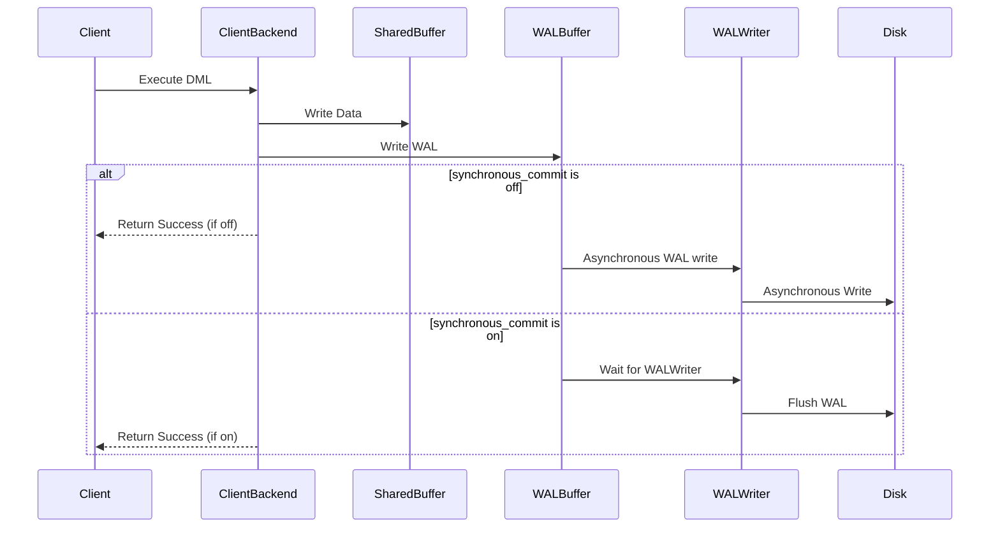

# SlateDB Synchronous Commit & Durability

Status: Draft

Authors:

* [Li Yazhou](https://github.com/flaneur2020)

## Background

The discussion of commit semantics and durability began in the comments of <https://github.com/slatedb/slatedb/pull/260#issuecomment-2570658593>. As the discussion evolved, it became clear that this is a complex topic. The semantics of commit and durability involve many intricate details, with subtle but important differences between various approaches.

We're creating this RFC to facilitate a thorough discussion of these concepts in the code review board.

## Goals

This RFC aims to:

1. Define clear synchronous commit semantics and durability guarantees that SlateDB users can rely on with confidence.
2. Create a well-defined API allowing users to specify their commit semantics and durability requirements.
3. Account for tiered WAL in the design.
4. Plan and organize the necessary code changes to implement these features.

As previously discussed in meetings and comments, we intend to implement these changes in an additive way that preserves all existing capabilities.

## References

- [Understanding synchronous_commit in PostgreSQL](https://medium.com/@mihir20/understanding-synchronous-commit-in-postgresql-54cb5609a221)
- [RocksDB: WAL Performance](https://github.com/facebook/rocksdb/wiki/WAL-Performance)

## Other Systems

Let's examine how other systems handle synchronous commits and durability guarantees before diving into the design. We'll focus on these key aspects:

1. The API for users to specify their commit semantics & durability requirements
2. Use cases & trade-offs, and the default settings
3. Error handling

### PostgreSQL

PostgreSQL provides a flexible setting called `synchronous_commit` that controls transaction durability and commit behavior. It offers several levels:

* `off`: Commits complete immediately after the transaction finishes, without waiting for the WAL to be written to disk. This means data loss is possible if a crash occurs.
* `local`: Commits wait for the WAL to be written and flushed to the local disk before returning.
* `on` (default): Commits wait for the WAL to be written and flushed locally, plus wait for at least one standby server to apply the WAL if synchronous replication is configured.
* `remote_write`: Commits wait for the WAL to be written locally and replicated to standby servers, then wait for standbys to flush to their file systems.
* `remote_apply`: Commits wait for the WAL to be written and flushed locally, then wait for standbys to fully apply the WAL, this ensures the data consistent between primary and standby.

The article "Understanding synchronous_commit in PostgreSQL" includes a helpful diagram showing how the `on` and `off` settings work (converted into a mermaid sequence diagram by @criccomini with ChatGPT):



The key distinction between `on` and `off` is that `on` ensures the WAL is written and flushed to local storage before proceeding. This highlights a central theme throughout this RFC: synchronous commit and durability fundamentally revolve around WAL handling.

Let's summarize the use cases and trade-offs for different `synchronous_commit` levels:

1. For financial systems where data is highly sensitive and data loss is unacceptable, `on`, `remote_write`, or `remote_apply` should be used.
2. For mission-critical systems that cannot tolerate data inconsistency between primary and standby servers after a failover, `remote_apply` should be used to guarantee data consistency across servers.
3. For workloads like logging or stream processing where some data loss is acceptable and performance is paramount, `off` or `local` can be used to optimize throughput.

### RocksDB

Let's look at how RocksDB describes synchronous commit in their documentation:

> #### Non-Sync Mode
>
> When WriteOptions.sync = false (the default), WAL writes are not synchronized to disk. Unless the operating system thinks it must flush the data (e.g. too many dirty pages), users don't need to wait for any I/O for write.
>
> Users who want to even reduce the CPU of latency introduced by writing to OS page cache, can choose Options.manual_wal_flush = true. With this option, WAL writes are not even flushed to the file system page cache, but kept in RocksDB. Users need to call DB::FlushWAL() to have buffered entries go to the file system.
>
> Users can call DB::SyncWAL() to force fsync WAL files. The function will not block writes being executed in other threads.
>
> In this mode, the WAL write is not crash safe.
>
> #### Sync Mode
>
> When WriteOptions.sync = true, the WAL file is fsync'ed before returning to the user.
>
> #### Group Commit
>
> As most other systems relying on logs, RocksDB supports group commit to improve WAL writing throughput, as well as write amplification. RocksDB's group commit is implemented in a naive way: when different threads are writing to the same DB at the same time, all outstanding writes that qualify to be combined will be combined together and write to WAL once, with one fsync. In this way, more writes can be completed by the same number of I/Os.
>
> Writes with different write options might disqualify themselves to be combined. The maximum group size is 1MB. RocksDB won't try to increase batch size by proactive delaying the writes.

Like PostgreSQL, RocksDB provides a `sync` option to control commit behavior and durability guarantees. When `sync = true`, a write is not considered committed until the data is `fsync()`ed to storage.

When `sync = false`, a write is considered committed immediately after the transaction completes, without waiting for the WAL to be written. While the WAL is still buffered in the kernel's page cache, data loss can occur if a crash happens.

Unlike PostgreSQL's `synchronous_commit` which offers multiple levels, RocksDB only provides a simple boolean option. This is because RocksDB is an embedded database and doesn't have the primary/standby architecture that PostgreSQL has.

To optimize synchronous commit performance, RocksDB implements Group Commit, which is a common pattern in WAL-based systems. This mechanism batches multiple writes together into a single, larger WAL write and flush operation, should improve I/O throughput a lot when comparing with multiple small writes.

(SlateDB implemented a similar Group Commit mechanism through its Commit Pipeline, multiple writes with `await_durable: true` will be batched into a single WAL write after `flush.interval` seconds or when the WAL buffer is full.)

It worths to note that RocksDB defaults to `sync = false`, meaning WAL writes are not crash-safe by default.

This default is likely to be a trade-off for performance. In many distributed systems (RocksDB's primary use case imo), some data loss on individual nodes is acceptable without compromising overall system durability. Examples include Raft clusters, distributed key-value stores, and stream processing state stores. For these use cases, enabling `sync: false` or `manual_wal_flush: true` is possible to be a good idea.

RocksDB allows mixing writes with different sync settings. For example, if transaction A commits with `sync = false` and transaction B starts afterwards, transaction A's writes will be visible to readers in transaction B. When transaction B commits with `sync = true`, both transactions' writes are persisted. This ordering guarantee means that when a `sync = true` write commits, all previous writes are guaranteed to be persisted as well.

Another important consideration is WAL write is possible to be failures. RocksDB handles these by retrying writes until determining whether the failure is temporary or permanent. In cases of permanent failure (like a full or corrupted disk), RocksDB marks the database state as fatal, rolls back the transaction like nothing happened, and switches the database instance to read-only mode.

## Synchronous Commit in a summary 

Based on the PostgreSQL and RocksDB references above, we can summarize the key semantics of Synchronous Commit:

1. A write is only considered committed once the WAL has been persisted to storage. Until then, the data remains invisible to readers.
2. If there is a permanent failure while persisting the WAL during a Synchronous Commit, the transaction rolls back completely. The database instance enters a fatal state and switches to read-only mode.
3. It's possible to have multiple levels of Synchronous Commit, or even disable it, allowing users to balance performance and durability requirements.
4. Synchronous and Unsynchronous Commits can be interleaved in different transactions. A transaction using Synchronous Commit can read writes from transactions that used Unsynchronous Commit. When a Synchronous Commit persists, it also persists any previous Unsynchronous Commit writes in the WAL.

## Current Design in SlateDB

This section is based on @criccomini 's comment in <https://github.com/slatedb/slatedb/pull/260#issuecomment-2576502212>.

SlateDB currently does not provide an explicit notion of Synchronous Commit. But it does provide a `DurabilityLevel` enum to control the durability guarantees on both read and write operations.

The `DurabilityLevel` enum is defined as follows:

```rust
enum DurabilityLevel {
    Memory,
    Local, // not implemented yet
    Remote,
}
```

And the `WriteOptions` struct contains a `await_durability: DurabilityLevel` option to control the waiting behavior for durability. If `await_durability` is set to `DurabilityLevel::Remote`, the write will wait for the WAL to be written into S3 before returning.

Please note that the commit semantic is a bit different from other systems' Synchronous Commit. No matter what `DurabilityLevel` is set in the write operation, this write is considered visible to the readers with `DurabilityLevel::Memory` immediately after the write is appended to the WAL, not nessarily flushed to storage.

The reason is that SlateDB's WAL is not a place for crash recovery only, but also a place for data reads. The read path is first access the WAL, then MemTable, then L0 SST, then SSTs at deeper levels.

In the notion of Synchronous Commit, the data is considered as committed as soon as the write is persisted to the WAL storage. Users can specify the durability level as `DurabilityLevel::Remote` for the read calls to ensure only the committed/persisted data is read.

SlateDB differs from both PostgreSQL and RocksDB in multiple ways. Unlike PostgreSQL, it's not a distributed system with Primary/Standby nodes. And unlike RocksDB, it stores data in S3 rather than local disk, which means slower write operations and additional costs for API requests. These differences lead to several key considerations:

1. Group commit is essential. By batching multiple writes together, we can reduce both API costs and improve performance compared to multiple small writes. However, even with Group Commit, writes to S3 will still be slower than local disk writes. (While parallel writes to S3 could potentially improve performance, this would increase both API costs and the complexity of handling failures.)
2. Writes will inherently take longer due to S3 latency. Given this reality, it makes sense to allow readers who can accept eventual consistency to access unpersisted and uncommitted data while waiting for writes to be durably committed.
3. Writing WAL to S3 has a higher risk of permanent failures due to network instability compared to local disk. This makes it critical to implement robust auto-recovery mechanisms for handling I/O failures.

These unique characteristics of SlateDB must be carefully considered as we design our durability and commit semantics.

## Possible Improvements
Synchronous Commit is a critical feature for mission-critical systems. It guarantees full ACID compliance by ensuring writes remain invisible until they are committed to durable storage. It also allows for different levels of durability guarantees to balance various use cases and trade-offs.

However, when comparing SlateDB's current model with PostgreSQL and RocksDB's Synchronous Commit implementations, there are some challenges in replicating the same semantics.

For example, in a transaction intended to be synchronously committed, the write should not be considered committed until the data is flushed to storage. But in SlateDB's current model, the data becomes visible to readers accepting unpersisted data (using `DurabilityLevel::Memory`) as soon as the write is appended to the WAL - before it's actually persisted to storage. This means uncommitted data can potentially be read before it's durably committed.

If users want to avoid reading uncommitted data, they can use `DurabilityLevel::Remote` to ensure they only read persisted data. However, this approach has drawbacks within transactions. If other writers make unpersisted writes (`DurabilityLevel::Memory`) to the same keys that the transaction is accessing, it will constantly encounter conflicts and rollbacks.

In short:

- We cannot guarantee Synchronous Commit semantics by setting writers to `DurabilityLevel::Remote` and readers to `DurabilityLevel::Memory`, since uncommitted data may be visible before it's durably committed.
- Setting both writers and readers to `DurabilityLevel::Remote` also presents challenges, as transactions may frequently roll back due to conflicts with unpersisted writes made by other writers using `DurabilityLevel::Memory` on the same keys.

## Proposal

This proposal aims to provide users with true Synchronous Commit semantics while preserving all capabilities of the current model.

tbd