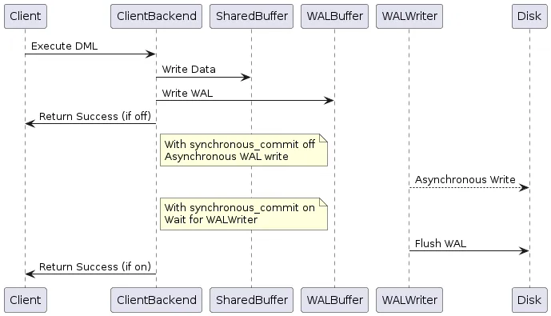

# SlateDB Synchronous Commit & Durability

Status: Draft

Authors:

* [Li Yazhou](https://github.com/flaneur2020)

## Background

The discussion of commit semantics and durability began in the comments of <https://github.com/slatedb/slatedb/pull/260#issuecomment-2570658593>. As the discussion evolved, it became clear that this is a complex topic. The semantics of commit and durability involve many intricate details, with subtle but important differences between various approaches.

We're creating this RFC to facilitate a thorough discussion of these concepts in the code review board.

## Goals

This RFC aims to:

1. Define clear synchronous commit semantics and durability guarantees that SlateDB users can rely on with confidence.
2. Create a well-defined API allowing users to specify their commit semantics and durability requirements.
3. Account for tiered WAL in the design.
4. Plan and organize the necessary code changes to implement these features.

As previously discussed in meetings and comments, we intend to implement these changes in an additive way that preserves all existing capabilities.

## References

- [Understanding synchronous_commit in PostgreSQL](https://medium.com/@mihir20/understanding-synchronous-commit-in-postgresql-54cb5609a221)
- [RocksDB: WAL Performance](https://github.com/facebook/rocksdb/wiki/WAL-Performance)

## Other Systems

Let's examine how other systems handle synchronous commits and durability guarantees. We'll focus on these key aspects:

1. The API for users to specify their commit semantics & durability requirements
2. Use cases & trade-offs, and the default settings
3. Error handling

### PostgreSQL
PostgreSQL provides a flexible setting called `synchronous_commit` that controls transaction durability and commit behavior. It offers several levels:

* `off`: Commits complete immediately after the transaction finishes, without waiting for the WAL to be written to disk. This means data loss is possible if a crash occurs.
* `local`: Commits wait for the WAL to be written and flushed to the local disk before returning.
* `on` (default): Commits wait for the WAL to be written and flushed locally, plus wait for at least one standby server to apply the WAL if synchronous replication is configured.
* `remote_write`: Commits wait for the WAL to be written locally and replicated to standby servers, then wait for standbys to flush to their file systems.
* `remote_apply`: Commits wait for the WAL to be written and flushed locally, then wait for standbys to fully apply the WAL, this ensures the data consistent between primary and standby.

The article "Understanding synchronous_commit in PostgreSQL" includes a helpful diagram showing how the `on` and `off` settings work:



The key distinction between `on` and `off` is that `on` ensures the WAL is written and flushed to local storage before proceeding. This highlights a central theme throughout this RFC: synchronous commit and durability fundamentally revolve around WAL handling.

Let's summarize the use cases and trade-offs for different `synchronous_commit` levels:

1. For financial systems where data is highly sensitive and data loss is unacceptable, `on`, `remote_write`, or `remote_apply` should be used.
2. For mission-critical systems that cannot tolerate data inconsistency between primary and standby servers after a failover, `remote_apply` should be used to guarantee data consistency across servers.
3. For workloads like logging or stream processing where some data loss is acceptable and performance is paramount, `off` or `local` can be used to optimize throughput.

### RocksDB

Let's directly quote the RocksDB documentation about the description of Synchronous Commit in RocksDB:

> #### Non-Sync Mode
>
> When WriteOptions.sync = false (the default), WAL writes are not synchronized to disk. Unless the operating system thinks it must flush the data (e.g. too many dirty pages), users don't need to wait for any I/O for write.
>
> Users who want to even reduce the CPU of latency introduced by writing to OS page cache, can choose Options.manual_wal_flush = true. With this option, WAL writes are not even flushed to the file system page cache, but kept in RocksDB. Users need to call DB::FlushWAL() to have buffered entries go to the file system.
>
> Users can call DB::SyncWAL() to force fsync WAL files. The function will not block writes being executed in other threads.
>
> In this mode, the WAL write is not crash safe.
>
> #### Sync Mode
>
> When WriteOptions.sync = true, the WAL file is fsync'ed before returning to the user.
>
> #### Group Commit
>
> As most other systems relying on logs, RocksDB supports group commit to improve WAL writing throughput, as well as write amplification. RocksDB's group commit is implemented in a naive way: when different threads are writing to the same DB at the same time, all outstanding writes that qualify to be combined will be combined together and write to WAL once, with one fsync. In this way, more writes can be completed by the same number of I/Os.
>
> Writes with different write options might disqualify themselves to be combined. The maximum group size is 1MB. RocksDB won't try to increase batch size by proactive delaying the writes.

Same as PostgreSQL, RocksDB also provides a `sync` option to control the commit semantics & durability guarantees. For write operations with `sync = true`, the commit is not considered as committed until the data is `fsync()`ed to storage.

For `sync = false`, the commit is considered as committed as soon as the transaction is finished, without waiting for the WAL to be written. The WAL is still buffered in kernel's Page Cache, data loss is possible if a crash occurs.

But instead of PostgreSQL's `synchronous_commit` which has multiple levels, RocksDB only provides a simple boolean option. The reason is that RocksDB is an embedded database, and do not have the concept of Primary/Standby like PostgreSQL.

To improve the performance of synchronous commit, RocksDB provides a Group Commit mechanism, which is commonly used in WAL based systems. This mechanism will combine multiple writes into a single WAL write, and then flush the WAL to storage in a bigger batch to improve the IO throughput.

(In SlateDB, we can leverage the Commit Pipeline to implement a similar Group Commit mechanism which batches multiple writes into a single WAL write.)

One thing worth mentioning is that RocksDB defaults to `sync = false`, which means the WAL write is not crash safe.

This is likely to be a trade-off for performance. In many use cases, especially in distributed systems (which is the most common use case for RocksDB), it's some times acceptable to allow data loss in a single node without hurting the durability of the system. Like making a raft cluster, distributed KV cluster, or a local state store for stream processing, etc. In these cases, `manual_wal_flush` is often a good idea.

Writes with `sync = true` and `sync = false` can be mixed together in RocksDB. If transaction A is committed with `sync = false`, and transaction B is started after transaction A, the writes from transaction A will be visible to the readers in transaction B, and both the writes from transaction A and B will be persisted when the transaction B is committed with `sync = true`. That means the WAL writes are ordered, whatever a `sync = true` write is committed, all the previous writes are guaranteed to be persisted.

There's also an important note that writing to WAL is possible to be failure. In this case, RocksDB will retry the write until it turns out the failure is not ephemeral. If the failure finally turns out to be permanent (e.g. the disk is full, or the disk is corrupted), RocksDB will give up and mark the db state as fatal, rollback the transaction, and make the db instance read-only.

## Synchronous Commit in a summary 

With the above references from PostgreSQL & RocksDB, we can summarize the expected semantics of Synchronous Commit in a way that:

1. The write is considered as committed as soon as the WAL is persisted to storage in a Synchronous Commit. Before the write is persisted, the data is invisible to the readers.
2. If got permanent failure on persisting the WAL in a Synchronous Commit, the transaction will be rolled back like nothing happened. The db instance will be marked as a fatal state, and be turned into read-only.
3. It's possible to have multiple levels of Synchronous Commit, which allows user to trade-off between performance and durability.
4. Synchronous Commit and Unsynchronous Commit can be mixed together in different transactions. Transaction with Synchronous Commit is able to read the writes from the transaction which disables Synchronous Commit, and the Synchronous Commit will persist all the previous writes which is possible to be Unsynchronous Commit in the WAL.

## Current Design in SlateDB

This section is based on @criccomini 's comment in <https://github.com/slatedb/slatedb/pull/260#issuecomment-2576502212>.

SlateDB currently does not provide an explicit notion of Synchronous Commit. But it does provide a `DurabilityLevel` enum to control the durability guarantees on both read and write operations.

The `DurabilityLevel` enum is defined as follows:

```rust
enum DurabilityLevel {
    Memory,
    Local, // not implemented yet
    Remote,
}
```

And the `WriteOptions` struct contains a `await_durability: DurabilityLevel` option to control the waiting behavior for durability. If `await_durability` is set to `DurabilityLevel::Remote`, the write will wait for the WAL to be written into S3 before returning.

Please note that the commit semantic is a bit different from other systems' Synchronous Commit. No matter what `DurabilityLevel` is set in the write operation, this write is considered visible to the readers with `DurabilityLevel::Memory` immediately after the write is appended to the WAL, not nessarily flushed to storage.

The reason is that SlateDB's WAL is not a place for crash recovery only, but also a place for data reads. The read path is first access the WAL, then MemTable, then L0 SST, then SSTs at deeper levels.

In the notion of Synchronous Commit, the data is considered as committed as soon as the write is persisted to the WAL storage. Users can specify the durability level as `DurabilityLevel::Remote` for the read calls to ensure only the committed/persisted data is read.

SlateDB is different from PostgreSQL in that it's not a distributed system which contains Primary/Standby like PostgreSQL. It's also different from RocksDB in that it's stored in S3 instead of local disk, which is considered slower on write operations, and it also costs $ on API requests. As the result:

1. Group commit is considered a must to reduce the cost of API requests and have a better performance than multiple small writes. However, even with Group Commit, it'll still considered as slower than local disk. (it might possible to improve the performance of writing to S3 by using parallel writes, but it'll also increase the cost of API requests, and increase the complexity of handling the failure cases.)
2. With consider writes is expected to wait longer. If the reader accepts to be eventually consistent, it'll be not bad to allow readers to read unpersisted data & uncommitted data while waiting the writes to be durable committed.
3. It's more likely to face permanent failures on writing WAL in a S3 based system when the network is unstable. It's more urgent to allow performing auto-recovery from the io failures for the db instance.

As above, we need to focus on certain aspects in our design while considering SlateDB's unique characteristics.

## Possible Improvements

Synchronous Commit is a very important feature for many mission critical systems. It guarantees a full ACID commit that ensures the writes is invisible until it's committed to durable storage, and it's possible to give different levels of durability guarantees for different use cases & trade offs.

However, when comparing with the PostgreSQL & RocksDB's Synchronous Commit model, the current model in SlateDB may faces some challenges to replicate the Synchronous Commit semantics.

Like, in a transaction which hopes to be a Synchronous Commit, this write is not considered as committed until the data is flushed to storage. But in the current model, the data will be visible to the readers whom accept unpersisted data with `DurabilityLevel::Memory` as soon as the write is appended to the WAL (before the WAL is persisted to storage), thus, this means it's possible to read the leaked uncommitted data before it's durable committed.

If a user do not want to read the leaked uncommitted data, they can ensure all the reads are persisted by using `DurabilityLevel::Remote` for all the persisted data is committed. But it's not wise to limit the read to persisted -only data in a transaction, because it'll face conflicts if some others put some unpersisted writes on the same keys this transaction accesses, it'll constantly face rollbacks on conflicts in this case.

In short:

- We can not guarantee the Synchronous Commit semantics with setting writers as `DurabilityLevel::Remote` and readers as `DurabilityLevel::Memory`, for it's possible to read the leaked uncommitted data before it's durable committed.
- We'll also face some challenges to guarantee the Synchronous Commit semantics with setting writers as `DurabilityLevel::Remote` and readers as `DurabilityLevel::Remote`, for it risks to rollback the transaction on conflicts if there're other writers whom has written some unpersisted data with `DurabilityLevel::Memory` on the same keys.

## Proposal

This proposal is planning to add a possible way to allow users to work with Synchronous Commit semantics, while keeping the current model's capabilities not reduced.

tbd