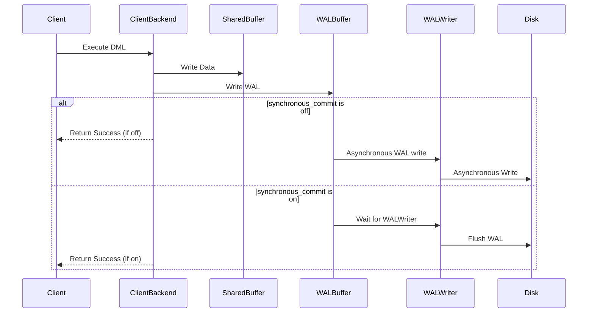
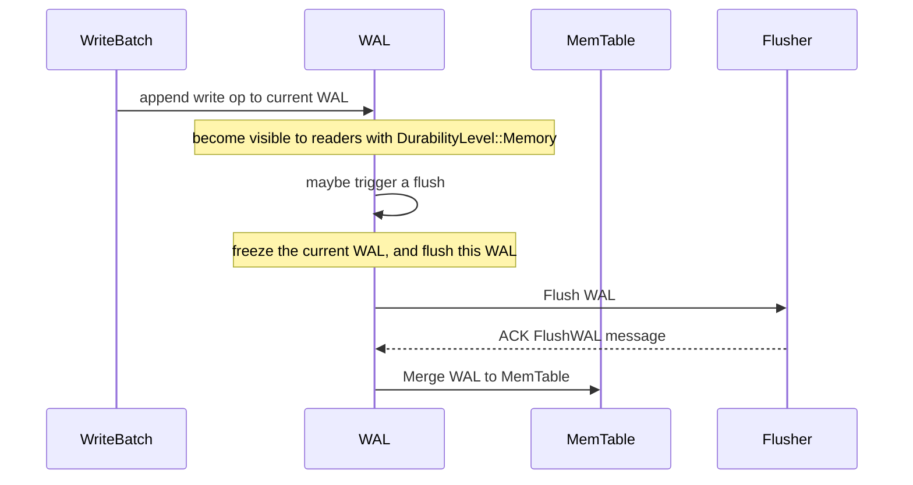
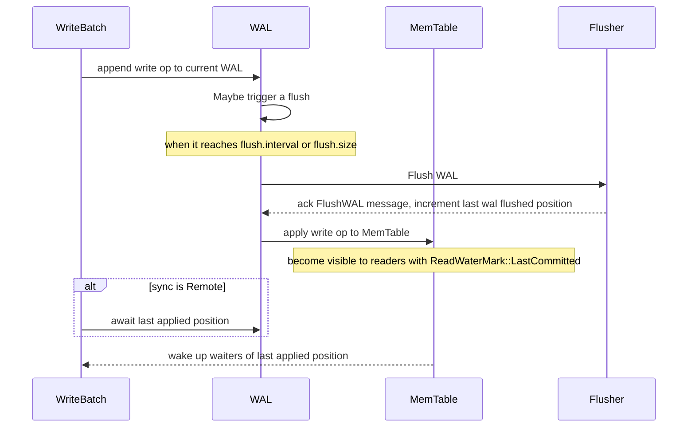

# SlateDB Synchronous Commit & Durability

Status: Accepted

Authors:

* [Li Yazhou](https://github.com/flaneur2020)

## Background

The discussion of commit semantics and durability began in the comments of <https://github.com/slatedb/slatedb/pull/260#issuecomment-2570658593>. As the discussion evolved, it became clear that this is a complex topic. The semantics of commit and durability involve many intricate details, with subtle but important differences between various approaches.

We're creating this RFC to facilitate a thorough discussion of these concepts in the code review board.

## Goals

This RFC aims to:

1. Define clear synchronous commit semantics and durability guarantees that SlateDB users can rely on with confidence.
2. Create a well-defined API allowing users to specify their commit semantics and durability requirements.
3. Account for tiered WAL in the design.
4. Plan and organize the necessary code changes to implement these features.

As previously discussed in meetings and comments, we intend to implement these changes in an additive way that preserves all existing capabilities.

## References

- [Understanding synchronous_commit in PostgreSQL](https://medium.com/@mihir20/understanding-synchronous-commit-in-postgresql-54cb5609a221)
- [RocksDB: WAL Performance](https://github.com/facebook/rocksdb/wiki/WAL-Performance)

## Other Systems

Let's examine how other systems handle synchronous commits and durability guarantees before diving into the design. We'll focus on these key aspects:

1. The API for users to specify their commit semantics & durability requirements
2. Use cases & trade-offs, and the default settings
3. Error handling

### PostgreSQL

PostgreSQL provides a flexible setting called `synchronous_commit` that controls transaction durability and commit behavior. It offers several levels:

* `off`: Commits complete immediately after the transaction finishes, without waiting for the WAL to be written to disk. This means data loss is possible if a crash occurs.
* `local`: Commits wait for the WAL to be written and flushed to the local disk before returning.
* `on` (default): Commits wait for the WAL to be written and flushed locally, plus wait for at least one standby server to apply the WAL if synchronous replication is configured.
* `remote_write`: Commits wait for the WAL to be written locally and replicated to standby servers, then wait for standbys to flush to their file systems.
* `remote_apply`: Commits wait for the WAL to be written and flushed locally, then wait for standbys to fully apply the WAL, this ensures the data consistent between primary and standby.

The article "Understanding synchronous_commit in PostgreSQL" includes a helpful diagram showing how the `on` and `off` settings work (converted into a mermaid sequence diagram by @criccomini with ChatGPT):



The key distinction between `on` and `off` is that `on` ensures the WAL is written and flushed to local storage before proceeding. This highlights a central theme throughout this RFC: synchronous commit and durability fundamentally revolve around WAL handling.

Let's summarize the use cases and trade-offs for different `synchronous_commit` levels:

1. For financial systems where data is highly sensitive and data loss is unacceptable, `on`, `remote_write`, or `remote_apply` should be used.
2. For mission-critical systems that cannot tolerate data inconsistency between primary and standby servers after a failover, `remote_apply` should be used to guarantee data consistency across servers.
3. For workloads like logging or stream processing where some data loss is acceptable and performance is paramount, `off` or `local` can be used to optimize throughput.

### RocksDB

RocksDB describes synchronous commit in their documentation as follows:

> #### Non-Sync Mode
>
> When WriteOptions.sync = false (the default), WAL writes are not synchronized to disk. Unless the operating system thinks it must flush the data (e.g. too many dirty pages), users don't need to wait for any I/O for write.
>
> Users who want to even reduce the CPU of latency introduced by writing to OS page cache, can choose Options.manual_wal_flush = true. With this option, WAL writes are not even flushed to the file system page cache, but kept in RocksDB. Users need to call DB::FlushWAL() to have buffered entries go to the file system.
>
> Users can call DB::SyncWAL() to force fsync WAL files. The function will not block writes being executed in other threads.
>
> In this mode, the WAL write is not crash safe.
>
> #### Sync Mode
>
> When WriteOptions.sync = true, the WAL file is fsync'ed before returning to the user.
>
> #### Group Commit
>
> As most other systems relying on logs, RocksDB supports group commit to improve WAL writing throughput, as well as write amplification. RocksDB's group commit is implemented in a naive way: when different threads are writing to the same DB at the same time, all outstanding writes that qualify to be combined will be combined together and write to WAL once, with one fsync. In this way, more writes can be completed by the same number of I/Os.
>
> Writes with different write options might disqualify themselves to be combined. The maximum group size is 1MB. RocksDB won't try to increase batch size by proactive delaying the writes.

Like PostgreSQL, RocksDB provides a `sync` option to control commit behavior and durability guarantees. When `sync = true`, a write is not considered committed until the data is `fsync()`ed to storage.

When `sync = false`, a write is considered committed immediately after the transaction completes, without waiting for the WAL to be written. While the WAL is still buffered in the kernel's page cache, data loss can occur if a crash happens.

Unlike PostgreSQL's `synchronous_commit` which offers multiple levels, RocksDB only provides a simple boolean option. This is because RocksDB is an embedded database and doesn't have the primary/standby architecture that PostgreSQL has.

To optimize synchronous commit performance, RocksDB implements Group Commit, which is a common pattern in WAL-based systems. This mechanism batches multiple writes together into a single, larger WAL write and flush operation, which significantly improves I/O throughput compared to multiple small writes.

(SlateDB implemented a similar Group Commit mechanism through its Commit Pipeline, where multiple writes with `await_durable: true` will be batched into a single WAL write after `flush.interval` seconds or when the WAL buffer is full.)

It's worth noting that RocksDB defaults to `sync = false`, meaning WAL writes are not crash-safe by default.

This default is likely a performance trade-off. In many distributed systems (RocksDB's primary use case), some data loss on individual nodes is acceptable without compromising overall system durability. Examples include Raft clusters, distributed key-value stores, and stream processing state stores. For these use cases, enabling `sync: false` or `manual_wal_flush: true` can be beneficial for performance.

RocksDB allows mixing writes with different sync settings. For example, if transaction A commits with `sync = false` and transaction B starts afterwards, transaction A's writes will be visible to readers in transaction B. When transaction B commits with `sync = true`, both transactions' writes are persisted. This ordering guarantee means that when a `sync = true` write commits, all previous writes are guaranteed to be persisted as well.

Another important consideration is WAL write failures. RocksDB handles these by retrying writes until determining whether the failure is temporary or permanent. In cases of permanent failure (like a full or corrupted disk), RocksDB marks the database state as fatal, rolls back the transaction, and switches the database instance to read-only mode.

## Synchronous Commit in Summary 

Based on the PostgreSQL and RocksDB references above, we can summarize the key semantics of Synchronous Commit:

1. A write is only considered committed once the WAL has been persisted to storage. Until then, the data remains invisible to readers.
2. If there is a permanent failure while persisting the WAL during a Synchronous Commit, the transaction rolls back. The database instance enters a fatal state and switches to read-only mode.
3. It's possible to have multiple levels of Synchronous Commit, or even disable it, allowing users to balance performance and durability requirements.
4. Synchronous and Unsynchronous Commits can be interleaved in different transactions. A transaction using Synchronous Commit can read writes from transactions that used Unsynchronous Commit. When a Synchronous Commit persists, it also persists any previous Unsynchronous Commit writes in the WAL.

## Current Design in SlateDB

This section is based on @criccomini's comment in <https://github.com/slatedb/slatedb/pull/260#issuecomment-2576502212>.

SlateDB currently does not provide an explicit notion of Synchronous Commit. However, it does provide a `DurabilityLevel` enum to control the durability guarantees on both read and write operations.

The `DurabilityLevel` enum is defined as follows:

```rust
enum DurabilityLevel {
    Memory,
    Local, // not implemented yet
    Remote,
}
```

The `WriteOptions` struct contains an `await_durability: DurabilityLevel` option to control the waiting behavior for durability. If `await_durability` is set to `DurabilityLevel::Remote`, the write will wait for the WAL to be written into S3 before returning.

It's important to note that SlateDB's commit semantics differ from other systems' Synchronous Commit. Regardless of what `DurabilityLevel` is set in the write operation, this write is considered visible to readers with `DurabilityLevel::Memory` immediately after the write is appended to the WAL, not necessarily flushed to storage.

This difference exists because SlateDB's WAL serves not only for crash recovery but also for data reads. The read path first accesses the WAL, then MemTable, then L0 SST, and finally SSTs at deeper levels.

In traditional Synchronous Commit semantics, data is considered committed only after the write is persisted to WAL storage. Users can specify the durability level as `DurabilityLevel::Remote` for read calls to ensure only committed/persisted data is read.

SlateDB differs from both PostgreSQL and RocksDB in multiple ways:

1. Unlike PostgreSQL, it's not a distributed system with Primary/Standby nodes.
2. Unlike RocksDB, it stores data in S3 rather than local disk, resulting in slower write operations and additional costs for API requests.

These differences lead to several key considerations:

1. Group commit is essential. By batching multiple writes together, we can reduce both API costs and improve performance compared to multiple small writes. However, even with Group Commit, writes to S3 will still be slower than local disk writes.
2. Writes will inherently take longer due to S3 latency. Given this reality, it makes sense to allow readers who can accept eventual consistency to access unpersisted and uncommitted data while waiting for writes to be durably committed.
3. Writing WAL to S3 has a higher risk of permanent failures due to network instability compared to local disk. This makes it critical to implement robust auto-recovery mechanisms for handling I/O failures. [^1]
4. We should provide a way to control the durability level of read operations, so users can choose to read only persisted data.

These unique characteristics of SlateDB must be carefully considered as we design our durability and commit semantics.

[^1]: The discussion in [RFC for Handling Data Corruption](https://github.com/slatedb/slatedb/pull/441) may also be related to this topic.

## Possible Improvements

Synchronous Commit is a critical feature for mission-critical systems. It guarantees full ACID compliance by ensuring writes remain invisible until they are committed to durable storage. It also allows for different levels of durability guarantees to balance various use cases and trade-offs.

However, when comparing SlateDB's current model with PostgreSQL and RocksDB's Synchronous Commit implementations, there are some challenges in replicating the same semantics.

For example, in a transaction intended to be synchronously committed, the write should not be considered committed until the data is flushed to storage. But in SlateDB's current model, the data becomes visible to readers accepting unpersisted data (using `DurabilityLevel::Memory`) as soon as the write is appended to the WAL - before it's actually persisted to storage. This means uncommitted data can potentially be read before it's durably committed.

If users want to avoid reading uncommitted data, they can use `DurabilityLevel::Remote` to ensure they only read persisted data. However, this approach has drawbacks within transactions. If other writers make unpersisted writes (`DurabilityLevel::Memory`) to the same keys that the transaction is accessing, it will constantly encounter conflicts and rollbacks.

In short:

- We cannot guarantee Synchronous Commit semantics by setting writers to `DurabilityLevel::Remote` and readers to `DurabilityLevel::Memory`, since uncommitted data may be visible before it's durably committed.
- Setting both writers and readers to `DurabilityLevel::Remote` also presents challenges, as transactions may frequently roll back due to conflicts with unpersisted writes made by other writers using `DurabilityLevel::Memory` on the same keys.

## Proposal

### Read Committed Data by Default

This proposal aims to provide users with true Synchronous Commit semantics while preserving all capabilities of the current model.

It's important to note that "Commit" and "Durability" are distinct concepts that aren't necessarily coupled. Data can be considered "Committed" even if it hasn't been flushed to persistent storage - it may exist only in memory. While such data isn't persisted, it can still be treated as safely committed from a transactional perspective.

Later transactions can safely depend on these "Unpersisted" but "Committed" data without worrying about conflicts, since they represent the latest committed state of the data. This allows for consistent transaction semantics even when some committed data hasn't yet been persisted to storage.

"Committed" data won't contain data that is still in the process of being committed (which is possible in reads with `DurabilityLevel::Memory` in the current model).

By allowing users to read "Committed" data by default, we can address the challenges outlined earlier. Reading committed data, regardless of persistence status, enables proper transaction semantics while still allowing for performance optimizations through writes with lower durability requirements. This provides a cleaner separation between transaction consistency and durability guarantees.

Let's assume we have a sequence of writes like this:

| seq | operation | marks |
| --- | ----------------- | ---- |
| 100 | WRITE key001 = "value001" with (durability: Memory) | |
| 101 | WRITE key002 = "value002" with (durability: Memory) | |
| 102 | WRITE key003 = "value003" with (durability: Memory) | |
| 103 | WRITE key004 = "value004" with (durability: Remote) | <-- last remote persisted seq |
| 104 | WRITE key005 = "value005" with (durability: Memory) | |
| 105 | WRITE key006 = "value006" with (durability: Memory) | <-- last committed seq |
| 106 | WRITE key007 = "value007" with (durability: Remote), but still haven't persisted yet | <-- last committing seq |

While "Committed" is distinct from the "DurabilityLevel" concept, both the "Committed" and "Persisted" positions can be tracked using separate watermarks in the commit history of sequence numbers.

Reading "Committed" data should be considered the default behavior for read operations, as committed data is safe data.

In some cases, users may want to read only "Persisted" data, and they can use the `durability_filter` option to achieve this goal:

```rust
let opts = ReadOptions::new().with_durability_filter(DurabilityLevel::Local);
db.get(key, opts).await?;
```

Using this durability filter option, the read operation will only retrieve data that has been persisted to storage. This will make sure the data it read is at least durable at `DurabilityLevel::Local`, but it might not be the most up-to-date.

By default, no matter what `DurabilityLevel` is set in the `durability_filter` option, the read operation will always read the Committed data. But at some use cases like disk caching, users may not care about the commitness of the data, but only care about the data is durable at least at `DurabilityLevel::Local`.

If the writer write with `SyncLevel::Remote`, the data will not be considered as committed until it's persisted to `Remote`. If the user want to read the data as soon as it's persisted to `Local`, they can use an additional option `dirty: true` to make this possible:

```rust
let opts = ReadOptions::new()
    .with_durability_filter(DurabilityLevel::Local)
    .with_dirty(true);
db.get(key, opts).await?;
```

### Sync Commit

To implement Synchronous Commit semantics, the write side do not need to change a lot: the operation returns once the WAL is persisted according to the specified durability level.

In other systems, this option is often named as `sync`, to emphasize the idea of synchronous commit, like:

```rust
let opts = WriteOptions::new().with_sync(DurabilityLevel::Remote);
db.write(key, value, opts).await?;
```

However, for the writes that not expected to durablely persisted, this can be thought of as **disabling** synchronous commit entirely rather than synchronizing to memory. The code sample may be like:

```rust
enum SyncLevel {
    Off,
    Local,
    Remote,
}

let opts = WriteOptions::new().with_sync(SyncLevel::Off);
db.write(key, value, opts).await?;
```

The benefits of having a `SyncLevel` enum are:

1. The name "Synchronous Commit" directly describes the feature we aim to support.
2. The term "sync" is commonly used across database systems and is well understood, familiar to users.
3. The names are shorter, easier to type & read.
4. It's accurate to describe as sync commit as "off" when it comes with memory durability.

At the writer side, if `sync` is enabled, the write operation will wait until the data is persisted to storage according to the specified sync level.

If `sync` is set to `SyncLevel::Off`, the write operation will not await it self to be persisted remotely.

But there's one worth noting: the commits are strictly ordered. The later write will wait for the previous write to be committed to commit itself. As a result, the write operation with `SyncLevel::Off` does NOT means the write will become visible immediately.

Give an example:

- thread A: seq 100: write keyXXX with `sync: Remote`
- thread B: seq 101: write keyYYY with `sync: Off`

The write operation B will NOT return immediately, but it will be queued in the WAL buffer, and await the previous write operation A to be committed, then it will be applied to MemTable and visible to readers, and finally return.

`commit()` always ensures "read your writes consistency", as a result, it's still a blocking operation even with `sync: Off`. If we want to have a no-wait write, we can consider add something like `commit_with_callback(cb: Callback)` interface, like [badger](https://pkg.go.dev/github.com/dgraph-io/badger/v4#Txn.CommitWith) did. This async commit interface is out of scope of this RFC, we can discuss it in a separate RFC or issue if needed.

### Difference between "await_durable" and "sync"

`await_durable` and `sync` appear to have similar behaviors - on the write side, both wait until data reaches a persistent state before returning.

However, there are subtle semantic differences between them:

1. `sync` determines when data enters the committed state and returns after data is committed.
2. `await_durable` only waits for the data's durability state.

For example, when a write has `Sync::Off` set, it is considered to enter the Committed state immediately, this write will become visible to readers with `LastCommitted` immediately.

However, at some point this data will still be eventually flushed to storage if the DB keeps running. If you want to subscribe or wait for when this `sync:Off` write becomes durably persisted, you can still use `await_durable` to achieve this goal.

Also, when using `sync` commit, it's possible to queue the later Non-Sync writes to be queued in the WAL buffer, delaying them later to be applied to MemTable and visible to readers.

Sometimes, user might hope to always allow the writes to be visible to readers immediately, while still waiting for the data to be durably persisted. `await_durable` and `sync` can be used together to achieve this goal:

```rust
let opts = WriteOptions::new()
  .with_sync(SyncLevel::Off) 
  .with_await_durable(DurabilityLevel::Remote) // on the writer side, i still await this until it's persisted in remote
db.put_with_options("key", "val", opts)
```

When WAL is disabled (no-WAL mode), the `sync` option has no effect since there is no WAL to sync. In this case, users should use `await_durable` to ensure their writes are persisted durably.

While `SyncLevel` and `DurabilityLevel` may appear similar, they serve distinct purposes. `SyncLevel` controls when writes become visible to readers by determining the commit semantics, while `DurabilityLevel` focuses on the durability of the write.

## Implementation

The key change is to seperate "Append to WAL" and "Commit to make it visible" into two different steps.

In the current design, whenever a write operation is called, it'll append the data to the WAL, the data is becoming visible to readers with `DurabilityLevel::Memory` immediately, as the readers will read the data from the WAL in front of MemTable. And when the WAL buffer reaches the `flush.interval` or `flush.size`, it'll be flushed to storage, and apply to MemTable.

The sequence diagram is like this:



In this proposal, "Commit to make it visible" effectively means "applying the changes to the MemTable", whenever the change is applied to MemTable, it's considered as committed.

The changes to the read path are minimal. For reads with different durability levels, we can simply use different sequence numbers as watermarks to determine visibility.

On the write side, after the data is appended to the WAL, it'll be applied to MemTable as soon as possible to make the change to be visible to readers.

The sequence diagram is like this:



### Handling No WAL Write

It's not possible to have Sync Commit when WAL is disabled. So let's not allow users to enable `sync` when WAL is disabled.

When `sync` is not possible to set, all the writes will be considered as Committed immediately, and become visible to readers in the MemTable.

Users can still use `await_durable` to wait for the write to be durably persisted on the writer side.

### Handling WAL Write Failures

It's more likely to have WAL write failures on object storage like S3 than local disk.

We do not have to fail the write operation immediately when the WAL write fails. Instead, we can retry the write operation with a backoff.

However, it's possible to have some failure on flushing WAL to object storage which last for several minutes or even longer, and without a local disk which might help to buffer the WAL during the failure.

In this case, we can still buffer the WAL in memory as long as possible. When the failure is resolved, we can resume the flush operation.

However, the memory is limited, and we can't buffer the WAL in memory forever. We already have a threshold setting `max_unflushed_bytes` for this. When this threshold is reached, we can't buffer the WAL anymore, and we have to mark the db into an read-only state.

When the WAL fails to be flushed to storage, the write operation with `SyncLevel::Remote` should be failed with an `IOError` (or a concrete error type), and considered as not committed. This write operation should be invisible to all of the readers.

### Possible Code Changes

As above described, we need to tackle with several details to implement this proposal, like:

1. The synchronization of flushing the WAL to storage.
2. Notify the writers when the WAL is successfully flushed to storage.
3. Retry the flush operation when it fails with backoff, and finally mark the db into an read-only state if it's permanent failure.
4. Flush the memory buffered WAL to storage in order.
5. Support tiered WAL storage like local disk and S3.
6. Handle the no-WAL mode.

Given the complexity of these changes, implementing everything in a single PR would be challenging. It's difficult to estimate the implementation effort required or identify all the code that will need to change in this RFC. A better approach would be to break this down into several smaller PRs, starting with some small refactoring to make the subsequent changes easier to be implemented.

One possible code change would be introducing a `WALManager` struct to centralize management of the WAL buffer and flush operations, helping to encapsulate the complexity in a single place.

For inspiration, we can also consider to reference how Badger structures their code. In Badger's implementation, they embed the WAL buffer inside the memtable struct, as shown here:

```go
// memTable structure stores a skiplist and a corresponding WAL. Writes to memTable are written
// both to the WAL and the skiplist. On a crash, the WAL is replayed to bring the skiplist back to
// its pre-crash form.
type memTable struct {
	sl         *skl.Skiplist
	wal        *logFile
	maxVersion uint64
	opt        Options
	buf        *bytes.Buffer
}
```

It makes sense to put the manager of the WAL buffer inside the memtable struct, as WAL is closely related to the memtable, it actually make a good encapsulation: put the complexities behind some simple `put()` / `get()` interface.

However, it's a different codebase, it would be better to keep code structure changes minimal with each iteration. It'll make more sense to have several small PoC PRs. Introducing a `WALManager` might be a good first step to encapsulate the WAL buffer, flushing, and synchronous commit functionality. This would allow us to have more detailed discussions about code structure as we develop these PoCs.

## Updates

- 2025-02-20: added the comparision between `sync` and `await_durable`
- 2025-03-12: revise the api with `with_durability_filter` and `with_dirty`
