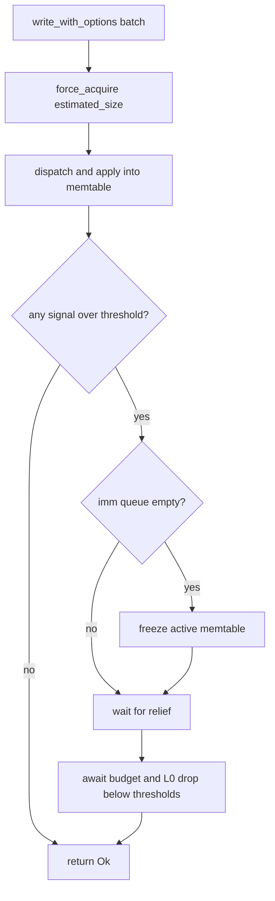

# Write Buffer Manager

Table of Contents:

<!-- TOC start (generate with https://bitdowntoc.derlin.ch) -->

- [Summary](#summary)
- [Motivation](#motivation)
- [Goals](#goals)
- [Non-Goals](#non-goals)
- [Design](#design)
  - [Phase 1: Live Write Buffer Capacity Enforcement](#phase-1-live-write-buffer-capacity-enforcement)
    - [ByteBudgetSemaphore](#bytebudgetsemaphore)
    - [ByteBufferManager](#bytebuffermanager)
    - [ByteBufferPermit](#bytebufferpermit)
    - [Integration into the Write Path](#integration-into-the-write-path)
    - [Memory Tracking Responsibilities](#memory-tracking-responsibilities)
    - [Size Estimation Algorithms](#size-estimation-algorithms)
    - [Memtable Permit Tracking](#memtable-permit-tracking)
    - [WAL Replay](#wal-replay)
    - [Backpressure Enhancement](#backpressure-enhancement)
    - [Public API and Builder](#public-api-and-builder)
    - [Defaults](#defaults)
  - [Phase 2: Instance Registry for Intelligent Backpressure (WIP)](#phase-2-instance-registry-for-intelligent-backpressure-wip)
- [Pathological Cases](#pathological-cases)
- [Impact Analysis](#impact-analysis)
  - [Core API & Query Semantics](#core-api--query-semantics)
  - [Consistency, Isolation, and Multi-Versioning](#consistency-isolation-and-multi-versioning)
  - [Time, Retention, and Derived State](#time-retention-and-derived-state)
  - [Metadata, Coordination, and Lifecycles](#metadata-coordination-and-lifecycles)
  - [Compaction](#compaction)
  - [Storage Engine Internals](#storage-engine-internals)
  - [Ecosystem & Operations](#ecosystem--operations)
- [Operations](#operations)
  - [Performance & Cost](#performance--cost)
  - [Observability](#observability)
  - [Compatibility](#compatibility)
- [Testing](#testing)
- [Rollout](#rollout)
- [Alternatives](#alternatives)
- [Open Questions](#open-questions)
- [References](#references)
- [Updates](#updates)

<!-- TOC end -->

Status: Implemented

Authors:

* [Zach Schoenberger](https://github.com/zach-schoenberger)

## Summary

This RFC introduces a `ByteBufferManager` — a byte-budget primitive — used to
enforce a memory budget on in-flight write data. By default each SlateDB
instance creates its own `ByteBufferManager` internally, sized from
`max_unflushed_bytes`; callers may optionally supply their own via
`DbBuilder::with_write_buffer_manager()`.

Phase 1 tracks and bounds the memory consumed by write batches, memtables, and
WAL buffers. The live write path uses non-blocking `force_acquire` to reserve
budget, dispatches and applies the batch into the memtable, then calls
`maybe_apply_backpressure`, which freezes the active memtable (turning it into a
drainable immutable table so its budget can be flushed and released) and waits
when over a threshold. Permit release is tied to memtable and WAL buffer drops.
This byte-budget check **replaces** the old point-in-time `max_unflushed_bytes`
snapshot backpressure mechanism entirely — it does not run alongside it. Soft
overshoot via `force_acquire` is intentional so a shared manager across DB
instances does not couple “I am waiting” with “freeze my local writer” before
the write is freezeable.

Backpressure continues to flow through the existing `maybe_apply_backpressure`
gate, but the conditions it evaluates change. In place of the single
`max_unflushed_bytes` snapshot it now checks **three** independent signals: the
byte budget (memory, replacing the snapshot), and — newly added — *writer-side*
stalls on the per-tree L0 SST count (`l0_max_ssts`) and the per-key L0 overlap
(`l0_max_ssts_per_key`). Those two L0 thresholds, their `FlushTracker::can_dispatch`
flush-dispatch gate, and the `l0_stall_count` metric already existed; what is
new is stalling the *writer* on them (reading new `max_l0_sst_count` /
`max_l0_overlap` atomics maintained by the manifest writer) so a small-value /
fast-flush workload that keeps the byte budget under capacity still can't
drive L0 unbounded while compaction falls behind. Both L0 stalls are gated on a
configured compactor so a no-compactor deployment can never stall unrelieved.

Phase 2 (WIP) builds on the shareable `ByteBufferManager` to add an instance
registry for intelligent, per-instance backpressure across DB instances that
share a budget.

## Motivation

SlateDB's existing backpressure mechanism does a good job of keeping memory
usage in check under most workloads: it polls the aggregate size of WAL +
immutable memtables against `max_unflushed_bytes` and stalls writers when the
threshold is exceeded. Today the check is a point-in-time snapshot
of memory already consumed. Between the check passing and the write landing
in the memtable, concurrent writes can increase memory pressure beyond the
intended budget. A proactive reservation step would let us bound memory
*before* the write is dispatched.

Separately, the current backpressure check reads the database state under a lock
to aggregate sizes. A lock-free tracking primitive would scale more
naturally as we add new pools.

The `ByteBufferManager` addresses these opportunities by:

- **Reserving** budget for each write batch via non-blocking `force_acquire`
  before dispatch (accounting for the batch's bytes; may soft-overshoot
  capacity).
- **Applying backpressure after apply**: once the batch is in the memtable, the
  writer freezes if at capacity and waits in `maybe_apply_backpressure` until
  allocated bytes drop below capacity. Waiting only after apply keeps
  freezeable state in front of the waiter — required for a manager shared across
  DB instances (a blocked instance must not assume freezing itself frees budget
  held elsewhere, and must not freeze before its own write exists).
- Automatically **releasing** permits when the owning memtable or WAL buffer is
  dropped (i.e., after flush to L0 / flush to object storage).
- Using lock-free atomics for all budget tracking, replacing — rather than
  coexisting with — the state-lock based `max_unflushed_bytes` snapshot on the
  write path with a contention-free reservation.

## Goals

- Enforce a global memory budget on in-flight write data (write batches through
  memtable flush).
  - The memory usage of the allocated write buffers (memtables, both current and immutable, and WAL buffers) should count towards the limit. This should not be double counted if it is one allocation (e.g. key/value `Bytes` shared between the WAL buffer and the memtable are charged once, by the memtable).
  - DbReader instances should be able to use the memory budget in future phases.
- The buffer memory limits should be observed as strictly as possible, erring towards over-counting if needed. Both user-provided key/value bytes and structural overhead (KVTable, WalBuffer, SkipMap nodes, etc.) count towards the budget.
- Provide an RAII permit lifecycle: `force_acquire` before dispatch, merge into
  the memtable on apply, release on memtable (and WAL buffer) drop.
- Replace the point-in-time `max_unflushed_bytes` snapshot backpressure
  mechanism with the byte budget (not run both).
- Add compaction-lag signals to the existing `maybe_apply_backpressure` gate so
  writers also stall when compaction falls behind. The `l0_max_ssts` /
  `l0_max_ssts_per_key` thresholds and their flush-dispatch gate
  (`FlushTracker::can_dispatch`) already exist; this adds the *writer-side*
  stall on the same thresholds so a fast-flush workload that never trips the
  memory budget can't drive L0 unbounded. These L0 stalls are only active when a
  compactor is configured to drain L0.
- Keep the live path compatible with a **shared** manager across DB instances:
  do not block in `acquire` with a local freeze side-effect before the write is
  applied.
- Support a caller-supplied per-write timeout on the backpressure wait. A
  `WriteOptions` timeout `Duration` bounds how long a write waits for permit
  allocation (the pre-dispatch backpressure wait); on expiry the write is
  cancelled before dispatch and its `WriteBatch` is returned to the caller via a
  dedicated error variant so it can be retried or shed without reconstruction.
  The timeout is scoped to permit allocation only, not the batch's time in the
  write queue.
- Avoid locking the database state for budget tracking.
- Allow callers to optionally share a budget across multiple DB instances via
  `DbBuilder::with_write_buffer_manager()`. (Phase 2) build a registry pattern
  on top of this for intelligent, per-instance backpressure.
- The configuration of the memory manager should be as simple as possible — ideally just one size. Additional configs can be added in future and then only if they are really needed.

## Non-Goals

- Tracking block cache or read-path memory.
- Tracking the transient memory used to **build L0 SSTs** during a flush. A
  flush encodes a frozen memtable into an SST, which can transiently consume
  roughly 2–3x the memtable's in-memory size (encoder buffers, block builders,
  the output SST bytes) before the memtable permit is released. That overhead
  is currently **untracked**; the budget accounts for the memtable, not the SST
  being produced from it. A future direction is to reserve budget for the
  *expected* SST memory at memtable-creation time so a flush cannot silently
  double the footprint of a frozen table (see
  [Open Questions](#open-questions)).
- Tracking compaction memory. Compaction reads and writes SSTs on its own
  threads with its own buffers; none of that is charged to the write buffer
  budget.
- Tracking struct byte allocations that will never be released like `DbInner::write_notifier`.
- Enforcing a hard limit on memory. `force_acquire` (used for structural
  overhead, WAL buffers, and replay) can intentionally overshoot capacity;
  backpressure bounds *new* writes, not existing allocations.
- Guaranteeing exact byte-level accounting (estimates are conservative
  approximations).
- (Phase 2) Per-instance tracking and intelligent backpressure policies — this
  RFC only outlines the direction.

## Design

### Phase 1: Live Write Buffer Capacity Enforcement

Phase 1 introduces three new types and integrates them into the existing write
path.

#### ByteBudgetSemaphore

The core primitive is an async semaphore built on `AtomicUsize` + `tokio::Notify`
that tracks allocations in bytes rather than discrete permits.

```rust
struct ByteBudgetSemaphore {
    notify: Notify,
    allocated_bytes: AtomicUsize,
    waiter_cnt: AtomicUsize,
    capacity: usize,
}
```

**Why not `tokio::sync::Semaphore`?** Tokio's semaphore enforces a hard capacity
limit — once all permits are issued, acquisitions block until permits are
returned, and there is no way to over-allocate. The `ByteBufferManager` relies
on soft capacity tracking: `force_acquire` lets writers overshoot capacity
rather than blocking. A custom `ByteBudgetSemaphore` gives us full control over
this soft-cap behavior, which `tokio::sync::Semaphore` does not support.

The semaphore operations used in production (interface summary; bodies elided):

```rust
impl ByteBudgetSemaphore {
    fn new(capacity: usize) -> Self;
    async fn acquire(&self, num_bytes: usize, on_block: impl Fn(bool)) -> bool;
    fn force_acquire(&self, num_bytes: usize);
    fn release(&self, num_bytes: usize);
    fn available(&self) -> usize;
    fn allocated(&self) -> usize;
    async fn wait_for_allocated_below(&self, num_bytes: usize);
}
```

- **`acquire`** — a blocking reservation primitive. On each attempt it either
  reserves `num_bytes` immediately when `allocated_bytes` is below `capacity`
  (atomic `compare_exchange` fast path), or — when at/over `capacity` — parks on
  `notify` until a `release` drops allocation below `capacity`, then re-checks.
  `on_block` fires before every park (`true` on the first) so callers can
  re-assert relief on each wait, and the call returns `true` if it parked at
  least once. **`acquire` is not used by the production write path** — writes
  reserve with non-blocking `force_acquire` and apply backpressure *after* the
  batch is applied (see
  [Integration into the Write Path](#integration-into-the-write-path)). It is
  retained as a building block for future modes such as strict
  blocking-before-dispatch (see [Open Questions](#open-questions)).
- **`force_acquire`** — non-blocking `fetch_add`. Can push `allocated_bytes`
  above `capacity`. Used for structural overhead, WAL buffers, and WAL replay.
- **`release`** — subtracts `num_bytes` from `allocated_bytes` via `fetch_sub`
  and notifies any outstanding waiters parked waiting for allocation to drain
  below `capacity`.
- **`available`** — returns `capacity - allocated_bytes` (saturating to zero
  when over-allocated).
- **`allocated`** — returns the current `allocated_bytes` count.
- **`wait_for_allocated_below`** — blocks until `allocated_bytes` drops below
  the given threshold *without* reserving (used by `await_capacity`). Uses the
  same enable-before-recheck pattern as `acquire` so a `release` between the
  initial load and park cannot be missed.

#### ByteBufferManager

A cloneable, generic byte-budget handle wrapping a shared
`Arc<ByteBudgetSemaphore>`. It is stored in a **new** `write_buffer_manager`
field on `DbInner` (the baseline `DbInner` had no such field) and is also
threaded into `DbState::new`, `KVTable::new`, and the WAL machinery — all of
which gain a `ByteBufferManager` parameter they did not have before.

```rust
#[derive(Clone)]
pub struct ByteBufferManager {
    inner: Arc<ByteBudgetSemaphore>,
}
```

The manager tracks a single threshold:

- **`capacity`** — the hard byte budget. A caller may reserve while
  `allocated` is below `capacity`; reaching `capacity` is what engages
  backpressure. Live-path admission is non-blocking (`force_acquire`), so
  `allocated` can momentarily reach or exceed `capacity`.

Backpressure engages when the budget is full and relieves as soon as allocation
dips below full — there is no sub-capacity watermark or cool-off band. The
builder requires `capacity` to leave room for one active memtable to reach
`l0_sst_size_bytes` (plus fixed per-memtable overhead) so a memtable can fill
and freeze before the budget is exhausted.

Methods (interface summary; bodies elided):

```rust
impl ByteBufferManager {
    pub fn new(capacity: usize) -> Self;
    pub fn unbounded() -> Self;
    pub async fn acquire(&self, num_bytes: usize, on_block: impl Fn(bool)) -> ByteBufferPermit;
    pub fn force_acquire(&self, num_bytes: usize) -> ByteBufferPermit;
    pub fn force_expand(&self, permit: &ByteBufferPermit, num_bytes: usize);
    pub fn available(&self) -> usize;
    pub fn capacity(&self) -> usize;
    pub fn allocated(&self) -> usize;
    pub fn at_capacity(&self) -> bool;
    pub async fn await_capacity(&self);
}
```

- **`new`** — constructs a manager with the `capacity` threshold described
  above.
- **`unbounded`** — `capacity == usize::MAX`; never applies
  backpressure. Used for read-only paths (e.g. `DbReader` / empty sentinel
  tables) and tests where the API requires a manager but accounting is
  unnecessary. Production WAL replay does *not* use `unbounded`; it charges the
  shared DB manager via `force_acquire`.
- **`acquire`** — the blocking reservation described above (thin wrapper over
  `ByteBudgetSemaphore::acquire`), returning an RAII `ByteBufferPermit`. The
  underlying `parked` `bool` is consumed internally for unblock logging and is
  not exposed to callers. Not used by the production write path.
- **`force_acquire`** — unconditionally reserves bytes without blocking; can
  push `allocated_bytes` above `capacity`. Used for structural overhead, WAL
  buffer creation, and WAL replay.
- **`force_expand`** — unconditionally adds `num_bytes` to an existing permit's
  reservation. Used by `KVTable::put` (per-entry structural overhead) and
  `WalBuffer::append` to record growth of the WAL buffer container as entries
  are appended. Today that WAL growth is the container's own bookkeeping
  (the `VecDeque`'s backing capacity — pointers/metadata), **not** the key/value
  bytes, which are owned by the `KVTable`; framing it as "record WAL buffer
  growth" keeps room to charge additional per-entry WAL overhead here later
  without changing the mechanism.
- **`available`** / **`capacity`** / **`allocated`** — accessors for
  `capacity - allocated_bytes` (saturating), the total budget, and the current
  outstanding reservation.
- **`at_capacity`** — the engage signal `maybe_apply_backpressure` checks:
  `true` once `allocated_bytes >= capacity`.
- **`await_capacity`** — the relief wait `maybe_apply_backpressure` blocks on:
  resolves once `allocated_bytes < capacity`, without reserving any bytes.

#### ByteBufferPermit

An RAII guard that releases its byte reservation on drop. Multiple permits can
be consolidated via `merge()` to combine reservations into a single guard.
The type is `pub` inside the private `byte_buffer_manager` module but is **not**
re-exported from `lib.rs` — external callers interact with it only indirectly
through `ByteBufferManager` / `DbBuilder`.

```rust
pub struct ByteBufferPermit {
    semaphore: Arc<ByteBudgetSemaphore>,
    reserved_bytes: AtomicUsize,
}

impl ByteBufferPermit {
    pub fn size(&self) -> usize;
    pub fn merge(&self, other: &ByteBufferPermit);
    pub fn take(&self, num_bytes: usize) -> Self;
}

impl Drop for ByteBufferPermit {
    fn drop(&mut self); // calls semaphore.release(reserved_bytes)
}
```

- **`size`** — returns the number of bytes currently reserved by this permit.
- **`merge`** — atomically zeroes the source permit's `reserved_bytes` and adds
  that value to the target. The source permit's `Drop` becomes a no-op,
  avoiding double-release. Used by `KVTable::add_write_permit` to consolidate
  multiple write batch permits into the table's single permit.
- **`take`** — subtracts up to `num_bytes` from this permit (saturating if
  fewer remain) and returns a new permit owning those bytes. Used by
  `KVTable::put` in the overwrite case to release cancelled structural
  overhead and replaced entry data back to the budget.

#### Integration into the Write Path

The permit lifecycle flows through the write path as follows:

```mermaid
sequenceDiagram
    participant W as Writer
    participant DB as DbInner
    participant BW as BatchWriter
    participant WAL as WalBuffer
    participant MT as KVTable

    W->>DB: write_with_options(batch)
    DB->>DB: force_acquire(estimated_size)
    Note over DB: non-blocking; may soft-overshoot capacity
    DB->>DB: batch.write_buffer_permit = Some(permit)
    DB->>BW: send WriteBatch

    BW->>WAL: append(entries)
    Note over WAL: force_expand, WAL container growth only
    BW->>MT: write_entries_to_memtable
    MT->>MT: add_write_permit (merge kv permit)
    MT->>MT: put(entry), force_expand structural overhead
    BW->>BW: maybe_freeze_current_memtable
    Note over BW: size / WAL thresholds only
    BW-->>DB: oneshot complete

    DB->>DB: maybe_apply_backpressure
    Note over DB: if byte budget at capacity and imm queue empty, freeze active
    Note over DB: wait until byte budget + L0 signals drop below their thresholds

    Note over WAL,MT: later, flush frees budget
    WAL->>WAL: flush WAL, drop WalBuffer, permit.drop()
    Note over WAL: frees WAL container overhead
    MT->>MT: flush to L0, drop KVTable, permit.drop()
    Note over MT: frees key/value bytes + memtable overhead
```

The fundamental pattern is that the **user provides byte buffers** (keys and
values), and those byte buffer metrics are tracked exclusively in relation to
the `KVTable`. The WAL buffer and dispatch channel do *not* account for the
key/value data bytes themselves — only the `KVTable` does.

1. **`WriteBatch`** gains a **new** `write_buffer_permit: Option<Arc<ByteBufferPermit>>`
   field (the baseline `WriteBatch` had no permit and no size method).
   `DbInner::write_with_options` `force_acquire`s the permit and assigns
   it to this field before dispatching the batch. The permit accounts **only
   for the key and value byte buffers** that the user is storing (the batch's
   new `estimated_size()`) — it does not account for the `WriteBatch` struct
   itself, the dispatch channel, or any other transient overhead.

2. **`DbInner::write_with_options`** reserves with non-blocking
   `force_acquire(estimated_size)`, attaches the permit, dispatches the batch,
   awaits apply completion, then **always** calls `maybe_apply_backpressure()`.
   In the baseline, `maybe_apply_backpressure` was called *before* enqueueing
   the batch; it now runs *after* apply so the write lands in a freezeable
   memtable before the writer can block. That method internally returns early
   when no signal is over threshold, so the common case is still just a few
   atomic loads. Blocking happens only after the write is in the memtable, and
   only when over a threshold (so a successful apply is not turned into an error
   by a racing `check_closed()` when under capacity). Blocking in `acquire` before
   dispatch was rejected for two reasons. First, **deadlock avoidance**: the
   flush pipeline that releases budget runs *behind* the same dispatch channel
   the write uses, so parking a writer in `acquire` before its batch is applied
   can wedge the very pipeline that would relieve it (a freeze requested while
   parked can run before the batch is applied, or on the wrong shared-manager
   instance, after which nothing re-arms relief and the waiter hangs). Second,
   the **`WriteBatch` bytes are already allocated** by the time we reach the
   write path — the user has handed us the keys and values — so refusing to
   admit them does not reclaim that memory; `force_acquire` records the
   already-incurred allocation and lets backpressure gate the *next* write once
   the batch is safely in a freezeable memtable.

3. **`DbInner::write_batch`** (batch writer) is unchanged relative to the
   baseline except that it now merges the write permit into the `KVTable`. It
   still applies entries and runs the same size/WAL-based
   `maybe_freeze_current_memtable`; the memtable freeze that responds to the
   byte budget is handled separately and centrally by
   `maybe_apply_backpressure` (see
   [Backpressure Enhancement](#backpressure-enhancement)), not here.

4. **`DbInner::write_entries_to_memtable`** takes the permit off the batch and
   merges it into the table's own permit. From this point, the `KVTable` owns
   the byte buffer budget for those key/value bytes.

##### Worked Examples

The following per-case walkthroughs show how a write interacts with the budget.
All three describe the **actual** behavior: the live path `force_acquire`s
(soft overshoot), applies the batch, then may block in
`maybe_apply_backpressure`. Where a stricter admission-control alternative may
be preferable, it is noted; that alternative is tracked in
[Open Questions](#open-questions).



- **10 MB batch, 1 MB budget (single write larger than the whole budget).**
  `force_acquire(~10 MB)` succeeds unconditionally and pushes `allocated` to
  ~10 MB — far above `capacity` (1 MB). The batch is
  applied, then `maybe_apply_backpressure` sees the budget over capacity,
  freezes the active memtable (imm queue empty), and blocks the *caller* until
  the flush drains it below 1 MB. The oversized write is admitted once (its
  bytes already exist), but the writer cannot issue another write until the
  budget recovers. *A stricter alternative* would reject or block such a write
  before admitting it; see [Open Questions](#open-questions).
- **100 MB budget, 1 MB memtable (typical steady state).** `force_acquire(~1 MB)`
  leaves `allocated` well under the 100 MB budget. `maybe_apply_backpressure`
  returns early after a few atomic loads — no freeze, no wait. This is the common
  fast path.
- **100 MB budget, 99 MB already outstanding (approaching the cap).** A new
  ~2 MB write `force_acquire`s to ~101 MB, reaching the budget. The batch is
  applied, then `maybe_apply_backpressure` freezes the active memtable and
  parks the writer until flushes bring `allocated` back below `capacity`
  (100 MB). Because admission is non-blocking, allocation can
  transiently exceed `capacity` by roughly one in-flight write's worth before
  the next writer is stalled — the intentional soft overshoot.

#### Memory Tracking Responsibilities

In the baseline none of these structures tracked memory against a budget —
`KVTable::new()`, `WalBuffer::new()`, and `WriteBatch` took no manager and held
no permit. This RFC gives each a permit (or a shared manager handle) and assigns
each a distinct, non-overlapping slice of memory to charge:

- **`KVTable` (memtable)** — `KVTable::new` gains a `&ByteBufferManager`
  parameter and the struct gains an `Arc<ByteBufferPermit>` field. It now tracks
  *everything* related to its state:
  - The user-provided key/value byte buffers (via the merged write permit)
  - Its own structural overhead: `KVTable` struct size, `SequenceTracker`
    pre-allocation, per-entry `SkipMap` node overhead, and `SequencedKey` +
    `RowEntry` struct sizes
  - On creation, `force_acquire(SEQ_TRACKER_OVERHEAD + KVTABLE_SIZE)` reserves
    the base cost; on each `put()`, `force_expand` adds per-entry structural
    overhead

- **`WalBuffer`** — gains a `write_buffer_manager` handle and a
  `write_buffer_permit`, and now tracks only its own structural overhead (the
  `WalBuffer` struct size and `VecDeque` capacity growth as entries are
  appended). It does **not** track the key/value data bytes. Those bytes are
  shared (via `Bytes` reference counting) with the `KVTable`, which is the sole
  owner of the key/value budget. The WAL buffer charges the **same shared DB
  `write_buffer_manager`** as the memtables — it does not use a private
  `unbounded()` budget. The manager is threaded into the WAL machinery at
  construction, where `WalBufferManager::start_new` gains a `write_buffer_manager`
  argument: `DbBuilder::build` → `WriterFencer::new(..)` →
  `WalWriterInit::load(..)` → `WalBufferManager::start_new(.., write_buffer_manager)`.
  Each `WalBuffer`'s permit is released when the buffer is flushed to object
  storage and dropped, freeing budget for new writes just like a memtable freed
  after its L0 flush.

- **`DbStateView` (read-side `Arc<KVTable>`)** — unchanged structurally; the
  `KVTable` can be shared via `Arc` for read access (e.g., in `DbStateView`).
  This shared reference does **not** independently track byte buffers — it is a
  view on the original table. The budget for key/value bytes remains with the
  original `KVTable`'s permit and is released only when the last `Arc` reference
  is dropped (i.e., after flush completes and all readers release the table).

#### Size Estimation Algorithms

All of the accounting below is new; the baseline computed none of these budget
charges. Each component uses a specific formula to calculate the bytes it
charges against the write buffer budget.

**Write Batch (user-provided key/value bytes)**

`WriteBatch::estimated_size()` is a **new** method. It sums only the raw key and
value byte lengths across all operations in the batch:

```
batch_size = ∑ op.estimated_kv_size()

where estimated_kv_size =
    Put  | Merge : key.len() + value.len()
    Delete       : key.len()
```

This is the size passed to `force_acquire` when the write-path permit is
created. It represents the user-provided byte buffers and nothing else.

**KVTable (memtable)**

The `KVTable` charges two categories of bytes against the budget:

1. *Base overhead* — acquired once at table creation:

   ```
   base = SEQ_TRACKER_OVERHEAD + KVTABLE_SIZE

   where
     SEQ_TRACKER_OVERHEAD = 8192 * size_of::<u64>() * 2   (~128 KiB)
     KVTABLE_SIZE         = size_of::<KVTable>()
   ```

2. *Per-entry structural overhead* — expanded on each `put()`:

   ```
   entry_overhead = SKIPMAP_ENTRY_OVERHEAD
                  + size_of::<SequencedKey>()
                  + size_of::<RowEntry>()

   where
     SKIPMAP_ENTRY_OVERHEAD = 128   (tower pointers, node header, alignment)
     SequencedKey           = size_of::<SequencedKey>()  (Bytes handle + u64 seq)
     RowEntry               = size_of::<RowEntry>()      (struct footprint, not data)
   ```


   In the overwrite case (same `SequencedKey` already exists), the just-
   expanded structural overhead and the replaced entry's data-size estimate
   are released back via `permit.take()` (which saturates if the permit is
   somehow short):

   ```
   excess = entry_overhead + old_entry.estimated_size()
   ```

The total budget consumed by one `KVTable` is therefore:

```
total = base
      + (num_entries * entry_overhead)
      + user_kv_bytes          (from merged write batch / replay permits)
      - overwrite_corrections  (excess returned via take())
```

**WalBuffer**

The `WalBuffer` charges only its own container overhead:

1. *Base overhead* — acquired once at buffer creation:

   ```
   base = size_of::<WalBuffer>()
   ```

2. *VecDeque capacity growth* — expanded each time the internal `VecDeque`
   reallocates:

   ```
   growth_bytes = (cap_after - cap_before) * size_of::<RowEntry>()
   ```

   This is only charged when the `VecDeque`'s capacity actually increases
   (i.e., when it reallocates its backing buffer to fit more entries).

The total budget consumed by one `WalBuffer` is:

```
total = base + cumulative_growth_bytes
```

Notably, the `WalBuffer` does **not** charge for the key/value data bytes of
the entries it holds. Those bytes are shared via `Bytes` reference counting
with the `KVTable`, which is the sole owner of that portion of the budget.
The container overhead is charged against the shared DB `write_buffer_manager`
(via `force_acquire` on creation and `force_expand` on growth), and released
when the buffer is dropped after its flush to object storage.

#### Memtable Permit Tracking

`KVTable` gains an `Arc<ByteBufferPermit>` field (the baseline `KVTable` had no
such field) that is created at construction time from the `&ByteBufferManager`
now passed to `KVTable::new` (covering the base structural overhead). When write
batches land in the table, their permits are merged into this single table
permit via `ByteBufferPermit::merge()`. This ensures all tracked bytes — both
the user-provided key/value buffers and the table's own structural allocations
— are released in a single `Drop` when the table is dropped after flush.

```rust
write_buffer_permit: Arc<ByteBufferPermit>,
```

```rust
/// Merges an external write-buffer budget permit into this table's
/// permit so that a single drop releases the combined reservation.
pub(crate) fn add_write_permit(&self, permit: &ByteBufferPermit) {
    self.write_buffer_permit.merge(permit);
}
```

#### WAL Replay

During WAL replay, the replay loop must make forward progress to populate the
memtable state, so it cannot use the blocking `acquire` (which could stall the
replay against its own not-yet-flushed tables). Two things change here relative
to the baseline. First, each recovered memtable now **charges the shared DB
`write_buffer_manager`** via non-blocking `force_acquire` for the sum of each
applied row's `RowEntry::estimated_size()` (key + value + seq + optional
timestamps — slightly heavier than the live `WriteBatch::estimated_size()`
key/value-only estimate), merging the resulting permit into the table; the
baseline did no budget accounting during replay. The table's own base
structural overhead is reserved at `KVTable::new` as usual. Second, the loop is
**reordered**: the baseline ran freeze → `maybe_apply_backpressure` →
`replay_memtable` (integrate last), whereas it now integrates first.

For each recovered memtable the outer replay loop now:

1. **Integrates first** via `replay_memtable` (freezes the previous active into
   an imm the flusher can drain and installs the new table).
2. Calls `maybe_freeze_memtable` (encoded size ≥ `max_unflushed_bytes`) so an
   oversized active is frozen and can't park forever. (Unchanged from baseline.)
3. Calls `maybe_apply_backpressure` to evaluate every backpressure signal
   (byte budget, L0 count, L0 overlap). When the byte budget is at capacity and
   the imm queue is empty, `maybe_apply_backpressure` itself freezes the active
   so SkipMap/structural overhead that exceeds capacity still yields a
   flushable imm, then waits until pressure eases (freezing makes budget
   releasable; waiting bounds how far replay races ahead of the flusher).

Waiting *before* integrate (as the baseline did) would deadlock once budget
accounting is added: the next table's `force_acquire`d bytes are still local and
the active table is not yet frozen, so nothing can free budget — hence the
reorder. This is the remaining production caller of `maybe_apply_backpressure`
that pairs it with an explicit encoded-size freeze; the steady write path relies
on the memtable freeze inside `maybe_apply_backpressure`.

#### Backpressure Enhancement

The byte budget **replaces** the old `max_unflushed_bytes` snapshot
backpressure mechanism; that snapshot check and its `await_uploaded` wait are
gone from the write path. Backpressure already flowed through a single
`maybe_apply_backpressure` method (called on the write path and per replayed
table); what changes is the set of conditions it evaluates. Where the baseline
checked one condition (`total_mem_size_bytes >= max_unflushed_bytes`), it now
evaluates **three independent signals** and owns the freeze-then-wait loop for
each. Only the **byte budget** signal is a brand-new mechanism; the two L0
signals add *writer-side* stalls on infrastructure that already existed (the
`l0_max_ssts` / `l0_max_ssts_per_key` settings, the `FlushTracker::can_dispatch`
flush-dispatch gate, and the `l0_stall_count` metric).

1. **Byte budget** (`write_buffer_manager.at_capacity()`) — *new.* Allocation
   has reached the budget (`allocated >= capacity`). Relief comes from flushes releasing permits; 
   the writer waits on `await_capacity()` until allocation drains back below `capacity`.
2. **L0 SST count** (`l0_at_capacity()`) — *new writer-side stall on an existing
   signal.* `l0_max_ssts` was already enforced per tree by the flush-dispatch
   gate (`FlushTracker::can_dispatch`), which stops *dispatching* flushes to a
   full tree. That gate stops *adding* to a full tree but only compaction
   *removes* L0 SSTs, so a workload that flushes faster than it compacts (and
   never trips the byte budget) could still stall the flusher indefinitely while
   writers kept accepting work. The new check stalls the *writer* on the same
   threshold so backpressure reaches the client.
3. **Per-key L0 overlap** (`l0_overlap_at_capacity()`) — *new writer-side stall
   on an existing signal.* The per-key analogue of the count check: the largest
   single tree's per-key L0 overlap (the peak number of L0 SST views covering
   any one key) has reached `l0_max_ssts_per_key`, bounding point-read
   amplification the same way the count signal bounds manifest growth. Also
   already enforced by the flush-dispatch gate; now surfaced as writer
   backpressure too.

The two L0 writer-side stalls were added because a small-value / fast-flush
workload can keep the byte budget well under capacity while L0 grows
unbounded when compaction can't keep up. Each reads a new lock-free atomic on
`DbInner` (`max_l0_sst_count`, `max_l0_overlap`) that the memtable flusher's
manifest writer now maintains, and both are gated on
`settings.compactor_options.is_some()`: without a compactor, nothing removes L0
SSTs, so stalling on an L0 signal could never be relieved (and a single tree's
L0 is already bounded by the flush-dispatch gate plus the byte budget). This
keeps no-compactor deployments and tests from deadlocking.

```rust
// DbInner gains two lock-free atomics, maintained by the memtable flusher's
// manifest writer, recording the largest single-tree L0 SST count and per-key
// L0 overlap seen at the last manifest mutation. The write path reads these to
// gate L0 backpressure without taking the state lock.
max_l0_sst_count: Arc<AtomicUsize>,
max_l0_overlap: Arc<AtomicUsize>,
```

The fast path is a single early-return when no signal is tripped, so a normal
write pays only three atomic loads:

```rust
// Fast path: return immediately unless a backpressure signal is tripped.
if !(write_buffer_manager.at_capacity()
    || l0_at_capacity()
    || l0_overlap_at_capacity())
{
    return Ok(());
}
```

When a signal is tripped, `maybe_apply_backpressure` loops, re-checking
`check_closed()` and refreshing the `total_mem_size_bytes` metric from
`write_buffer_manager.allocated()` on each iteration, and handles whichever
signal is active:

- **Byte budget** — records backpressure, fires the `db-backpressure-applied`
  fail point, warns, and — this is new — **freezes the active memtable itself**
  to seed a drainable imm, but only when the imm queue is empty. Existing imms
  will drain and release budget on their own; freezing an under-full active
  when imms already exist just manufactures an extra small L0 SST. If draining
  the existing imm(s) is not enough, the loop re-enters with an empty queue and
  freezes then. It then waits via
  `await_backpressure_relief(await_capacity())`.
- **L0 count / L0 overlap** — records backpressure, increments the matching
  `l0_stall_count` counter (`num_ssts` / `num_ssts_per_key`), fires the fail
  point, and warns. There is no direct completion signal to await (a memtable
  *upload* would only add to L0); relief comes from compaction draining L0,
  which the writer observes when the manifest writer's poll refreshes the
  atomics. So it re-checks after one `manifest_poll_interval` sleep.

Every wait is wrapped in `await_backpressure_relief`, which resolves on the
earliest of: the supplied progress future, the DB being closed/fenced (whose
terminal error is returned), or a 30s watchdog that forces a re-check rather
than block forever.

The wait is **bounded and interruptible at the DB level** — a stalled writer
always makes forward progress on close/fence or at the watchdog interval, so a
wedged flush pipeline cannot hang a writer indefinitely.

On top of that DB-level bound, the write path **must** honor a caller-supplied
write timeout. `WriteOptions` carries an optional timeout `Duration`; when set,
it bounds how long a write will wait for backpressure to clear. To keep the
feature minimally invasive, the timeout is scoped to **permit allocation only**
— the backpressure wait in `maybe_apply_backpressure` before the batch is
dispatched — and deliberately does *not* cover the batch's time in the write
queue once it has been accepted (that phase remains governed by the close/fence
and watchdog behavior above). Scoping to the permit-allocation wait keeps the
cancellation point at a place where the write has not yet been dispatched, so it
can be cleanly abandoned.

When the permit-allocation wait exceeds the timeout, the write is cancelled
before dispatch and a dedicated error variant is returned that **hands the
`WriteBatch` back to the caller** rather than dropping it, so the caller can
retry, back off, or shed the write without having to reconstruct it. A write
with no timeout set retains the existing DB-level-bounded behavior. A timeout of
`0` indicates an immediate error return (`WriteTimeout`) if there is no capacity
to allocate a permit, without waiting at all.

```rust
pub struct WriteOptions {
    // ...existing fields...

    /// Maximum time this write will wait for write-buffer permit allocation
    /// (the pre-dispatch backpressure wait). `None` keeps the existing
    /// DB-level-bounded behavior. A value of `0` returns `WriteTimeout`
    /// immediately when no permit can be allocated, without waiting. Does not
    /// bound time spent in the write queue after the batch has been accepted.
    pub backpressure_timeout: Option<Duration>,
}

pub enum SlateDBError {
    // ...existing variants...

    /// The backpressure wait exceeded `WriteOptions::backpressure_timeout`
    /// before a permit could be allocated. The write was never dispatched;
    /// the original batch is returned so the caller can retry or shed it.
    WriteTimeout { batch: WriteBatch },
}
```

Caller side, this makes a timed-out write cheap to retry without rebuilding the
batch:

```rust
let opts = WriteOptions {
    backpressure_timeout: Some(Duration::from_millis(500)),
    ..Default::default()
};

loop {
    match db.write_with_options(batch, &opts).await {
        Ok(()) => break,
        // Budget stayed full for longer than the timeout; the batch came back
        // to us untouched, so back off and try again (or drop it).
        Err(SlateDBError::WriteTimeout { batch: returned }) => {
            batch = returned;
            tokio::time::sleep(backoff).await;
        }
        Err(e) => return Err(e),
    }
}
```

When the byte budget is at capacity, the memtable freeze that seeds a drainable
immutable table happens **solely in `maybe_apply_backpressure`**: neither
`write_batch` nor the replay loop freezes in response to the byte budget. They
only perform the pre-existing size/WAL-threshold freeze via
`maybe_freeze_current_memtable` / `maybe_freeze_memtable` (unchanged from the
baseline). Handling the budget-triggered freeze in one place avoids
manufacturing small L0 SSTs on every at-capacity write and lets the
imm-queue-empty check gate it.

Blocking `ByteBufferManager::acquire` remains available as a primitive (and is
covered by unit tests) but is **not** used on the production write path: its
`on_block` freeze model does not compose with a shared manager across
instances.

> **Consideration:** The `ByteBufferManager` tracks outstanding bytes more
> accurately than the old `max_unflushed_bytes` check, which relied on a
> point-in-time snapshot of WAL + immutable memtable sizes under a read lock.
> Because the byte budget already accounts for all in-flight write data from
> reservation through flush (memtable overhead + key/value bytes + WAL buffer
> overhead), it fully replaces that snapshot mechanism — the write path no
> longer consults `max_unflushed_bytes` for backpressure. The setting name is
> kept only as the default seed for the budget capacity. The L0
> count / overlap signals are orthogonal to memory: they bound compaction lag
> and read amplification, which the byte budget alone does not.

#### Public API and Builder

- `ByteBufferManager` is re-exported from `lib.rs` as a public type.
- `ByteBufferPermit` is `pub` in the private `byte_buffer_manager` module but
  is **not** re-exported from `lib.rs`; external crates cannot name the type.
- `DbBuilder::with_write_buffer_manager(ByteBufferManager)` lets a caller supply
  their own manager — for a custom capacity, or to share a single
  budget across multiple DB instances.
- When no manager is supplied, each instance creates its own `ByteBufferManager`
  internally with `capacity` set to
  `settings.max_unflushed_bytes`.
- (Phase 2 will layer an instance registry and per-instance accounting on top of
  the shared-manager capability that already exists here.)

#### Defaults

When no explicit `ByteBufferManager` is provided via
`DbBuilder::with_write_buffer_manager()`, the database constructs one with:

- **`capacity`** = `settings.max_unflushed_bytes` (default 1 GB)

Backpressure triggers only when the full budget is consumed: `at_capacity()`
returns `true` once allocated bytes reach `capacity`. This is the simplest
behavior — the system allows writes to fill the budget completely before
applying backpressure, relying on the flush pipeline to drain immutable
memtables in the background.

The builder validates the (default or supplied) manager with two guards:

1. **Minimum capacity** — capacity must be at least `MIN_WRITE_BUFFER_SIZE`
   (1 MiB). This floor ensures there is always enough headroom to cover the
   fixed overhead of a single `KVTable` (primarily the `SequenceTracker`
   pre-allocation at ~128 KiB) plus at least one entry, preventing a deadlock
   where the budget is exhausted before any write can land.

2. **Minimum capacity for freeze headroom** — capacity must also be at least
   `l0_sst_size_bytes + SEQ_TRACKER_OVERHEAD + KVTABLE_SIZE`. The active memtable
   is only frozen once its *encoded* size reaches `l0_sst_size_bytes`, and the
   budget also counts the fixed per-memtable overhead that the freeze threshold
   does not. If capacity were below this sum, the buffer could sit at
   capacity holding only a single unfrozen active memtable — nothing would be
   eligible to flush, so nothing would free budget, and the writer would stall
   until the next unrelated freeze. (Per-entry SkipMap overhead is intentionally
   not included in this floor, so tiny-value workloads still get a proactive
   freeze under backpressure.)

### Phase 2: Instance Registry for Intelligent Backpressure (WIP)

Phase 1 enforces budget limits but applies backpressure blindly — when the
budget is exhausted, all writers block regardless of which DB instance holds the
majority of the allocation. `DbBuilder::with_write_buffer_manager()` already
lets callers share one `ByteBufferManager` across instances; Phase 2 builds an
instance registry on top of that sharing to enable smarter backpressure
strategies by tracking which instances share the budget.

**Problem:** When a single `ByteBufferManager` is shared across multiple DB
instances via `DbBuilder::with_write_buffer_manager()`, an instance that has
consumed a disproportionate share of the budget causes all other instances to
stall. Without per-instance tracking there is no mechanism to identify the
heavy consumer or to direct backpressure at it specifically.

**Proposed direction:** Add an instance registry within the shared manager:

- **Registration** — Each DB instance registers itself with the shared
  `ByteBufferManager` on startup and deregisters on shutdown. The registry
  tracks per-instance metadata such as current byte allocation and instance
  identity.
- **Per-instance accounting** — Permits are tagged with their owning instance,
  allowing the manager to report per-instance budget consumption.
- **Backpressure policies** — With per-instance visibility, the manager can
  support smarter strategies such as:
  - *Proportional fairness* — stall only the instance that has exceeded its
    fair share rather than blocking all writers.
  - *Priority-based* — allow high-priority instances to preempt or receive
    larger budget slices.
  - *Targeted flush signaling* — notify the heaviest consumer to trigger an
    early flush, freeing budget for other instances.
- **Observability** — The registry enables per-instance metrics (bytes held,
  permits outstanding, time spent blocked) for debugging shared-budget
  contention.

Several concrete shapes this could take are captured here so the Phase 2 design
starts from them:

- **Per-consumer Views (exclusive sub-budgets).** Rather than every consumer
  drawing from one flat pool, introduce a `View` (working name) type that owns
  an exclusive slice of the shared budget — analogous to Flink's
  `LocalBufferPool` carved out of a global `NetworkBufferPool`. Each DB instance
  (or, later, each `DbReader`) acquires a `View` with a guaranteed minimum and
  an elastic maximum; the manager arbitrates the shared remainder between Views.
  This gives fairness and isolation without every write touching global state on
  the hot path. The intent is to **define the `View` type as part of Phase 2
  now** (so the shared-manager API is shaped for it) and implement the
  arbitration policies incrementally.
- **Smoother / sawtooth-free backpressure.** Phase 1 backpressure is
  effectively binary (under capacity = free, over = stall), which can produce a
  sawtooth throughput pattern. A Phase 2 policy could ramp resistance as
  allocation approaches capacity — e.g. rate-limiting admitted writes with
  short sleeps rather than a hard park — to smooth the transition and keep
  latency more predictable under sustained pressure.
- **Explicit consumer identity / registration.** Follow the pattern SlateDB
  already uses for `DbCache`, where consumers register with a stable ID, so the
  registry can attribute allocation and target relief at a specific consumer
  rather than inferring it. This keeps the accounting model consistent with the
  block-cache side of the system.

Detailed design of Phase 2 is deferred to a future RFC, once Phase 1 is
validated in production and multi-instance sharing patterns are better
understood from production usage.

## Pathological Cases

When Phase 2 introduces shared budgets across instances, the following
pathological case can arise: 1 to N instances obtain buffer permits so that the
total allocated buffer is slightly under or equal to capacity. This
will cause any write by any other instance to always trigger a small memtable to
be flushed — essentially making each write to any instance that doesn't own a
significant portion of the buffer permits produce a new memtable. In order
to properly handle this kind of issue, the `ByteBufferManager` needs a way to
know what allocations are being held and a mechanism to trigger their release.
Phase 2's instance registry and intelligent backpressure policies are designed
to address this.

## Impact Analysis

SlateDB features and components that this RFC interacts with. Check all that
apply.

### Core API & Query Semantics

- [x] Basic KV API (`get`/`put`/`delete`)
- [ ] Range queries, iterators, seek semantics
- [ ] Range deletions
- [ ] Error model, API errors

### Consistency, Isolation, and Multi-Versioning

- [ ] Transactions
- [ ] Snapshots
- [ ] Sequence numbers

### Time, Retention, and Derived State

- [ ] Time to live (TTL)
- [ ] Compaction filters
- [ ] Merge operator
- [ ] Change Data Capture (CDC)

### Metadata, Coordination, and Lifecycles

- [ ] Manifest format
- [ ] Checkpoints
- [ ] Clones
- [ ] Garbage collection
- [ ] Database splitting and merging
- [ ] Multi-writer

### Compaction

- [ ] Compaction state persistence
- [ ] Compaction filters
- [x] Compaction strategies
- [ ] Distributed compaction
- [ ] Compactions format

Write backpressure now *also* stalls the writer on L0 SST count (`l0_max_ssts`)
and per-key L0 overlap (`l0_max_ssts_per_key`) when compaction falls behind.
These thresholds and their flush-dispatch gate already existed; this adds the
writer-side stall on the same thresholds. It is only active when a compactor is
configured to drain L0.

### Storage Engine Internals

- [x] Write-ahead log (WAL)
- [ ] Block cache
- [ ] Object store cache
- [ ] Indexing (bloom filters, metadata)
- [ ] SST format or block format

### Ecosystem & Operations

- [ ] CLI tools
- [ ] Language bindings (Go/Python/etc)
- [x] Observability (metrics/logging/tracing)

## Operations

### Performance & Cost

- **Write latency:** Under normal load, the reservation is a single atomic
  `fetch_add` (`force_acquire`) — sub-microsecond overhead, and never touches
  the state lock; `maybe_apply_backpressure` then early-returns after three
  atomic loads. Under pressure, the write still applies (soft overshoot), then
  the writer waits in `maybe_apply_backpressure` until flushes free the byte
  budget or compaction drains L0. This is the desired behavior: controlled
  backpressure without coupling waiters to a pre-apply local freeze.
- **Write throughput:** No change under steady-state. Under burst, throughput
  is capped by flush rate (or compaction rate, when an L0 signal is the
  bottleneck), which is the correct bottleneck.
- **Read latency/throughput:** No impact. The write-buffer manager is not on
  the read path.
- **Object-store requests:** No change. Flush behavior is unchanged.
- **Space/read/write amplification:** No change. Data layout is unchanged.

### Observability

- **Configuration changes:** No new *required* configuration — the budget is
  derived from `max_unflushed_bytes` by default. `DbBuilder` exposes an optional
  `with_write_buffer_manager()` for callers who want a custom or shared budget.
- **New components:** `ByteBufferManager` (public, re-exported from `lib.rs`),
  `ByteBufferPermit` (`pub` in a private module; not crate-re-exported),
  `ByteBudgetSemaphore` (internal).
- **Metrics:** No new metric *names* are introduced; the change is which code
  paths update pre-existing metrics.
  - `backpressure_count` (existing) now fires whenever `maybe_apply_backpressure`
    stalls on any of its signals (byte budget, L0 count, or L0 overlap; live
    path after apply, and WAL replay), where before it fired only on the
    `max_unflushed_bytes` snapshot stall.
  - `l0_stall_count` (existing, labeled `type=num_ssts` / `type=num_ssts_per_key`)
    was previously incremented only by the flush-dispatch gate
    (`FlushTracker::can_dispatch`) when it blocked a flush. It is now *also*
    incremented by the writer-side L0 stalls in `maybe_apply_backpressure`, so
    the counter reflects both the flush gate and writer backpressure.
  - `total_mem_size_bytes` (existing) is now sourced from
    `write_buffer_manager.allocated()` (after each live `force_acquire` and on
    each iteration of `maybe_apply_backpressure`) instead of the old
    lock-held WAL + memtable size snapshot.
  - `segment_max_l0_sst_count` (existing gauge, maintained by the manifest
    writer) is unchanged; the manifest writer additionally now populates the
    new `max_l0_sst_count` / `max_l0_overlap` **atomics** on `DbInner` that the
    writer-side L0 checks read (these atomics are internal state, not metrics).
- **Logging:** For byte-budget backpressure `maybe_apply_backpressure` warns
  with `max_unflushed_bytes`, `write_buffer_allocated`, and
  `write_buffer_remaining`. For L0 backpressure it warns with
  `max_l0_sst_count` / `l0_max_ssts` (count) or `max_l0_overlap` /
  `l0_max_ssts_per_key` (overlap). A 30s watchdog in `await_backpressure_relief`
  also warns when no relief signal has arrived. (`acquire` still logs if used,
  but is not on the production write path.)

### Compatibility

- **Existing data on object storage / on-disk formats:** No change. This is
  purely an in-memory tracking mechanism.
- **Existing public APIs:** The `ByteBufferManager` is a new public type and
  `DbBuilder` gains an optional `with_write_buffer_manager()` method. The
  snapshot-based `max_unflushed_bytes` backpressure path is removed (replaced
  by the byte budget). The `max_unflushed_bytes` setting remains as the default
  budget capacity seed.
- **Rolling upgrades:** Not applicable — this is a client-side, in-memory
  mechanism with no wire protocol or storage format changes.

## Testing

- **Unit tests:** Comprehensive tests for `ByteBudgetSemaphore` and
  `ByteBufferManager` covering:
  - Full budget availability on creation.
  - Budget reduction on `force_acquire`.
  - Blocking/parking behavior of `acquire` at capacity, the
    `on_block` callback firing (first vs. subsequent parks), and unblocking on
    release.
  - Budget restoration on permit drop.
  - `merge()` combining sizes correctly.
  - `merge()` preventing double-release on source drop.
  - `merge()` panicking on cross-manager merge.
  - Zero-sized permit drop safety.
  - Multi-permit merge and release.
  - `take()` splitting and saturating when the request exceeds reserved bytes.
  - `await_capacity` observing a release that races before the waiter parks
    (enable-before-recheck regression).
- **Integration tests:** `DbInner`-level tests validate the write path
  end-to-end, including a backpressure waiter exiting promptly when the DB is
  fenced, `total_mem_size_bytes` reflecting the manager's allocated bytes, and
  builder validation of the capacity floor (≥ `l0_sst_size_bytes +`
  per-memtable overhead). WAL replay
  under a tight write-buffer budget confirms open does not deadlock when a
  single replayed table exceeds capacity (integrate → freeze → wait).
  Dedicated tests assert the L0 backpressure gates (`l0_at_capacity`,
  `l0_overlap_at_capacity`) engage only with a compactor configured and only
  at/above `l0_max_ssts` / `l0_max_ssts_per_key`.
  The `manifest_writer`, `tracker`, and `uploader` module tests are updated to
  construct/thread the `ByteBufferManager`.
- **Fault-injection/chaos tests:** Not in Phase 1. A future phase could
  inject failures into the flush path to verify that permits are not leaked.
- **Deterministic simulation tests:** Not in Phase 1.
- **Formal methods verification:** Not planned.
- **Performance tests:** Manual benchmarking under bursty write workloads to
  verify that the write-buffer budget prevents memory overshoot without
  degrading steady-state throughput.

## Rollout

- Milestones / phases:
  - **Phase 1:** Land `ByteBufferManager`, `ByteBufferPermit`,
    `ByteBudgetSemaphore`, and write-path integration (`force_acquire` before
    dispatch, freeze-when-at-capacity after apply, wait in
    `maybe_apply_backpressure`, permit release on memtable/WAL-buffer drop).
    Each instance creates its own manager with budget equal to
    `max_unflushed_bytes` by default, and
    `DbBuilder::with_write_buffer_manager()` allows supplying or sharing a
    manager.
  - **Phase 2:** Add an instance registry, per-instance accounting, and
    intelligent backpressure policies on top of the shared manager.
- Feature flags / opt-in:
  - Phase 1 is always active with a per-instance default budget; supplying or
    sharing a manager is opt-in via `DbBuilder::with_write_buffer_manager()`.
  - Phase 2's registry-driven policies are opt-in and gated on a future RFC.
- Docs updates:
  - `ByteBufferManager` type-level documentation (crate-public).
  - `ByteBufferPermit` type-level documentation (module-public; not re-exported).
  - `DbBuilder::with_write_buffer_manager()` API docs.
  - (Phase 2) Operational guidance on tuning the budget for multi-instance
    deployments.

## Alternatives

**Status quo — keep the `max_unflushed_bytes` snapshot check**

The existing backpressure mechanism works well for steady-state workloads. Under
highly concurrent bursty writers, however, there can be a gap between the
point-in-time size check and the actual write, during which total memory usage
may temporarily exceed the intended budget. Keeping that check and adding the
byte budget beside it would leave two competing backpressure signals. This RFC
rejects that: the `ByteBufferManager` **replaces** the snapshot check. Budget
is reserved with `force_acquire` and writers wait after apply when over
capacity, rather than relying on a locked point-in-time size snapshot.

**Use `tokio::sync::Semaphore`**

Tokio's semaphore is well-tested and supports async acquisition. However, it
enforces a hard capacity limit: once all permits are issued, further
acquisitions block until permits are returned, and there is no way to
over-allocate. The `ByteBufferManager` relies on soft capacity tracking —
`force_acquire` lets a writer's reservation overshoot capacity rather than
blocking. A custom `ByteBudgetSemaphore` gives us full control over this
soft-cap behavior, which `tokio::sync::Semaphore` does not support.

**Integrate budget tracking into the database state lock**

Instead of a separate atomic semaphore, we could track the budget inside the
`RwLock`-protected `DbState`. This would avoid introducing a new primitive,
but it would add reservation and release operations to the state lock's
critical section. The lock-free approach keeps budget tracking off the
state-lock path entirely, which is a better fit as more resource pools are
added over time.

**Blocking `acquire` before dispatch with freeze-from-`on_block` (rejected)**

An iteration of this design blocked in `acquire` before enqueue and used
`on_block` to request a local memtable freeze (`notify_backpressure_flush`).
That creates a deadlock race: a writer can hold a budget-filling reservation
before its `WriteBatch` is applied, a Freeze can run too early (empty/stale
memtable), and the waiter then never wakes to re-request freeze. It also does
not compose with a **shared** `ByteBufferManager` across DB instances — a
blocked instance would freeze itself while another instance holds the permits.
The adopted design uses non-blocking `force_acquire` → apply →
`maybe_apply_backpressure`, which freezes the active memtable and waits
when over capacity. Soft overshoot is accepted; Phase 2
adds intelligent cross-instance relief. Blocking `acquire` remains as a
primitive for non-production use / tests.

**Per-writer budgets instead of a global budget**

We could assign each writer its own slice of the budget, avoiding contention
entirely. This would be more complex to configure and would not handle
heterogeneous write sizes well (one writer with large batches would exhaust its
slice while another's sits idle). A global budget with lock-free atomics is
simple and handles skewed workloads naturally.

**Strict admission control (error or block before admitting the write)**

The adopted design admits every write via non-blocking `force_acquire` and only
applies backpressure *after* the batch is in the memtable, so allocation can
soft-overshoot `capacity` by roughly one in-flight write. In memory-constrained
environments (e.g. a Kubernetes pod with a hard cgroup limit and an
OOMKiller), that overshoot can be the difference between graceful backpressure
and a killed process. A stricter mode would either **reject** an incoming write
with a retriable error, or **block it before admission**, once the budget is at
capacity — trading availability/latency for a hard memory ceiling. This is
attractive enough that we expect to offer it as an opt-in policy, but it is not
the Phase 1 default because (a) the `WriteBatch` bytes are already allocated by
the time the write reaches the budget, so erroring does not reclaim them, and
(b) blocking before admission reintroduces the shared-manager freeze/deadlock
hazards described above. Tracked as an Open Question; the `acquire` primitive is
retained specifically so a blocking variant can be built without new machinery.

## Open Questions

- What is the right default budget? Phase 1 uses `max_unflushed_bytes`, but this
  may be too generous or too restrictive depending on the workload. Should the
  budget be a separate setting or a fraction of `max_unflushed_bytes`? A
  sub-capacity high watermark (triggering backpressure below the full budget,
  e.g. at 80%, with hysteresis) was part of an earlier design but removed for
  now to keep configuration to a single threshold; it may be reintroduced as a
  future refinement if hysteresis proves necessary.
- **Should there be a strict / error-returning mode?** The default admits
  writes with a soft overshoot (`force_acquire`) and applies backpressure after
  apply. For hard-limited environments (k8s cgroup + OOMKiller) an opt-in mode
  that returns a retriable error — or blocks before admitting — once the budget
  is at capacity would give a firmer memory ceiling at the cost of
  availability/latency. What is the right surface (a `WriteOptions` flag, a
  builder-level policy) and semantics (error vs. block, per-write vs.
  per-instance)? See [Alternatives](#alternatives).
- **Should we reserve budget for the L0 SST a flush will build?** Flushing a
  memtable transiently allocates roughly 2–3x its size to encode the output
  SST, which is currently untracked (see [Non-Goals](#non-goals)). Reserving
  that expected SST memory at memtable-creation time (via `force_acquire`)
  would keep a flush from silently doubling a frozen table's footprint, at the
  cost of a more conservative effective budget. What multiplier is safe, and
  should it be configurable?
- For Phase 2, what backpressure policy should be the default when multiple
  instances share a budget? Proportional fairness, priority-based, or
  something simpler?
- **How should the byte budget be exposed to the [`WalWriter`] trait
  (RFC 0030 — Pluggable WAL)?** Today the shared `ByteBufferManager` is threaded
  only into the *built-in* WAL implementation via concrete constructors
  (`WalWriterInit` holds a `ByteBufferManager` and passes it to
  `WalBufferManager::start_new`). The `WalWriter` trait itself has no notion of
  the budget, so a third-party WAL implementation that buffers writes in memory
  has no sanctioned way to charge that memory against the shared budget — its
  buffering would be invisible to backpressure. Options to consider:
  - *Construction-context injection:* pass the `ByteBufferManager` (or a
    narrower budget handle) into WAL construction — e.g. as a field on a
    `WalWriterContext`/config struct handed to `WriterInit` — so implementations
    can opt into charging permits without the budget appearing on the hot-path
    trait methods. This keeps the existing threading pattern but makes it an
    explicit, documented input rather than a built-in-only convention.
  - *Trait-level accounting hooks:* have `WalWriter` surface its buffered-byte
    footprint (e.g. `append` reports bytes charged, or the trait exposes a
    permit/observer) so SlateDB can account for it uniformly. This is more
    explicit but couples the plugin surface to the `ByteBufferManager`
    primitive and its RAII/release semantics.
  - *External estimation:* have SlateDB charge a conservative estimate on the
    writer's behalf from the batch size. This avoids exposing the primitive at
    all, but can't see the implementation's actual buffering strategy and risks
    double-counting the key/value `Bytes` already charged by the memtable.

  The tension is between keeping `ByteBufferManager` an internal accounting
  primitive and letting pluggable WALs participate in the shared memory budget.
  A decision here should be coordinated with RFC 0030 so the WAL plugin
  interface and the budget primitive evolve together.

## References

- [Issue #1669: Better Memory Management With A ByteBufferManager](https://github.com/slatedb/slatedb/issues/1669)
- [PR #1 (prototype): adding the primitive](https://github.com/zach-schoenberger/slatedb/pull/1)
- [RFC 0030: Pluggable WAL](./0030-pluggable-wal.md) — introduces the
  `WalWriter` trait; see the Open Questions above for exposing the byte budget
  to pluggable WAL implementations.
- RocksDB [`WriteBufferManager`](https://github.com/facebook/rocksdb/wiki/Write-Buffer-Manager)
  — prior art for global memtable memory budgeting in an LSM engine.

## Updates

> Historical notes below record design iterations. Where they conflict with the
> body of this RFC, the body (and the latest update) is authoritative.

- **2025-07-11 (historical):** Renamed `WriteBufferManager` →
  `ByteBufferManager` / `WriteBufferPermit` → `ByteBufferPermit`. At that time
  the write path still used reactive `force_acquire` → dispatch →
  `maybe_apply_backpressure`. Status changed from Draft to Implemented.
- **2026-06-12 (historical):** Temporarily removed unused blocking `acquire` /
  `try_acquire` while the production path was `force_acquire`-only. Superseded
  by the 2026-08-06 rework below.
- **2026-08-06:** Replaced the `max_unflushed_bytes` snapshot backpressure path
  with the byte budget; WAL buffers charge the shared DB manager;
  `with_write_buffer_manager()` available in Phase 1; builder guards for
  capacity / high-watermark floors.
- **2026-08-06 (correctness):** `wait_for_allocated_below` enable-before-recheck;
  WAL replay integrate-then-freeze-then-wait; builder rejects
  `high_watermark > capacity`; `release` notifies all waiters; saturating
  `take` / overwrite accounting; permit visibility docs.
- **2026-08-06 (shared-manager write path):** Adopted non-blocking
  `force_acquire` → apply → freeze-if-at-capacity → `maybe_apply_backpressure`
  for the live path. Rejected blocking `acquire` + `notify_backpressure_flush`
  (Flush-before-WriteBatch deadlock; wrong-instance freeze under a shared
  manager). Removed `backpressure_flush_pending` /
  `notify_backpressure_flush`.
- **2026-08-08 (central memtable freeze + writer-side L0 backpressure):** Moved
  the memtable freeze that responds to the byte budget into
  `maybe_apply_backpressure`, which now freezes the active memtable itself when
  the budget is at capacity (only when the imm queue is empty). Added two
  *writer-side* backpressure stalls alongside the byte budget: per-tree L0 SST
  count (`l0_at_capacity` / `l0_max_ssts`) and per-key L0 overlap
  (`l0_overlap_at_capacity` / `l0_max_ssts_per_key`). The thresholds, the
  `FlushTracker::can_dispatch` flush-dispatch gate, and the `l0_stall_count` /
  `segment_max_l0_sst_count` metrics already existed; new here are the
  writer-side checks, the lock-free `DbInner` atomics they read
  (`max_l0_sst_count`, `max_l0_overlap`, populated by the manifest writer), the
  extra `l0_stall_count` increments from the writer path, and the compactor
  gating. L0 stalls are relieved by re-checking after a `manifest_poll_interval`
  sleep; all waits are wrapped in `await_backpressure_relief` (close/fence-aware
  with a 30s watchdog, refactored from the baseline's inline timeout).
- **2026-08-12 (documentation pass):** Clarified existing behavior and defined
  additional requirements.
  Corrected the description of `acquire` — it is a primitive, **not** the live
  write-path reservation (production uses `force_acquire`); added a crisp
  `capacity` vs. `high_watermark` distinction (`capacity` is the hard budget
  where backpressure engages; `high_watermark` is the drain/relief threshold a
  stalled writer must fall below to resume, only relevant once capacity is hit;
  default equal); reworded `acquire` over-reservation (the threshold gates when
  the next reservation may proceed, not the resulting total). Strengthened the
  "why `force_acquire`" rationale (flush-pipeline deadlock avoidance +
  already-allocated `WriteBatch` bytes). Added a *Worked Examples* subsection
  with a block diagram covering the 10 MB-batch/1 MB-budget,
  100 MB-budget/1 MB-memtable, and 100 MB-budget/99 MB-outstanding cases.
  Expanded Non-Goals to call out untracked L0 SST-build overhead (~2–3x
  memtable) and compaction memory. Reframed `force_expand`'s WAL use as
  recording WAL buffer growth (currently container metadata/pointers). Defined
  a required caller-supplied per-write timeout scoped to the permit-allocation
  wait, returning the `WriteBatch` via a dedicated error variant on expiry.
  Added Alternatives/Open Questions for a
  strict error-or-block mode and reserving budget for the
  L0 SST a flush builds. Expanded Phase 2 with per-consumer `View`
  sub-budgets (Flink `LocalBufferPool`/`NetworkBufferPool` style, type to be
  defined now), smoother/sawtooth-free backpressure via rate-limiting, and
  `DbCache`-style consumer registration. Softened the Motivation wording
  ("concurrent writes can increase memory pressure").
- **2026-08-30:** Removed the `high_watermark` (and the associated
  `over_capacity`/cool-off) concept from `ByteBufferManager` and
  `ByteBudgetSemaphore`, collapsing admission to a single `capacity` threshold
  with no sub-capacity watermark or hysteresis band. `ByteBufferManager::new`
  and `ByteBudgetSemaphore::acquire` lose their watermark argument; `new` is now
  single-arg (`new(capacity)`) and `unbounded()` is `capacity == usize::MAX`.
  `at_capacity()` engages once `allocated >= capacity` and `await_capacity()`
  waits until allocation drops below `capacity`. The builder now applies only
  the minimum-capacity guards (`MIN_WRITE_BUFFER_SIZE` and freeze headroom); the
  `high_watermark ≤ capacity` and minimum-watermark checks are gone. A
  sub-capacity watermark with hysteresis may be reconsidered in a future
  iteration (see [Open Questions](#open-questions)).
