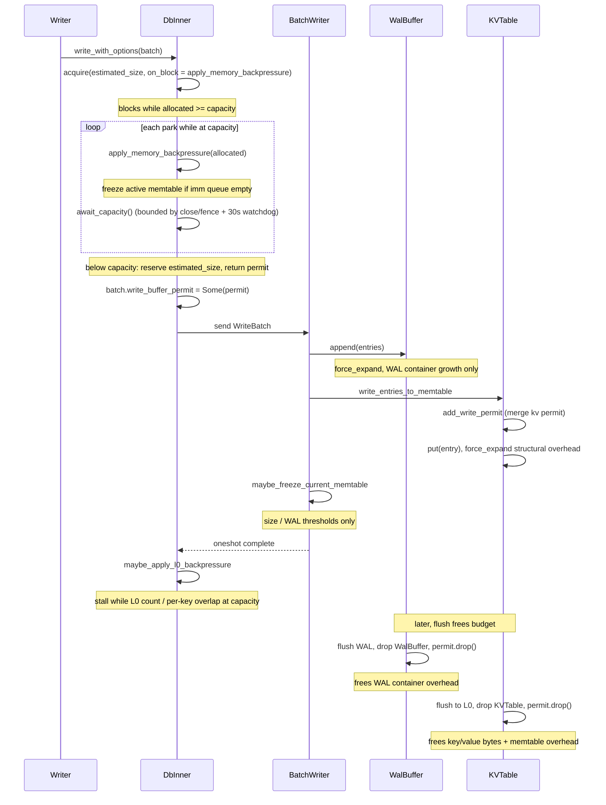
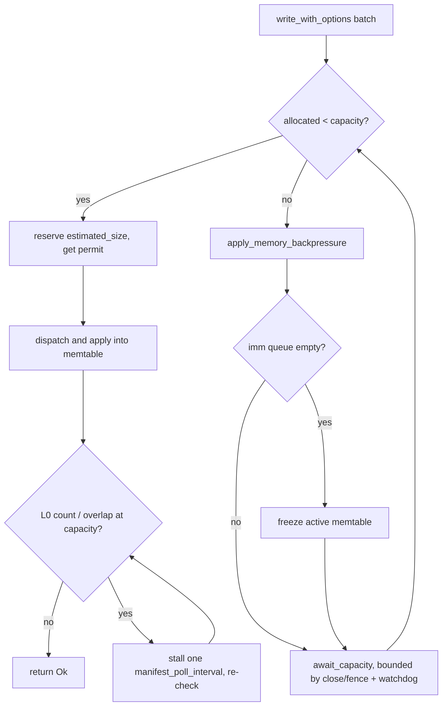

# Write Buffer Manager

Table of Contents:

<!-- TOC start (generate with https://bitdowntoc.derlin.ch) -->

- [Summary](#summary)
- [Motivation](#motivation)
- [Goals](#goals)
- [Non-Goals](#non-goals)
- [Design](#design)
  - [Phase 1: Live Write Buffer Capacity Enforcement](#phase-1-live-write-buffer-capacity-enforcement)
    - [ByteBudgetSemaphore](#bytebudgetsemaphore)
    - [ByteBufferManager](#bytebuffermanager)
    - [ByteBufferPermit](#bytebufferpermit)
    - [Integration into the Write Path](#integration-into-the-write-path)
    - [Memory Tracking Responsibilities](#memory-tracking-responsibilities)
    - [Size Estimation Algorithms](#size-estimation-algorithms)
    - [Memtable Permit Tracking](#memtable-permit-tracking)
    - [WAL Replay](#wal-replay)
    - [Backpressure Enhancement](#backpressure-enhancement)
    - [Public API and Builder](#public-api-and-builder)
    - [Defaults](#defaults)
  - [Phase 2: Instance Registry for Intelligent Backpressure (WIP)](#phase-2-instance-registry-for-intelligent-backpressure-wip)
- [Pathological Cases](#pathological-cases)
- [Impact Analysis](#impact-analysis)
  - [Core API & Query Semantics](#core-api--query-semantics)
  - [Consistency, Isolation, and Multi-Versioning](#consistency-isolation-and-multi-versioning)
  - [Time, Retention, and Derived State](#time-retention-and-derived-state)
  - [Metadata, Coordination, and Lifecycles](#metadata-coordination-and-lifecycles)
  - [Compaction](#compaction)
  - [Storage Engine Internals](#storage-engine-internals)
  - [Ecosystem & Operations](#ecosystem--operations)
- [Operations](#operations)
  - [Performance & Cost](#performance--cost)
  - [Observability](#observability)
  - [Compatibility](#compatibility)
- [Testing](#testing)
- [Rollout](#rollout)
- [Alternatives](#alternatives)
- [Open Questions](#open-questions)
- [References](#references)

<!-- TOC end -->

Status: Implemented

Authors:

* [Zach Schoenberger](https://github.com/zach-schoenberger)

## Summary

This RFC introduces a `ByteBufferManager` — a byte-budget primitive — used to
enforce a memory budget on in-flight write data. By default each SlateDB
instance creates its own `ByteBufferManager` internally, sized from
`max_unflushed_bytes`; callers may optionally supply their own via
`DbBuilder::with_write_buffer_manager()`.

Phase 1 tracks and bounds the memory consumed by write batches, memtables, and
WAL buffers. On the live write path a blocking `acquire` reserves budget for the
batch's estimated size before dispatch, running an async `on_block` callback
(`apply_memory_backpressure`) that frees budget while it waits; the returned RAII
permit is released when the owning memtable or WAL buffer is dropped after flush.
This byte budget **replaces** the old point-in-time `max_unflushed_bytes`
snapshot backpressure mechanism entirely. A second, post-dispatch gate
(`maybe_apply_l0_backpressure`) stalls the writer on compaction lag. The
mechanism, its shared-manager safety, and the two gates are detailed in
[Integration into the Write Path](#integration-into-the-write-path) and
[Backpressure Enhancement](#backpressure-enhancement).

Phase 2 (WIP) builds on the shareable `ByteBufferManager` to add an instance
registry for intelligent, per-instance backpressure across DB instances that
share a budget.

## Motivation

SlateDB's existing backpressure mechanism does a good job of keeping memory
usage in check under most workloads: it polls the aggregate size of WAL +
immutable memtables against `max_unflushed_bytes` and stalls writers when the
threshold is exceeded. Today the check is a point-in-time snapshot
of memory already consumed. Between the check passing and the write landing
in the memtable, concurrent writes can increase memory pressure beyond the
intended budget. A proactive reservation step would let us bound memory
*before* the write is dispatched.

Separately, the current backpressure check reads the database state under a lock
to aggregate sizes. A lock-free tracking primitive would scale more
naturally as we add new pools.

The `ByteBufferManager` addresses these opportunities by:

- **Reserving** budget for each write batch via the blocking `acquire` before
  dispatch, closing the check-then-write gap the snapshot left open.
- **Applying backpressure while the reservation waits** via an async `on_block`
  callback (`apply_memory_backpressure`), and **stalling on compaction lag after
  apply** via a second gate (`maybe_apply_l0_backpressure`).
- Automatically **releasing** permits when the owning memtable or WAL buffer is
  dropped (i.e., after flush to L0 / flush to object storage).
- Using lock-free atomics for all budget tracking, **replacing** the state-lock
  based `max_unflushed_bytes` snapshot on the write path with a contention-free
  reservation.

## Goals

- Enforce a global memory budget on in-flight write data (write batches through
  memtable flush).
  - The memory usage of the allocated write buffers (memtables, both current and immutable, and WAL buffers) should count towards the limit. This should not be double counted if it is one allocation (e.g. key/value `Bytes` shared between the WAL buffer and the memtable are charged once, by the memtable).
  - DbReader instances should be able to use the memory budget in future phases.
- The buffer memory limits should be observed as strictly as possible, erring towards over-counting if needed. Both user-provided key/value bytes and structural overhead (KVTable, WalBuffer, SkipMap nodes, etc.) count towards the budget.
- Provide an RAII permit lifecycle: `acquire` (blocking) before dispatch on the
  live path — or non-blocking `force_acquire` for structural overhead, WAL
  buffers, and replay — merge into the memtable on apply, release on memtable
  (and WAL buffer) drop.
- Replace the point-in-time `max_unflushed_bytes` snapshot backpressure
  mechanism with the byte budget (not run both).
- Add compaction-lag signals via a post-dispatch `maybe_apply_l0_backpressure`
  gate so writers also stall when compaction falls behind. This adds a
  *writer-side* stall on the pre-existing `l0_max_ssts` / `l0_max_ssts_per_key`
  thresholds and their flush-dispatch gate (`FlushTracker::can_dispatch`), active
  only when a compactor is configured to drain L0.
- Keep the live path compatible with a **shared** manager across DB instances
  (a blocked writer reserves no budget of its own and every wait is bounded by a
  close/fence + watchdog relief loop — see
  [Integration into the Write Path](#integration-into-the-write-path)).
- Avoid locking the database state for budget tracking.
- Allow callers to optionally share a budget across multiple DB instances via
  `DbBuilder::with_write_buffer_manager()`. (Phase 2) build a registry pattern
  on top of this for intelligent, per-instance backpressure.
- The configuration of the memory manager should be as simple as possible — ideally just one size. Additional configs can be added in future and then only if they are really needed.

## Non-Goals

- Tracking block cache or read-path memory.
- Tracking the transient memory used to **build L0 SSTs** during a flush. A
  flush encodes a frozen memtable into an SST, which can transiently consume
  roughly 2–3x the memtable's in-memory size (encoder buffers, block builders,
  the output SST bytes) before the memtable permit is released. That overhead
  is currently **untracked**; the budget accounts for the memtable, not the SST
  being produced from it. Whether to leave it untracked or offer opt-in
  accounting is an [Open Question](#open-questions).
- Tracking compaction memory. Compaction reads and writes SSTs on its own
  threads with its own buffers; none of that is charged to the write buffer
  budget.
- Tracking struct byte allocations that will never be released like `DbInner::write_notifier`.
- Enforcing a hard limit on memory. `force_acquire` (used for structural
  overhead, WAL buffers, and replay) can intentionally overshoot capacity;
  backpressure bounds *new* writes, not existing allocations.
- Guaranteeing exact byte-level accounting (estimates are conservative
  approximations).
- (Phase 2) Per-instance tracking and intelligent backpressure policies — this
  RFC only outlines the direction.

## Design

### Phase 1: Live Write Buffer Capacity Enforcement

Phase 1 introduces three new types and integrates them into the existing write
path.

#### ByteBudgetSemaphore

The core primitive is an async semaphore built on `AtomicUsize` + `tokio::Notify`
that tracks allocations in bytes rather than discrete permits.

```rust
struct ByteBudgetSemaphore {
    notify: Notify,
    allocated_bytes: AtomicUsize,
    waiter_cnt: AtomicUsize,
    capacity: usize,
}
```

**Why not `tokio::sync::Semaphore`?** Two reasons. First, **soft
over-allocation**: `force_acquire` (WAL buffers, replay, structural overhead)
and a single admitted write can both push `allocated_bytes` above `capacity`,
whereas Tokio's semaphore enforces a hard limit and can never over-issue.
Second, the **async `on_block` hook**: `acquire` awaits a caller-supplied async
callback before each park so a blocked writer can perform relief work (freeze a
memtable, wait for the budget to drain) on every wait; `tokio::sync::Semaphore`
has no such hook. A custom `ByteBudgetSemaphore` also lets `release` broadcast
to `await_capacity` waiters via `notify_waiters`.

The semaphore operations used in production (interface summary; bodies elided):

```rust
impl ByteBudgetSemaphore {
    fn new(capacity: usize) -> Self;
    async fn acquire<F, Fut, Err>(&self, num_bytes: usize, on_block: F) -> Result<usize, Err>
    where
        F: Fn(usize, usize) -> Fut,
        Fut: Future<Output = Result<(), Err>>;
    fn force_acquire(&self, num_bytes: usize);
    fn release(&self, num_bytes: usize);
    fn available(&self) -> usize;
    fn allocated(&self) -> usize;
    async fn wait_for_allocated_below(&self, num_bytes: usize);
}
```

- **`acquire`** — the blocking reservation primitive used by the live write
  path. On each attempt it reserves `num_bytes` immediately when `allocated_bytes`
  is below `capacity` (atomic `compare_exchange` fast path); otherwise it parks
  on `notify` until a `release` drops allocation below `capacity`, then
  re-checks. `on_block` is an **async** callback invoked immediately before every
  park, receiving `(parked_cnt, allocated)` — `parked_cnt == 1` on the first park
  — and is awaited before the park so callers can perform async relief work (e.g.
  freezing the active memtable and waiting for the budget to drain) on each wait.
  It returns the number of times it parked. Because the write's bytes are only
  reserved once allocation is below `capacity`, a parked writer holds no budget
  of its own while it waits.
- **`force_acquire`** — non-blocking `fetch_add`. Can push `allocated_bytes`
  above `capacity`. Used for structural overhead, WAL buffers, and WAL replay.
- **`release`** — subtracts `num_bytes` from `allocated_bytes` via `fetch_sub`
  and notifies any outstanding waiters parked waiting for allocation to drain
  below `capacity`.
- **`available`** — returns `capacity - allocated_bytes` (saturating to zero
  when over-allocated).
- **`allocated`** — returns the current `allocated_bytes` count.
- **`wait_for_allocated_below`** — blocks until `allocated_bytes` drops below
  the given threshold *without* reserving (used by `await_capacity`). Uses the
  same enable-before-recheck pattern as `acquire` so a `release` between the
  initial load and park cannot be missed.

#### ByteBufferManager

A cloneable, generic byte-budget handle wrapping a shared
`Arc<ByteBudgetSemaphore>`. It is stored in a **new** `write_buffer_manager`
field on `DbInner` (the baseline `DbInner` had no such field) and is also
threaded into `DbState::new`, `KVTable::new`, and the WAL machinery — all of
which gain a `ByteBufferManager` parameter they did not have before.

```rust
#[derive(Clone)]
pub struct ByteBufferManager {
    inner: Arc<ByteBudgetSemaphore>,
}
```

The manager tracks a single threshold:

- **`capacity`** — the byte budget. A caller may reserve while `allocated` is
  below `capacity`; reaching `capacity` is what engages backpressure. Live-path
  admission blocks in `acquire` until allocation is below `capacity`, then
  reserves the write's full request atomically — so a single admitted write can
  push `allocated` up to roughly one write's worth above `capacity` (the
  intentional soft overshoot). `force_acquire` (WAL buffers, replay) can also
  push `allocated` above `capacity`.

Backpressure engages when the budget is full and relieves as soon as allocation
dips below full — there is no sub-capacity watermark or cool-off band. The
builder requires `capacity` to leave room for one active memtable to reach
`l0_sst_size_bytes` (plus fixed per-memtable overhead) so a memtable can fill
and freeze before the budget is exhausted.

Methods (interface summary; bodies elided):

```rust
impl ByteBufferManager {
    pub fn new(capacity: usize) -> Self;
    pub fn unbounded() -> Self;
    pub async fn acquire<F, Fut, Err>(&self, num_bytes: usize, on_block: F) -> Result<ByteBufferPermit, Err>
    where
        F: Fn(usize, usize) -> Fut,
        Fut: Future<Output = Result<(), Err>>;
    pub fn force_acquire(&self, num_bytes: usize) -> ByteBufferPermit;
    pub fn force_expand(&self, permit: &ByteBufferPermit, num_bytes: usize);
    pub fn available(&self) -> usize;
    pub fn capacity(&self) -> usize;
    pub fn allocated(&self) -> usize;
    pub fn at_capacity(&self) -> bool;
    pub async fn await_capacity(&self);
}
```

- **`new`** — constructs a manager with the `capacity` threshold described
  above.
- **`unbounded`** — `capacity == usize::MAX`; never applies
  backpressure. Used for read-only paths (e.g. `DbReader` / empty sentinel
  tables) and tests where the API requires a manager but accounting is
  unnecessary. Production WAL replay does *not* use `unbounded`; it charges the
  shared DB manager via `force_acquire`.
- **`acquire`** — the blocking reservation used by the live write path (a thin
  wrapper over `ByteBudgetSemaphore::acquire`), returning `Result<ByteBufferPermit,
  Err>`. The `on_block` callback is async and its error type propagates out, so a
  DB error raised while waiting (e.g. the DB closing) aborts the reservation. The
  wrapper logs when a write first blocks (`parked_cnt == 1`) and when it is
  unblocked after having parked; the park count is otherwise consumed internally.
- **`force_acquire`** — unconditionally reserves bytes without blocking; can
  push `allocated_bytes` above `capacity`. Used for structural overhead, WAL
  buffer creation, and WAL replay.
- **`force_expand`** — unconditionally adds `num_bytes` to an existing permit's
  reservation. Used by `KVTable::put` (per-entry structural overhead) and
  `WalBuffer::append` to record growth of the WAL buffer container as entries
  are appended. Today that WAL growth is the container's own bookkeeping
  (the `VecDeque`'s backing capacity — pointers/metadata), **not** the key/value
  bytes, which are owned by the `KVTable`; framing it as "record WAL buffer
  growth" keeps room to charge additional per-entry WAL overhead here later
  without changing the mechanism.
- **`available`** / **`capacity`** / **`allocated`** — accessors for
  `capacity - allocated_bytes` (saturating), the total budget, and the current
  outstanding reservation.
- **`at_capacity`** — `true` once `allocated_bytes >= capacity`. A convenience
  predicate for callers and tests; the live write path relies on `acquire`'s
  internal below-capacity check rather than reading this directly.
- **`await_capacity`** — the relief wait `apply_memory_backpressure` blocks on:
  resolves once `allocated_bytes < capacity`, without reserving any bytes.

#### ByteBufferPermit

An RAII guard that releases its byte reservation on drop. Multiple permits can
be consolidated via `merge()` to combine reservations into a single guard.
The type is `pub` inside the private `byte_buffer_manager` module but is **not**
re-exported from `lib.rs` — external callers interact with it only indirectly
through `ByteBufferManager` / `DbBuilder`.

```rust
pub struct ByteBufferPermit {
    semaphore: Arc<ByteBudgetSemaphore>,
    reserved_bytes: AtomicUsize,
}

impl ByteBufferPermit {
    pub fn size(&self) -> usize;
    pub fn merge(&self, other: &ByteBufferPermit);
    pub fn take(&self, num_bytes: usize) -> Self;
}

impl Drop for ByteBufferPermit {
    fn drop(&mut self); // calls semaphore.release(reserved_bytes)
}
```

- **`size`** — returns the number of bytes currently reserved by this permit.
- **`merge`** — atomically zeroes the source permit's `reserved_bytes` and adds
  that value to the target. The source permit's `Drop` becomes a no-op,
  avoiding double-release. Used by `KVTable::add_write_permit` to consolidate
  multiple write batch permits into the table's single permit.
- **`take`** — subtracts up to `num_bytes` from this permit (saturating if
  fewer remain) and returns a new permit owning those bytes. Used by
  `KVTable::put` in the overwrite case to release cancelled structural
  overhead and replaced entry data back to the budget.

#### Integration into the Write Path

The permit lifecycle flows through the write path as follows:



The fundamental pattern is that the **user provides byte buffers** (keys and
values), and those byte buffer metrics are tracked exclusively in relation to
the `KVTable`. The WAL buffer and dispatch channel do *not* account for the
key/value data bytes themselves — only the `KVTable` does.

1. **`WriteBatch`** gains a **new** `write_buffer_permit: Option<Arc<ByteBufferPermit>>`
   field (the baseline `WriteBatch` had no permit and no size method).
   `DbInner::write_with_options` obtains the permit from `acquire` and assigns
   it to this field before dispatching the batch. The permit accounts **only
   for the key and value byte buffers** that the user is storing (the batch's
   new `estimated_size()`) — it does not account for the `WriteBatch` struct
   itself, the dispatch channel, or any other transient overhead.

2. **`DbInner::write_with_options`** calls the blocking
   `acquire(estimated_size, on_block)` *before* dispatch, where `on_block` is
   `apply_memory_backpressure`. `acquire`'s fast path reserves immediately when
   allocation is below `capacity`, so the common case is a single
   `compare_exchange`. When at capacity, `acquire` parks and, before each park,
   awaits `apply_memory_backpressure`, which freezes the active memtable (only
   when the imm queue is empty, to seed a drainable imm) and waits until
   allocation drains below `capacity`. Only once below capacity does `acquire`
   reserve the write's bytes and return the permit; the batch is then attached to
   the permit, dispatched, and applied. After apply completes, the writer calls
   `maybe_apply_l0_backpressure()`, which stalls on the L0 count / per-key
   overlap signals (see [Backpressure Enhancement](#backpressure-enhancement)).

   Blocking in `acquire` before dispatch is safe here precisely because the
   waiting write **has not reserved its own bytes** and the `on_block` freeze
   only touches local state and re-fires on every park:
   - **No self-deadlock on the waiter's own bytes.** The write's
     `estimated_size` is reserved only after allocation is below capacity, so a
     parked writer holds no budget of its own that it would need to release to
     make progress. The `on_block` freezes an *already-applied* prior write's
     active memtable, producing an imm the flusher can drain to free budget.
   - **Re-asserted relief.** `on_block` runs on every park, so a freeze request
     that raced ahead of the flusher (or landed on the wrong shared-manager
     instance) is re-issued on the next park rather than being lost.
   - **Bounded wait.** Every wait inside `apply_memory_backpressure` is wrapped
     in `await_backpressure_relief`, which resolves on close/fence or a 30s
     watchdog, so a wedged or shared flush pipeline can never hang a writer
     indefinitely.

   The **`WriteBatch` bytes are already allocated** by the time we reach the
   write path — the user has handed us the keys and values — so blocking does
   not reclaim that memory; it gates *admission* so the budget bounds how many
   in-flight writes accumulate, freezing prior state to make room.

3. **`DbInner::write_batch`** (batch writer) is unchanged relative to the
   baseline except that it now merges the write permit into the `KVTable`. It
   still applies entries and runs the same size/WAL-based
   `maybe_freeze_current_memtable`; the memtable freeze that responds to the
   byte budget is handled separately by `apply_memory_backpressure` (the
   `acquire` `on_block`), not here.

4. **`DbInner::write_entries_to_memtable`** takes the permit off the batch and
   merges it into the table's own permit. From this point, the `KVTable` owns
   the byte buffer budget for those key/value bytes.

##### Worked Examples

The following per-case walkthroughs show how a write interacts with the budget.
All three describe the **actual** behavior: the live path blocks in `acquire`
(running `apply_memory_backpressure` on each park) until it can reserve its
bytes below capacity, then dispatches and applies the batch, then runs the
post-dispatch L0 gate.



- **10 MB batch, 1 MB budget (single write larger than the whole budget).**
  Allocation starts at 0 (below `capacity`), so `acquire` reserves ~10 MB in one
  shot and returns immediately — a single write is admitted even when it exceeds
  the whole budget, since it cannot be split and its bytes already exist. That
  reservation pushes `allocated` to ~10 MB, far above `capacity`; the *next*
  write blocks in `acquire`, whose `on_block` freezes the 10 MB active memtable
  and waits until the flush drains it below 1 MB.
- **100 MB budget, 1 MB memtable (typical steady state).** `acquire(~1 MB)` sees
  `allocated` well under the 100 MB budget and reserves on the fast path — no
  `on_block`, no freeze, no wait. This is the common fast path.
- **100 MB budget, 99 MB already outstanding (approaching the cap).** A new
  ~2 MB write still finds `allocated` (99 MB) below `capacity`, so it reserves
  and pushes `allocated` to ~101 MB — the intentional soft overshoot of roughly
  one in-flight write. The *following* write now sees `allocated >= capacity`,
  blocks in `acquire`, freezes the active memtable via `on_block`, and parks
  until flushes bring `allocated` back below 100 MB.

#### Memory Tracking Responsibilities

In the baseline none of these structures tracked memory against a budget —
`KVTable::new()`, `WalBuffer::new()`, and `WriteBatch` took no manager and held
no permit. This RFC gives each a permit (or a shared manager handle) and assigns
each a distinct, non-overlapping slice of memory to charge:

- **`KVTable` (memtable)** — `KVTable::new` gains a `ByteBufferManager`
  parameter (taken by value — a cheap `Arc` clone — and stored on the struct so
  `put` can charge per-entry overhead) and the struct gains an
  `Arc<ByteBufferPermit>` field. It now tracks *everything* related to its state:
  - The user-provided key/value byte buffers (via the merged write permit)
  - Its own structural overhead: `KVTable` struct size, `SequenceTracker`
    pre-allocation, per-entry `SkipMap` node overhead, and `SequencedKey` +
    `RowEntry` struct sizes
  - On creation, `force_acquire(SEQ_TRACKER_OVERHEAD + KVTABLE_SIZE)` reserves
    the base cost; on each `put()`, `force_expand` adds per-entry structural
    overhead

- **`WalBuffer`** — gains a `write_buffer_manager` handle and a
  `write_buffer_permit`, and now tracks only its own structural overhead (the
  `WalBuffer` struct size and `VecDeque` capacity growth as entries are
  appended). It does **not** track the key/value data bytes. Those bytes are
  shared (via `Bytes` reference counting) with the `KVTable`, which is the sole
  owner of the key/value budget. The WAL buffer charges the **same shared DB
  `write_buffer_manager`** as the memtables — it does not use a private
  `unbounded()` budget. The manager is threaded into the WAL machinery at
  construction: `DbBuilder::build` → `WriterFencer::new(..)` →
  `SlateDbWalWriterInit::load(.., write_buffer_manager)` →
  `SlateDbWalWriter::start_new(.., write_buffer_manager)`, which creates each
  `WalBuffer` via `WalBuffer::new(&write_buffer_manager)`.
  Each `WalBuffer`'s permit is released when the buffer is flushed to object
  storage and dropped, freeing budget for new writes just like a memtable freed
  after its L0 flush.

- **`DbStateView` (read-side `Arc<KVTable>`)** — unchanged structurally; the
  `KVTable` can be shared via `Arc` for read access (e.g., in `DbStateView`).
  This shared reference does **not** independently track byte buffers — it is a
  view on the original table. The budget for key/value bytes remains with the
  original `KVTable`'s permit and is released only when the last `Arc` reference
  is dropped (i.e., after flush completes and all readers release the table).

#### Size Estimation Algorithms

All of the accounting below is new; the baseline computed none of these budget
charges. Each component uses a specific formula to calculate the bytes it
charges against the write buffer budget.

**Write Batch (user-provided key/value bytes)**

`WriteBatch::estimated_size()` is a **new** method. It sums only the raw key and
value byte lengths across all operations in the batch:

```
batch_size = ∑ op.estimated_kv_size()

where estimated_kv_size =
    Put  | Merge : key.len() + value.len()
    Delete       : key.len()
```

This is the size passed to `acquire` when the write-path permit is
created. It represents the user-provided byte buffers and nothing else.

**KVTable (memtable)**

The `KVTable` charges two categories of bytes against the budget:

1. *Base overhead* — acquired once at table creation:

   ```
   base = SEQ_TRACKER_OVERHEAD + KVTABLE_SIZE

   where
     SEQ_TRACKER_OVERHEAD = 8192 * size_of::<u64>() * 2   (~128 KiB)
     KVTABLE_SIZE         = size_of::<KVTable>()
   ```

2. *Per-entry structural overhead* — expanded on each `put()`:

   ```
   entry_overhead = SKIPMAP_ENTRY_OVERHEAD
                  + size_of::<SequencedKey>()
                  + size_of::<RowEntry>()

   where
     SKIPMAP_ENTRY_OVERHEAD = 128   (tower pointers, node header, alignment)
     SequencedKey           = size_of::<SequencedKey>()  (Bytes handle + u64 seq)
     RowEntry               = size_of::<RowEntry>()      (struct footprint, not data)
   ```


   In the overwrite case (same `SequencedKey` already exists), the just-
   expanded structural overhead and the replaced entry's data-size estimate
   are released back via `permit.take()` (which saturates if the permit is
   somehow short):

   ```
   excess = entry_overhead + old_entry.estimated_size()
   ```

The total budget consumed by one `KVTable` is therefore:

```
total = base
      + (num_entries * entry_overhead)
      + user_kv_bytes          (from merged write batch / replay permits)
      - overwrite_corrections  (excess returned via take())
```

**WalBuffer**

The `WalBuffer` charges only its own container overhead:

1. *Base overhead* — acquired once at buffer creation:

   ```
   base = size_of::<WalBuffer>()
   ```

2. *VecDeque capacity growth* — expanded each time the internal `VecDeque`
   reallocates:

   ```
   growth_bytes = (cap_after - cap_before) * size_of::<RowEntry>()
   ```

   This is only charged when the `VecDeque`'s capacity actually increases
   (i.e., when it reallocates its backing buffer to fit more entries).

The total budget consumed by one `WalBuffer` is:

```
total = base + cumulative_growth_bytes
```

Notably, the `WalBuffer` does **not** charge for the key/value data bytes of
the entries it holds (those are owned by the `KVTable`, per
[Memory Tracking Responsibilities](#memory-tracking-responsibilities)). Only the
container overhead above is charged against the shared DB `write_buffer_manager`
(via `force_acquire` on creation and `force_expand` on growth), and released when
the buffer is dropped after its flush to object storage.

#### Memtable Permit Tracking

`KVTable` gains an `Arc<ByteBufferPermit>` field (the baseline `KVTable` had no
such field) that is created at construction time from the `ByteBufferManager`
now passed to `KVTable::new` (covering the base structural overhead). When write
batches land in the table, their permits are merged into this single table
permit via `ByteBufferPermit::merge()`. This ensures all tracked bytes — both
the user-provided key/value buffers and the table's own structural allocations
— are released in a single `Drop` when the table is dropped after flush.

```rust
write_buffer_permit: Arc<ByteBufferPermit>,
```

```rust
/// Merges an external write-buffer budget permit into this table's
/// permit so that a single drop releases the combined reservation.
pub(crate) fn add_write_permit(&self, permit: &ByteBufferPermit) {
    self.write_buffer_permit.merge(permit);
}
```

#### WAL Replay

During WAL replay, the replay loop must make forward progress to populate the
memtable state, so it uses non-blocking `force_acquire` (blocking on a
not-yet-flushed table's own bytes would deadlock). Two things change here
relative to the baseline. First, each recovered memtable now **charges the
shared DB `write_buffer_manager`** via `force_acquire` for the sum of each
applied row's `RowEntry::estimated_size()` (key + value + seq + optional
timestamps — slightly heavier than the live `WriteBatch::estimated_size()`
key/value-only estimate), merging the resulting permit into the table; the
baseline did no budget accounting during replay. The table's own base
structural overhead is reserved at `KVTable::new` as usual. Second, the loop is
**reordered**: the baseline ran freeze → backpressure → `replay_memtable`
(integrate last), whereas it now integrates first.

For each recovered memtable the outer replay loop now:

1. **Integrates first** via `replay_memtable` (freezes the previous active into
   an imm the flusher can drain and installs the new table).
2. Calls `maybe_freeze_memtable` (encoded size ≥ `max_unflushed_bytes`) so an
   oversized active is frozen and can't park forever. (Unchanged from baseline.)
3. Drains the byte budget with an explicit loop:

   ```rust
   let mut allocated = write_buffer_manager.allocated();
   while allocated >= write_buffer_manager.capacity() {
       apply_memory_backpressure(allocated).await?;
       allocated = write_buffer_manager.allocated();
   }
   ```

   `apply_memory_backpressure` freezes the active (when the imm queue is empty)
   so SkipMap/structural overhead that exceeds capacity still yields a flushable
   imm, then waits until pressure eases. Looping on `allocated >= capacity`
   bounds how far replay races ahead of the flusher.

Waiting *before* integrate (as the baseline did) would deadlock once budget
accounting is added: the next table's `force_acquire`d bytes are still local and
the active table is not yet frozen, so nothing can free budget — hence the
reorder. Replay is the caller that pairs `apply_memory_backpressure` with an
explicit encoded-size freeze and drain loop; the steady write path instead runs
`apply_memory_backpressure` as the `acquire` `on_block`.

#### Backpressure Enhancement

The byte budget **replaces** the old `max_unflushed_bytes` snapshot
backpressure mechanism; that snapshot check and its `await_uploaded` wait are
gone from the write path. In the baseline, backpressure flowed through a single
`maybe_apply_backpressure` method checking one condition
(`total_mem_size_bytes >= max_unflushed_bytes`). It is now split into **two
gates**, applied at different points in the write:

- **`apply_memory_backpressure`** — the memory gate, run *before* dispatch as
  the async `on_block` of `acquire` (and as the drain loop body during replay).
- **`maybe_apply_l0_backpressure`** — the compaction-lag gate, run *after* the
  batch is applied.

Only the **byte budget** is a brand-new mechanism; the two L0 signals add
*writer-side* stalls on infrastructure that already existed (the `l0_max_ssts` /
`l0_max_ssts_per_key` settings, the `FlushTracker::can_dispatch` flush-dispatch
gate, and the `l0_stall_count` metric).

1. **Byte budget** (`allocated >= capacity`) — *new.* Checked implicitly by
   `acquire` (its fast path reserves only below capacity). Relief comes from
   flushes releasing permits; the `on_block` (`apply_memory_backpressure`) waits
   on `await_capacity()` until allocation drains back below `capacity`.
2. **L0 SST count** (`l0_at_capacity()`) — *new writer-side stall on an existing
   signal.* The largest single tree's L0 SST count has reached `l0_max_ssts`.
   Already enforced per tree by the flush-dispatch gate
   (`FlushTracker::can_dispatch`), which stops *dispatching* flushes to a full
   tree; the new check surfaces the same threshold as writer backpressure.
3. **Per-key L0 overlap** (`l0_overlap_at_capacity()`) — *new writer-side stall
   on an existing signal.* The per-key analogue: the largest single tree's
   per-key L0 overlap (the peak number of L0 SST views covering any one key) has
   reached `l0_max_ssts_per_key`, bounding point-read amplification the way the
   count signal bounds manifest growth. Also already enforced by the
   flush-dispatch gate; now surfaced as writer backpressure too.

The two L0 writer-side stalls exist because the flush-dispatch gate stops
*adding* to a full tree but only compaction *removes* L0 SSTs, so a small-value /
fast-flush workload can keep the byte budget well under capacity while L0 grows
unbounded when compaction can't keep up — stalling the flusher indefinitely
while writers keep accepting work. The new checks stall the *writer* so
backpressure reaches the client. Each reads a new lock-free atomic on `DbInner`
(`max_l0_sst_count`, `max_l0_overlap`) that the memtable flusher's manifest
writer now maintains, and both are gated on
`settings.compactor_options.is_some()`: without a compactor, nothing removes L0
SSTs, so stalling on an L0 signal could never be relieved (and a single tree's
L0 is already bounded by the flush-dispatch gate plus the byte budget). This
keeps no-compactor deployments and tests from deadlocking.

```rust
// DbInner gains two lock-free atomics, maintained by the memtable flusher's
// manifest writer, recording the largest single-tree L0 SST count and per-key
// L0 overlap seen at the last manifest mutation. The write path reads these to
// gate L0 backpressure without taking the state lock.
max_l0_sst_count: Arc<AtomicUsize>,
max_l0_overlap: Arc<AtomicUsize>,
```

**Memory gate — `apply_memory_backpressure`.** Invoked as the `acquire`
`on_block` (once per park) and as the replay drain-loop body. Given the current
allocation, it: checks `check_closed()`, records backpressure, refreshes the
`total_mem_size_bytes` metric, fires the `db-backpressure-applied` fail point,
warns, and — this is new — **freezes the active memtable itself** to seed a
drainable imm, but only when the imm queue is empty. Existing imms drain and
release budget on their own; freezing an under-full active when imms already
exist just manufactures an extra small L0 SST. If draining the existing imm(s)
is not enough, the next park re-enters with an empty queue and freezes then. It
then waits via `await_backpressure_relief(await_capacity())`.

**Compaction-lag gate — `maybe_apply_l0_backpressure`.** Run after apply. Its
fast path is a single early-return when neither L0 signal is tripped, so a
normal write pays only two atomic loads:

```rust
// Fast path: return immediately unless an L0 signal is tripped.
if !(l0_at_capacity() || l0_overlap_at_capacity()) {
    return Ok(());
}
```

When a signal is tripped it loops, re-checking `check_closed()` and handling
whichever L0 signal is active: it records backpressure, increments the matching
`l0_stall_count` counter (`num_ssts` / `num_ssts_per_key`), fires the fail
point, and warns. There is no direct completion signal to await (a memtable
*upload* would only add to L0); relief comes from compaction draining L0, which
the writer observes when the manifest writer's poll refreshes the atomics. So it
re-checks after one `manifest_poll_interval` sleep.

**Bounded, interruptible waits.** Every wait in either gate is wrapped in
`await_backpressure_relief`, which resolves on the earliest of: the supplied
progress future, the DB being closed/fenced (whose terminal error is returned),
or a 30s watchdog that forces a re-check rather than block forever. A stalled
writer therefore always makes forward progress on close/fence or at the watchdog
interval, so a wedged (or shared) flush pipeline cannot hang a writer
indefinitely.

```rust
async fn await_backpressure_relief(
    &self,
    progress: impl Future<Output = Result<(), SlateDBError>>,
) -> Result<(), SlateDBError> {
    tokio::select! {
        biased;
        result = async { Err(self.await_closed().await) } => result,
        result = progress => result,
        _ = self.system_clock.sleep(Duration::from_secs(30)) => Ok(()),
    }
}
```

The budget-triggered memtable freeze happens **solely in
`apply_memory_backpressure`**: neither `write_batch` nor the replay loop freezes
in response to the byte budget. They only perform the pre-existing size/WAL-
threshold freeze via `maybe_freeze_current_memtable` / `maybe_freeze_memtable`
(unchanged from the baseline). Handling the budget-triggered freeze in one place
avoids manufacturing small L0 SSTs on every at-capacity write and lets the
imm-queue-empty check gate it.

> **Future work — caller-supplied write timeout.** The DB-level bound above
> (close/fence + 30s watchdog) is the only wait bound today. A caller-supplied
> per-write timeout on the pre-dispatch backpressure wait is a natural extension
> but is **not yet implemented**; the reservation flow leaves room for it (the
> cancellation point is the `acquire`/`on_block` wait, before dispatch). See
> [Open Questions](#open-questions).

> **Consideration:** The `ByteBufferManager` tracks outstanding bytes more
> accurately than the old `max_unflushed_bytes` check, which relied on a
> point-in-time snapshot of WAL + immutable memtable sizes under a read lock:
> the byte budget accounts for all in-flight write data from reservation through
> flush (memtable overhead + key/value bytes + WAL buffer overhead). The setting
> name is kept only as the default seed for the budget capacity. The L0
> count / overlap signals are orthogonal to memory: they bound compaction lag
> and read amplification, which the byte budget alone does not.

#### Public API and Builder

- `ByteBufferManager` is re-exported from `lib.rs` as a public type.
- `ByteBufferPermit` is `pub` in the private `byte_buffer_manager` module but
  is **not** re-exported from `lib.rs`; external crates cannot name the type.
- `DbBuilder::with_write_buffer_manager(ByteBufferManager)` lets a caller supply
  their own manager — for a custom capacity, or to share a single
  budget across multiple DB instances.
- When no manager is supplied, each instance creates its own `ByteBufferManager`
  internally with `capacity` set to
  `settings.max_unflushed_bytes`.
- (Phase 2 will layer an instance registry and per-instance accounting on top of
  the shared-manager capability that already exists here.)

#### Defaults

When no explicit `ByteBufferManager` is provided via
`DbBuilder::with_write_buffer_manager()`, the database constructs one with:

- **`capacity`** = `settings.max_unflushed_bytes` (default 1 GB)

Backpressure triggers only when the full budget is consumed: `at_capacity()`
returns `true` once allocated bytes reach `capacity`. This is the simplest
behavior — the system allows writes to fill the budget completely before
applying backpressure, relying on the flush pipeline to drain immutable
memtables in the background.

Two independent checks keep the budget from being set so small that a write can
never land:

1. **Builder guard — minimum manager capacity.** The builder rejects any
   manager (default *or* supplied via `with_write_buffer_manager`) whose
   `capacity()` is below `MIN_WRITE_BUFFER_SIZE` (a fixed `1 MiB`). This floor
   covers the fixed overhead of a single `KVTable` (struct size, the
   `SequenceTracker` pre-allocation at ~128 KiB, SkipMap node overhead,
   per-entry key/value handles) plus the `WalBuffer` struct and its initial
   `VecDeque` allocation, so the budget can always admit at least one small
   write. This is the *only* validation applied to the manager's capacity; there
   is no separate `l0_sst_size_bytes`-derived capacity guard.

2. **Settings validation — freeze headroom.** Independently, `Settings::validate()`
   requires `max_unflushed_bytes > l0_sst_size_bytes`. Because the default
   manager's capacity is `max_unflushed_bytes`, this guarantees the default
   budget leaves room for an active memtable to reach its `l0_sst_size_bytes`
   freeze threshold (where the steady-path `maybe_freeze_current_memtable`
   freezes it) before the budget is exhausted — so something is always eligible
   to flush and free budget. Note this is a check on the *setting*, not on a
   supplied manager's capacity, and it does not additionally account for the
   fixed per-memtable structural overhead.

### Phase 2: Instance Registry for Intelligent Backpressure (WIP)

Phase 1 enforces budget limits but applies backpressure blindly — when the
budget is exhausted, all writers block regardless of which DB instance holds the
majority of the allocation. `DbBuilder::with_write_buffer_manager()` already
lets callers share one `ByteBufferManager` across instances; Phase 2 builds an
instance registry on top of that sharing to enable smarter backpressure
strategies by tracking which instances share the budget.

**Problem:** When a single `ByteBufferManager` is shared across multiple DB
instances via `DbBuilder::with_write_buffer_manager()`, an instance that has
consumed a disproportionate share of the budget causes all other instances to
stall. Without per-instance tracking there is no mechanism to identify the
heavy consumer or to direct backpressure at it specifically.

**Proposed direction:** Add an instance registry within the shared manager:

- **Registration** — Each DB instance registers itself with the shared
  `ByteBufferManager` on startup and deregisters on shutdown. The registry
  tracks per-instance metadata such as current byte allocation and instance
  identity.
- **Per-instance accounting** — Permits are tagged with their owning instance,
  allowing the manager to report per-instance budget consumption.
- **Backpressure policies** — With per-instance visibility, the manager can
  support smarter strategies such as:
  - *Proportional fairness* — stall only the instance that has exceeded its
    fair share rather than blocking all writers.
  - *Priority-based* — allow high-priority instances to preempt or receive
    larger budget slices.
  - *Targeted flush signaling* — notify the heaviest consumer to trigger an
    early flush, freeing budget for other instances.
- **Observability** — The registry enables per-instance metrics (bytes held,
  permits outstanding, time spent blocked) for debugging shared-budget
  contention.

Several concrete shapes this could take are captured here so the Phase 2 design
starts from them:

- **Per-consumer Views (exclusive sub-budgets).** Rather than every consumer
  drawing from one flat pool, introduce a `View` (working name) type that owns
  an exclusive slice of the shared budget carved out of the global budget. Each
  DB instance (or, later, each `DbReader`) acquires a `View` with a guaranteed
  minimum and an elastic maximum; the manager arbitrates the shared remainder
  between Views. This gives fairness and isolation without every write touching
  global state on the hot path. The intent is to **define the `View` type as
  part of Phase 2 now** (so the shared-manager API is shaped for it) and
  implement the arbitration policies incrementally.
- **Smoother / sawtooth-free backpressure.** Phase 1 backpressure is
  effectively binary (under capacity = free, over = stall), which can produce a
  sawtooth throughput pattern. A Phase 2 policy could ramp resistance as
  allocation approaches capacity — e.g. rate-limiting admitted writes with
  short sleeps rather than a hard park — to smooth the transition and keep
  latency more predictable under sustained pressure.
- **Explicit consumer identity / registration.** Follow the pattern SlateDB
  already uses for `DbCache`, where consumers register with a stable ID, so the
  registry can attribute allocation and target relief at a specific consumer
  rather than inferring it. This keeps the accounting model consistent with the
  block-cache side of the system.

Detailed design of Phase 2 is deferred to a future RFC, once Phase 1 is
validated in production and multi-instance sharing patterns are better
understood from production usage.

## Pathological Cases

When Phase 2 introduces shared budgets across instances, the following
pathological case can arise: 1 to N instances obtain buffer permits so that the
total allocated buffer is slightly under or equal to capacity. This
will cause any write by any other instance to always trigger a small memtable to
be flushed — essentially making each write to any instance that doesn't own a
significant portion of the buffer permits produce a new memtable. In order
to properly handle this kind of issue, the `ByteBufferManager` needs a way to
know what allocations are being held and a mechanism to trigger their release.
Phase 2's instance registry and intelligent backpressure policies are designed
to address this.

## Impact Analysis

SlateDB features and components that this RFC interacts with. Check all that
apply.

### Core API & Query Semantics

- [x] Basic KV API (`get`/`put`/`delete`)
- [ ] Range queries, iterators, seek semantics
- [ ] Range deletions
- [ ] Error model, API errors

### Consistency, Isolation, and Multi-Versioning

- [ ] Transactions
- [ ] Snapshots
- [ ] Sequence numbers

### Time, Retention, and Derived State

- [ ] Time to live (TTL)
- [ ] Compaction filters
- [ ] Merge operator
- [ ] Change Data Capture (CDC)

### Metadata, Coordination, and Lifecycles

- [ ] Manifest format
- [ ] Checkpoints
- [ ] Clones
- [ ] Garbage collection
- [ ] Database splitting and merging
- [ ] Multi-writer

### Compaction

- [ ] Compaction state persistence
- [ ] Compaction filters
- [x] Compaction strategies
- [ ] Distributed compaction
- [ ] Compactions format

Write backpressure now *also* stalls the writer on L0 SST count (`l0_max_ssts`)
and per-key L0 overlap (`l0_max_ssts_per_key`) when compaction falls behind.
These thresholds and their flush-dispatch gate already existed; this adds the
writer-side stall on the same thresholds. It is only active when a compactor is
configured to drain L0.

### Storage Engine Internals

- [x] Write-ahead log (WAL)
- [ ] Block cache
- [ ] Object store cache
- [ ] Indexing (bloom filters, metadata)
- [ ] SST format or block format

### Ecosystem & Operations

- [ ] CLI tools
- [ ] Language bindings (Go/Python/etc)
- [x] Observability (metrics/logging/tracing)

## Operations

### Performance & Cost

- **Write latency:** Under normal load, the reservation is a single atomic
  `compare_exchange` in `acquire`'s fast path — sub-microsecond overhead, and
  never touches the state lock; after apply, `maybe_apply_l0_backpressure`
  early-returns after two atomic loads. Under memory pressure, the write blocks
  in `acquire` (running `apply_memory_backpressure` on each park) until flushes
  free the byte budget; under compaction lag it blocks in
  `maybe_apply_l0_backpressure` until compaction drains L0. This is the desired
  behavior: controlled backpressure without holding the waiter's own budget
  while it waits.
- **Write throughput:** No change under steady-state. Under burst, throughput
  is capped by flush rate (or compaction rate, when an L0 signal is the
  bottleneck), which is the correct bottleneck.
- **Read latency/throughput:** No impact. The write-buffer manager is not on
  the read path.
- **Object-store requests:** No change. Flush behavior is unchanged.
- **Space/read/write amplification:** No change. Data layout is unchanged.

### Observability

- **Configuration changes:** No new *required* configuration — the budget is
  derived from `max_unflushed_bytes` by default. `DbBuilder` exposes an optional
  `with_write_buffer_manager()` for callers who want a custom or shared budget.
- **New components:** `ByteBufferManager` (public, re-exported from `lib.rs`),
  `ByteBufferPermit` (`pub` in a private module; not crate-re-exported),
  `ByteBudgetSemaphore` (internal).
- **Metrics:** No new metric *names* are introduced; the change is which code
  paths update pre-existing metrics.
  - `backpressure_count` (existing) now fires whenever `apply_memory_backpressure`
    or `maybe_apply_l0_backpressure` stalls on any of its signals (byte budget;
    L0 count or L0 overlap; live path and WAL replay), where before it fired only
    on the `max_unflushed_bytes` snapshot stall.
  - `l0_stall_count` (existing, labeled `type=num_ssts` / `type=num_ssts_per_key`)
    was previously incremented only by the flush-dispatch gate
    (`FlushTracker::can_dispatch`) when it blocked a flush. It is now *also*
    incremented by the writer-side L0 stalls in `maybe_apply_l0_backpressure`, so
    the counter reflects both the flush gate and writer backpressure.
  - `total_mem_size_bytes` (existing) is now sourced from
    `write_buffer_manager.allocated()` (after each live reservation and on each
    iteration of `apply_memory_backpressure`) instead of the old lock-held
    WAL + memtable size snapshot.
  - `segment_max_l0_sst_count` (existing gauge, maintained by the manifest
    writer) is unchanged; the manifest writer additionally now populates the
    new `max_l0_sst_count` / `max_l0_overlap` **atomics** on `DbInner` that the
    writer-side L0 checks read (these atomics are internal state, not metrics).
- **Logging:** For byte-budget backpressure `apply_memory_backpressure` warns
  with `max_unflushed_bytes` and `write_buffer_allocated`; `acquire` itself logs
  when a write first blocks (`parked_cnt == 1`) and when it is unblocked after
  parking. For L0 backpressure `maybe_apply_l0_backpressure` warns with
  `max_l0_sst_count` / `l0_max_ssts` (count) or `max_l0_overlap` /
  `l0_max_ssts_per_key` (overlap). A 30s watchdog in `await_backpressure_relief`
  also warns when no relief signal has arrived.

### Compatibility

- **Existing data on object storage / on-disk formats:** No change. This is
  purely an in-memory tracking mechanism.
- **Existing public APIs:** The `ByteBufferManager` is a new public type and
  `DbBuilder` gains an optional `with_write_buffer_manager()` method. The
  snapshot-based `max_unflushed_bytes` backpressure path is removed (replaced
  by the byte budget). The `max_unflushed_bytes` setting remains as the default
  budget capacity seed.
- **Rolling upgrades:** Not applicable — this is a client-side, in-memory
  mechanism with no wire protocol or storage format changes.

## Testing

- **Unit tests:** Comprehensive tests for `ByteBudgetSemaphore` and
  `ByteBufferManager` covering:
  - Full budget availability on creation.
  - Budget reduction on `force_acquire`.
  - Blocking/parking behavior of `acquire` at capacity, the
    `on_block` callback firing (first vs. subsequent parks), and unblocking on
    release.
  - Budget restoration on permit drop.
  - `merge()` combining sizes correctly.
  - `merge()` preventing double-release on source drop.
  - `merge()` panicking on cross-manager merge.
  - Zero-sized permit drop safety.
  - Multi-permit merge and release.
  - `take()` splitting and saturating when the request exceeds reserved bytes.
  - `await_capacity` observing a release that races before the waiter parks
    (enable-before-recheck regression).
- **Integration tests:** `DbInner`-level tests validate the write path
  end-to-end, including a backpressure waiter exiting promptly when the DB is
  fenced, `total_mem_size_bytes` reflecting the manager's allocated bytes, and
  builder rejection of a manager whose capacity is below `MIN_WRITE_BUFFER_SIZE`
  (1 MiB), plus a check that `MIN_WRITE_BUFFER_SIZE` is itself sufficient for a
  single write. WAL replay
  under a tight write-buffer budget confirms open does not deadlock when a
  single replayed table exceeds capacity (integrate → freeze → wait).
  Dedicated tests assert the L0 backpressure gates (`l0_at_capacity`,
  `l0_overlap_at_capacity`) engage only with a compactor configured and only
  at/above `l0_max_ssts` / `l0_max_ssts_per_key`.
  The `manifest_writer`, `tracker`, and `uploader` module tests are updated to
  construct/thread the `ByteBufferManager`.
- **Fault-injection/chaos tests:** Not in Phase 1. A future phase could
  inject failures into the flush path to verify that permits are not leaked.
- **Deterministic simulation tests:** Not in Phase 1.
- **Formal methods verification:** Not planned.
- **Performance tests:** Manual benchmarking under bursty write workloads to
  verify that the write-buffer budget prevents memory overshoot without
  degrading steady-state throughput.

## Rollout

- Milestones / phases:
  - **Phase 1:** Land `ByteBufferManager`, `ByteBufferPermit`,
    `ByteBudgetSemaphore`, and write-path integration (blocking `acquire` before
    dispatch with `apply_memory_backpressure` as the async `on_block`,
    post-dispatch `maybe_apply_l0_backpressure`, permit release on
    memtable/WAL-buffer drop).
    Each instance creates its own manager with budget equal to
    `max_unflushed_bytes` by default, and
    `DbBuilder::with_write_buffer_manager()` allows supplying or sharing a
    manager.
  - **Phase 2:** Add an instance registry, per-instance accounting, and
    intelligent backpressure policies on top of the shared manager.
- Feature flags / opt-in:
  - Phase 1 is always active with a per-instance default budget; supplying or
    sharing a manager is opt-in via `DbBuilder::with_write_buffer_manager()`.
  - Phase 2's registry-driven policies are opt-in and gated on a future RFC.
- Docs updates:
  - `ByteBufferManager` type-level documentation (crate-public).
  - `ByteBufferPermit` type-level documentation (module-public; not re-exported).
  - `DbBuilder::with_write_buffer_manager()` API docs.
  - (Phase 2) Operational guidance on tuning the budget for multi-instance
    deployments.

## Alternatives

**Status quo — keep the `max_unflushed_bytes` snapshot check**

The existing backpressure mechanism works well for steady-state workloads. Under
highly concurrent bursty writers, however, there can be a gap between the
point-in-time size check and the actual write, during which total memory usage
may temporarily exceed the intended budget. Keeping that check and adding the
byte budget beside it would leave two competing backpressure signals. This RFC
rejects that: the `ByteBufferManager` **replaces** the snapshot check. Budget
is reserved with the blocking `acquire` before dispatch (writers wait there when
at capacity), rather than relying on a locked point-in-time size snapshot.

**Use `tokio::sync::Semaphore`**

Tokio's semaphore is well-tested and supports async acquisition, but it enforces
a hard capacity limit with no way to over-allocate and offers no hook to run
relief work before parking. The `ByteBudgetSemaphore` needs both soft
over-allocation and an async `on_block` callback, as detailed in
[ByteBudgetSemaphore](#bytebudgetsemaphore).

**Integrate budget tracking into the database state lock**

Instead of a separate atomic semaphore, we could track the budget inside the
`RwLock`-protected `DbState`. This would avoid introducing a new primitive,
but it would add reservation and release operations to the state lock's
critical section. The lock-free approach keeps budget tracking off the
state-lock path entirely, which is a better fit as more resource pools are
added over time.

**Blocking `acquire` before dispatch (adopted) vs. freeze-from-`on_block` fire-and-forget (rejected)**

The adopted live path blocks in `acquire` *before* dispatch and runs
`apply_memory_backpressure` as the async `on_block`. An **earlier** iteration
also blocked before dispatch but did so unsafely: it let the writer hold a
budget-filling reservation *before* its `WriteBatch` was applied and used a
fire-and-forget `notify_backpressure_flush` from `on_block`. That created a
deadlock race — a freeze could run too early against an empty/stale memtable,
and the parked waiter never re-requested it — and it did not compose with a
**shared** manager, since a blocked instance would freeze itself while another
held the permits.

The current design keeps blocking-before-dispatch but removes those hazards: the
writer reserves no budget of its own while parked, `on_block` is awaited inline
and re-fires on every park, and every wait is bounded by
`await_backpressure_relief` (close/fence + 30s watchdog). These properties and
why they make blocking safe are detailed in
[Integration into the Write Path](#integration-into-the-write-path).

Soft overshoot of roughly one in-flight write is still accepted; Phase 2 adds
intelligent cross-instance relief.

**Per-writer budgets instead of a global budget**

We could assign each writer its own slice of the budget, avoiding contention
entirely. This would be more complex to configure and would not handle
heterogeneous write sizes well (one writer with large batches would exhaust its
slice while another's sits idle). A global budget with lock-free atomics is
simple and handles skewed workloads naturally.

**Strict admission control (error or block-until-drained before admitting the write)**

The adopted design still admits a single write even when it would push
allocation past `capacity`: `acquire`'s fast path reserves the full request once
allocation is *below* capacity, so a write can soft-overshoot by roughly one
in-flight write's worth. In memory-constrained environments (e.g. a Kubernetes
pod with a hard cgroup limit and an OOMKiller), that overshoot can be the
difference between graceful backpressure and a killed process. A stricter mode
would **reject** an incoming write with a retriable error once at capacity,
rather than admitting the overshoot — trading availability/latency for a harder
memory ceiling. This is attractive enough that we expect to offer it as an
opt-in policy, but it is not the Phase 1 default because the `WriteBatch` bytes
are already allocated by the time the write reaches the budget, so erroring does
not reclaim them. Tracked as an Open Question.

## Open Questions

- What is the right default budget? Phase 1 uses `max_unflushed_bytes`, but this
  may be too generous or too restrictive depending on the workload. Should the
  budget be a separate setting or a fraction of `max_unflushed_bytes`? A
  sub-capacity high watermark (triggering backpressure below the full budget,
  e.g. at 80%, with hysteresis) was part of an earlier design but removed for
  now to keep configuration to a single threshold; it may be reintroduced as a
  future refinement if hysteresis proves necessary.
- **Should there be a strict / error-returning mode?** The default admits a
  single write even when it soft-overshoots `capacity` (the reservation succeeds
  as long as allocation was below capacity) and blocks the *next* write. For
  hard-limited environments (k8s cgroup + OOMKiller) an opt-in mode that returns
  a retriable error once the budget is at capacity would give a firmer memory
  ceiling at the cost of availability/latency. What is the right surface (a
  `WriteOptions` flag, a builder-level policy) and semantics (error vs. block,
  per-write vs. per-instance)? See [Alternatives](#alternatives).
- **Should the pre-dispatch backpressure wait honor a caller-supplied
  timeout?** Today the only wait bound is DB-level (close/fence + 30s watchdog).
  A per-write timeout on the `acquire`/`on_block` wait — returning the
  `WriteBatch` to the caller via a dedicated error variant on expiry so it can
  be retried or shed without reconstruction — would let latency-sensitive
  callers cap how long a write blocks on memory pressure. It is **not yet
  implemented**. The cancellation point (before dispatch) already fits this
  cleanly; open questions are the surface (a `WriteOptions` `Duration`), whether
  a `0` timeout means "fail fast if at capacity", and the error-variant shape.
- **Should the transient L0 SST-build overhead be tracked at all, and if so, how?**
  Flushing a memtable transiently allocates roughly 2–3x its size to encode the
  output SST (encoder buffers, block builders, the output SST bytes) before the
  memtable permit is released; today this is untracked (see
  [Non-Goals](#non-goals)). Two directions:
  - **Leave it untracked (default).** The overshoot is transient (one flush's
    worth, released as soon as the SST is written) and bounded by the flush
    concurrency, so for most deployments the simpler accounting is acceptable.
  - **Opt-in accounting.** For memory-constrained deployments, reserve budget
    for the *expected* SST memory at memtable-creation time so a flush cannot
    silently double a frozen table's footprint, at the cost of a more
    conservative effective budget. Open sub-questions: what multiplier is safe,
    whether it is a builder-level toggle or a numeric factor, and how it
    interacts with flush concurrency.
- For Phase 2, what backpressure policy should be the default when multiple
  instances share a budget? Proportional fairness, priority-based, or
  something simpler?
- **How should the byte budget be exposed to the [`WalWriter`] trait
  (RFC 0030 — Pluggable WAL)?** Today the shared `ByteBufferManager` is threaded
  only into the *built-in* WAL implementation via concrete constructors
  (`SlateDbWalWriterInit` holds a `ByteBufferManager` and passes it to
  `SlateDbWalWriter::start_new`, which charges each `WalBuffer`). The `WalWriter` trait itself has no notion of
  the budget, so a third-party WAL implementation that buffers writes in memory
  has no sanctioned way to charge that memory against the shared budget — its
  buffering would be invisible to backpressure. Options to consider:
  - *Construction-context injection:* pass the `ByteBufferManager` (or a
    narrower budget handle) into WAL construction — e.g. as a field on a
    `WalWriterContext`/config struct handed to `WriterInit` — so implementations
    can opt into charging permits without the budget appearing on the hot-path
    trait methods. This keeps the existing threading pattern but makes it an
    explicit, documented input rather than a built-in-only convention.
  - *Trait-level accounting hooks:* have `WalWriter` surface its buffered-byte
    footprint (e.g. `append` reports bytes charged, or the trait exposes a
    permit/observer) so SlateDB can account for it uniformly. This is more
    explicit but couples the plugin surface to the `ByteBufferManager`
    primitive and its RAII/release semantics.
  - *External estimation:* have SlateDB charge a conservative estimate on the
    writer's behalf from the batch size. This avoids exposing the primitive at
    all, but can't see the implementation's actual buffering strategy and risks
    double-counting the key/value `Bytes` already charged by the memtable.

  The tension is between keeping `ByteBufferManager` an internal accounting
  primitive and letting pluggable WALs participate in the shared memory budget.
  A decision here should be coordinated with RFC 0030 so the WAL plugin
  interface and the budget primitive evolve together.

## References

- [Issue #1669: Better Memory Management With A ByteBufferManager](https://github.com/slatedb/slatedb/issues/1669)
- [PR #1 (prototype): adding the primitive](https://github.com/zach-schoenberger/slatedb/pull/1)
- [RFC 0030: Pluggable WAL](./0030-pluggable-wal.md) — introduces the
  `WalWriter` trait; see the Open Questions above for exposing the byte budget
  to pluggable WAL implementations.
- RocksDB [`WriteBufferManager`](https://github.com/facebook/rocksdb/wiki/Write-Buffer-Manager)
  — prior art for global memtable memory budgeting in an LSM engine.
