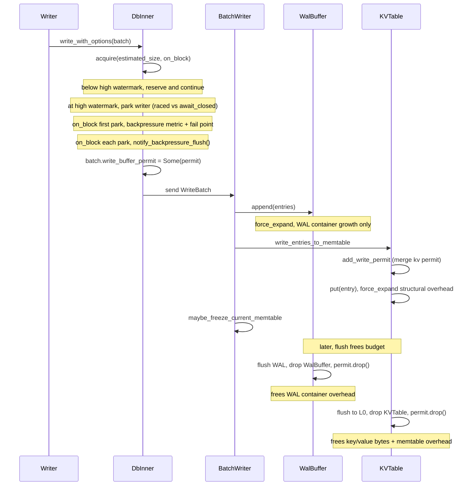

# Write Buffer Manager

Table of Contents:

<!-- TOC start (generate with https://bitdowntoc.derlin.ch) -->

- [Summary](#summary)
- [Motivation](#motivation)
- [Goals](#goals)
- [Non-Goals](#non-goals)
- [Design](#design)
  - [Phase 1: Live Write Buffer Capacity Enforcement](#phase-1-live-write-buffer-capacity-enforcement)
    - [ByteBudgetSemaphore](#bytebudgetsemaphore)
    - [ByteBufferManager](#bytebuffermanager)
    - [ByteBufferPermit](#bytebufferpermit)
    - [Integration into the Write Path](#integration-into-the-write-path)
    - [Memory Tracking Responsibilities](#memory-tracking-responsibilities)
    - [Size Estimation Algorithms](#size-estimation-algorithms)
    - [Memtable Permit Tracking](#memtable-permit-tracking)
    - [WAL Replay](#wal-replay)
    - [Backpressure Enhancement](#backpressure-enhancement)
    - [Public API and Builder](#public-api-and-builder)
    - [Defaults](#defaults)
  - [Phase 2: Instance Registry for Intelligent Backpressure (WIP)](#phase-2-instance-registry-for-intelligent-backpressure-wip)
- [Pathological Cases](#pathological-cases)
- [Impact Analysis](#impact-analysis)
  - [Core API & Query Semantics](#core-api--query-semantics)
  - [Consistency, Isolation, and Multi-Versioning](#consistency-isolation-and-multi-versioning)
  - [Time, Retention, and Derived State](#time-retention-and-derived-state)
  - [Metadata, Coordination, and Lifecycles](#metadata-coordination-and-lifecycles)
  - [Compaction](#compaction)
  - [Storage Engine Internals](#storage-engine-internals)
  - [Ecosystem & Operations](#ecosystem--operations)
- [Operations](#operations)
  - [Performance & Cost](#performance--cost)
  - [Observability](#observability)
  - [Compatibility](#compatibility)
- [Testing](#testing)
- [Rollout](#rollout)
- [Alternatives](#alternatives)
- [Open Questions](#open-questions)
- [References](#references)
- [Updates](#updates)

<!-- TOC end -->

Status: Implemented

Authors:

* [Zach Schoenberger](https://github.com/zach-schoenberger)

## Summary

This RFC introduces a `ByteBufferManager` — a byte-budget primitive — used to
enforce a memory budget on in-flight write data. By default each SlateDB
instance creates its own `ByteBufferManager` internally, sized from
`max_unflushed_bytes`; callers may optionally supply their own via
`DbBuilder::with_write_buffer_manager()`.

Phase 1 tracks and bounds the memory consumed by write batches, memtables, and
WAL buffers. A blocking `acquire` on the write path reserves budget *before* a
batch is dispatched, so writers stall (and trigger a memtable freeze) when the
budget's high watermark is reached, and release is tied to memtable and WAL
buffer drops. This byte-budget high-watermark check **replaces** the old
point-in-time `max_unflushed_bytes` snapshot backpressure mechanism entirely —
it does not run alongside it. Phase 2 (WIP) builds on the shareable
`ByteBufferManager` to add an instance registry for intelligent, per-instance
backpressure across DB instances that share a budget.

## Motivation

SlateDB's existing backpressure mechanism does a good job of keeping memory
usage in check under most workloads: it polls the aggregate size of WAL +
immutable memtables against `max_unflushed_bytes` and stalls writers when the
threshold is exceeded. Today the check is a point-in-time snapshot
of memory already consumed. Between the check passing and the write landing
in the memtable, concurrent writers can collectively overshoot the intended
budget. A proactive reservation step would let us bound memory *before* the
write is dispatched.

Separately, the current backpressure check reads the database state under a lock
to aggregate sizes. A lock-free tracking primitive would scale more
naturally as we add new pools.

The `ByteBufferManager` addresses these opportunities by:

- **Reserving** budget for each write batch via a blocking `acquire` that
  accounts for the batch's bytes *before* it is dispatched. When the budget is
  below its high watermark the reservation is non-blocking; when it is at the
  watermark the writer parks until allocated bytes drop below the watermark.
- **Applying backpressure** at the source: a parked writer requests a memtable
  freeze (to accelerate flushing) and does not proceed until the budget drops
  below the high watermark, bounding memory *before* the write lands.
- Automatically **releasing** permits when the owning memtable or WAL buffer is
  dropped (i.e., after flush to L0 / flush to object storage).
- Using lock-free atomics for all budget tracking, replacing — rather than
  coexisting with — the state-lock based `max_unflushed_bytes` snapshot on the
  write path with a contention-free reservation.

## Goals

- Enforce a global memory budget on in-flight write data (write batches through
  memtable flush).
  - The memory usage of the allocated write buffers (memtables, both current and immutable, and WAL buffers) should count towards the limit. This should not be double counted if it is one allocation (e.g. key/value `Bytes` shared between the WAL buffer and the memtable are charged once, by the memtable).
  - This will not track buffers used for compaction.
  - DbReader instances should be able to use the memory budget in future phases.
- The buffer memory limits should be observed as strictly as possible, erring towards over-counting if needed. Both user-provided key/value bytes and structural overhead (KVTable, WalBuffer, SkipMap nodes, etc.) count towards the budget.
- Provide an RAII permit lifecycle: acquire before write, release on memtable
  (and WAL buffer) drop.
- Replace the point-in-time `max_unflushed_bytes` snapshot backpressure
  mechanism with the byte budget (not run both).
- Avoid locking the database state for budget tracking.
- Allow callers to optionally share a budget across multiple DB instances via
  `DbBuilder::with_write_buffer_manager()`. (Phase 2) build a registry pattern
  on top of this for intelligent, per-instance backpressure.
- The configuration of the memory manager should be as simple as possible — ideally just one size. Additional configs can be added in future and then only if they are really needed.

## Non-Goals

- Renaming or removing the `max_unflushed_bytes` *configuration knob*. The old
  snapshot-based backpressure mechanism that consulted it is fully replaced by
  the byte budget; the setting remains only as the default source for
  `ByteBufferManager` capacity / high watermark. Other consumers of the value
  are out of scope for this RFC.
- Tracking block cache or read-path memory.
- Tracking struct byte allocations that will never be released like `DbInner::write_notifier`.
- Enforcing a hard limit on memory. `force_acquire` (used for structural
  overhead, WAL buffers, and replay) can intentionally overshoot capacity; the
  high watermark bounds *new* writes, not existing allocations.
- Guaranteeing exact byte-level accounting (estimates are conservative
  approximations).
- (Phase 2) Per-instance tracking and intelligent backpressure policies — this
  RFC only outlines the direction.

## Design

### Phase 1: Live Write Buffer Capacity Enforcement

Phase 1 introduces three new types and integrates them into the existing write
path.

#### ByteBudgetSemaphore

The core primitive is an async semaphore built on `AtomicUsize` + `tokio::Notify`
that tracks allocations in bytes rather than discrete permits.

```slatedb/slatedb/src/byte_buffer_manager.rs#L244-L249
struct ByteBudgetSemaphore {
    notify: Notify,
    allocated_bytes: AtomicUsize,
    waiter_cnt: AtomicUsize,
    capacity: usize,
}
```

**Why not `tokio::sync::Semaphore`?** Tokio's semaphore enforces a hard capacity
limit — once all permits are issued, acquisitions block until permits are
returned, and there is no way to over-allocate. The `ByteBufferManager` relies
on soft capacity tracking: `force_acquire` lets writers overshoot capacity
rather than blocking. A custom `ByteBudgetSemaphore` gives us full control over
this soft-cap behavior, which `tokio::sync::Semaphore` does not support.

The semaphore operations used in production:

```slatedb/slatedb/src/byte_buffer_manager.rs#L251-L378
impl ByteBudgetSemaphore {
    fn new(capacity: usize) -> Self;
    async fn acquire(&self, num_bytes: usize, watermark: usize, on_block: impl Fn(bool)) -> bool;
    fn force_acquire(&self, num_bytes: usize);
    fn release(&self, num_bytes: usize);
    fn available(&self) -> usize;
    fn allocated(&self) -> usize;
    async fn wait_for_allocated_below(&self, num_bytes: usize);
}
```

- **`acquire`** — the blocking reservation used by the live write path. When
  `allocated_bytes < watermark` it reserves `num_bytes` atomically via a
  `compare_exchange` fast path and returns without parking. Otherwise it parks
  on `notify` until a `release` drops allocation below the watermark, then
  reserves. The `on_block` callback fires immediately before *every* park
  (`true` only on the first) so callers can re-assert relief on each wait.
  Returns `true` if it parked at least once. Because each caller reserves its
  full request once below the watermark, `acquire` can still push allocation
  above the watermark — the watermark gates *entry*, not the post-reservation
  total.
- **`force_acquire`** — non-blocking `fetch_add`. Can push `allocated_bytes`
  above `capacity`. Used for structural overhead, WAL buffers, and WAL replay.
- **`release`** — subtracts `num_bytes` from `allocated_bytes` via `fetch_sub`
  and notifies any outstanding waiters. Waiters may be parked on the high
  watermark (not `capacity`), so every release with waiters must wake them.
- **`available`** — returns `capacity - allocated_bytes` (saturating to zero
  when over-allocated).
- **`allocated`** — returns the current `allocated_bytes` count.
- **`wait_for_allocated_below`** — blocks until `allocated_bytes` drops below
  the given threshold *without* reserving (used by `await_capacity`). Uses the
  same enable-before-recheck pattern as `acquire` so a `release` between the
  initial load and park cannot be missed.

#### ByteBufferManager

A cloneable, generic byte-budget handle wrapping a shared
`Arc<ByteBudgetSemaphore>`. In the write path it is stored
as the `write_buffer_manager` field on `DbInner` because this instance
specifically tracks write buffer memory.

```slatedb/slatedb/src/byte_buffer_manager.rs#L18-L21
#[derive(Clone)]
pub struct ByteBufferManager {
    inner: Arc<ByteBudgetSemaphore>,
    pub(crate) high_watermark: usize,
}
```

The `high_watermark` field is `pub(crate)` (used by `DbBuilder` validation).
It defines the threshold at which `acquire()` parks new reservations,
`at_capacity()` returns `true`, and `await_capacity()` blocks. Setting it
below `capacity` lets the backpressure system trigger before the hard capacity
limit is reached, giving the flush pipeline time to drain.

Methods:

```slatedb/slatedb/src/byte_buffer_manager.rs#L23-L133
impl ByteBufferManager {
    pub fn new(capacity: usize, high_watermark: usize) -> Self;
    pub fn unbounded() -> Self;
    pub async fn acquire(&self, num_bytes: usize, on_block: impl Fn(bool)) -> ByteBufferPermit;
    pub fn force_acquire(&self, num_bytes: usize) -> ByteBufferPermit;
    pub fn force_expand(&self, permit: &ByteBufferPermit, num_bytes: usize);
    pub fn available(&self) -> usize;
    pub fn capacity(&self) -> usize;
    pub fn allocated(&self) -> usize;
    pub fn at_capacity(&self) -> bool;
    pub async fn await_capacity(&self);
}
```

- **`new`** — constructs a manager with a hard `capacity` and a `high_watermark`
  at which `at_capacity()`/`acquire` begin applying backpressure.
- **`unbounded`** — constructs a manager with `capacity == high_watermark ==
  usize::MAX`; it never applies backpressure. Used for read-only paths
  (e.g. `DbReader` / empty sentinel tables) and tests where the API requires a
  manager but accounting is unnecessary. Production WAL replay does *not* use
  `unbounded`; it charges the shared DB manager via `force_acquire`.
- **`acquire`** — the blocking reservation used by the live write path. Reserves
  `num_bytes` immediately when below the high watermark; otherwise parks until
  allocated bytes drop below the watermark, invoking `on_block(first)` before
  each park. Returns an RAII `ByteBufferPermit` (the underlying semaphore's
  parked `bool` is consumed internally for unblock logging and is not exposed
  to callers).
- **`force_acquire`** — unconditionally reserves bytes (for structural overhead,
  WAL buffer creation, and WAL replay). Can push `allocated_bytes` above
  `capacity`. Never blocks.
- **`force_expand`** — unconditionally adds `num_bytes` to an existing permit's
  reservation. Used by `KVTable::put` (per-entry structural overhead) and
  `WalBuffer::append` (VecDeque capacity growth).
- **`available`** — returns `capacity - allocated_bytes` (saturating).
- **`capacity`** — returns the total byte budget capacity.
- **`allocated`** — returns the total outstanding reserved bytes.
- **`at_capacity`** — returns `true` if `allocated_bytes >= high_watermark`.
- **`await_capacity`** — waits until allocated bytes drop below the high
  watermark. Does not reserve any bytes (used by `maybe_apply_backpressure`).

#### ByteBufferPermit

An RAII guard that releases its byte reservation on drop. Multiple permits can
be consolidated via `merge()` to combine reservations into a single guard.
The type is `pub` inside the private `byte_buffer_manager` module but is **not**
re-exported from `lib.rs` — external callers interact with it only indirectly
through `ByteBufferManager` / `DbBuilder`.

```slatedb/slatedb/src/byte_buffer_manager.rs#L142-L224
pub struct ByteBufferPermit {
    semaphore: Arc<ByteBudgetSemaphore>,
    reserved_bytes: AtomicUsize,
}

impl ByteBufferPermit {
    pub fn size(&self) -> usize;
    pub fn merge(&self, other: &ByteBufferPermit);
    pub fn take(&self, num_bytes: usize) -> Self;
}

impl Drop for ByteBufferPermit {
    fn drop(&mut self); // calls semaphore.release(reserved_bytes)
}
```

- **`size`** — returns the number of bytes currently reserved by this permit.
- **`merge`** — atomically zeroes the source permit's `reserved_bytes` and adds
  that value to the target. The source permit's `Drop` becomes a no-op,
  avoiding double-release. Used by `KVTable::add_write_permit` to consolidate
  multiple write batch permits into the table's single permit.
- **`take`** — subtracts up to `num_bytes` from this permit (saturating if
  fewer remain) and returns a new permit owning those bytes. Used by
  `KVTable::put` in the overwrite case to release cancelled structural
  overhead and replaced entry data back to the budget.

#### Integration into the Write Path

The permit lifecycle flows through the write path as follows:



The fundamental pattern is that the **user provides byte buffers** (keys and
values), and those byte buffer metrics are tracked exclusively in relation to
the `KVTable`. The WAL buffer and dispatch channel do *not* account for the
key/value data bytes themselves — only the `KVTable` does.

1. **`WriteBatch`** has a `write_buffer_permit: Option<Arc<ByteBufferPermit>>`
   field. `DbInner::write_with_options` acquires the permit and assigns it to
   this field before dispatching the batch. The permit accounts **only for the
   key and value byte buffers** that the user is storing (the batch's
   `estimated_size()`) — it does not account for the `WriteBatch` struct itself,
   the dispatch channel, or any other transient overhead.

2. **`DbInner::write_with_options`** reserves the budget *before* enqueueing by
   calling `self.write_buffer_manager.acquire(estimated_size, on_block)`, raced
   against `await_closed()` in a `biased` `tokio::select!` so a parked writer
   exits promptly if the DB is fenced/closed. When the budget is below the high
   watermark the reservation is immediate; when it is at the watermark the
   writer parks. The `on_block` callback:
   - on the **first** park, increments `backpressure_count` and fires the
     `db-backpressure-applied` fail point;
   - on **every** park, calls `notify_backpressure_flush()` to request a
     memtable freeze so the flush pipeline drains and releases budget.

   Once the permit is obtained, it is attached to
   `batch_req.batch.write_buffer_permit` and the batch is dispatched. This
   "acquire-then-dispatch" ordering bounds memory *before* the write is
   in-flight. Note there is no post-dispatch `maybe_apply_backpressure()` call
   on the steady write path — blocking happens inside `acquire`.

3. **`DbInner::write_entries_to_memtable`** (called from the batch writer) takes
   the permit off the batch (`batch.write_buffer_permit.take()`) and passes it
   to the `KVTable` via `add_write_permit`, which merges it into the table's own
   permit. From this point, the `KVTable` owns the byte buffer budget for those
   key/value bytes.

**Deduplicated freeze signaling.** `notify_backpressure_flush()` does *not*
await a flush; it fire-and-forget enqueues a single `BatchWriterMessage::Flush`
(with `freeze_memtable = true`) guarded by a `backpressure_flush_pending`
`AtomicBool`. Only the writer that flips the flag `false → true` sends the
message; a burst of blocked writers therefore enqueues at most one in-flight
freeze rather than flooding the writer. The batch writer clears the flag after
it issues the freeze/flush, re-arming the dedup so the next wave of parks can
request another freeze. If the writer is gone (DB closing) the flag is cleared
so the dedup never wedges; parked writers are released by `await_closed`.

#### Memory Tracking Responsibilities

Each component tracks a distinct slice of memory:

- **`KVTable` (memtable)** — Tracks *everything* related to its state:
  - The user-provided key/value byte buffers (via the merged write permit)
  - Its own structural overhead: `KVTable` struct size, `SequenceTracker`
    pre-allocation, per-entry `SkipMap` node overhead, and `SequencedKey` +
    `RowEntry` struct sizes
  - On creation, `force_acquire(SEQ_TRACKER_OVERHEAD + KVTABLE_SIZE)` reserves
    the base cost; on each `put()`, `force_expand` adds per-entry structural
    overhead

- **`WalBuffer`** — Tracks only its own structural overhead (the `WalBuffer`
  struct size and `VecDeque` capacity growth as entries are appended). It does
  **not** track the key/value data bytes. Those bytes are shared (via `Bytes`
  reference counting) with the `KVTable`, which is the sole owner of the
  key/value budget. The WAL buffer charges the **same shared DB
  `write_buffer_manager`** as the memtables — it does not use a private
  `unbounded()` budget. The manager is threaded into the WAL machinery at
  construction: `DbBuilder::build` → `WriterFencer::new(..)` →
  `WalWriterInit::load(..)` → `WalBufferManager::start_new(.., write_buffer_manager)`.
  Each `WalBuffer`'s permit is released when the buffer is flushed to object
  storage and dropped, freeing budget for new writes just like a memtable freed
  after its L0 flush.

- **`DbStateView` (read-side `Arc<KVTable>`)** — The `KVTable` can be shared
  via `Arc` for read access (e.g., in `DbStateView`). This shared reference
  does **not** independently track byte buffers — it is a view on the original
  table. The budget for key/value bytes remains with the original `KVTable`'s
  permit and is released only when the last `Arc` reference is dropped (i.e.,
  after flush completes and all readers release the table).

#### Size Estimation Algorithms

Each component uses a specific formula to calculate the bytes it charges
against the write buffer budget.

**Write Batch (user-provided key/value bytes)**

The `WriteBatch::estimated_size()` sums only the raw key and value byte lengths
across all operations in the batch:

```
batch_size = ∑ op.estimated_kv_size()

where estimated_kv_size =
    Put  | Merge : key.len() + value.len()
    Delete       : key.len()
```

This is the size passed to `acquire` when the write-path permit is created. It
represents the user-provided byte buffers and nothing else.

**KVTable (memtable)**

The `KVTable` charges two categories of bytes against the budget:

1. *Base overhead* — acquired once at table creation:

   ```
   base = SEQ_TRACKER_OVERHEAD + KVTABLE_SIZE

   where
     SEQ_TRACKER_OVERHEAD = 8192 * size_of::<u64>() * 2   (~128 KiB)
     KVTABLE_SIZE         = size_of::<KVTable>()
   ```

2. *Per-entry structural overhead* — expanded on each `put()`:

   ```
   entry_overhead = SKIPMAP_ENTRY_OVERHEAD
                  + size_of::<SequencedKey>()
                  + size_of::<RowEntry>()

   where
     SKIPMAP_ENTRY_OVERHEAD = 128   (tower pointers, node header, alignment)
     SequencedKey           = size_of::<SequencedKey>()  (Bytes handle + u64 seq)
     RowEntry               = size_of::<RowEntry>()      (struct footprint, not data)
   ```


   In the overwrite case (same `SequencedKey` already exists), the just-
   expanded structural overhead and the replaced entry's data-size estimate
   are released back via `permit.take()` (which saturates if the permit is
   somehow short):

   ```
   excess = entry_overhead + old_entry.estimated_size()
   ```

The total budget consumed by one `KVTable` is therefore:

```
total = base
      + (num_entries * entry_overhead)
      + user_kv_bytes          (from merged write batch / replay permits)
      - overwrite_corrections  (excess returned via take())
```

**WalBuffer**

The `WalBuffer` charges only its own container overhead:

1. *Base overhead* — acquired once at buffer creation:

   ```
   base = size_of::<WalBuffer>()
   ```

2. *VecDeque capacity growth* — expanded each time the internal `VecDeque`
   reallocates:

   ```
   growth_bytes = (cap_after - cap_before) * size_of::<RowEntry>()
   ```

   This is only charged when the `VecDeque`'s capacity actually increases
   (i.e., when it reallocates its backing buffer to fit more entries).

The total budget consumed by one `WalBuffer` is:

```
total = base + cumulative_growth_bytes
```

Notably, the `WalBuffer` does **not** charge for the key/value data bytes of
the entries it holds. Those bytes are shared via `Bytes` reference counting
with the `KVTable`, which is the sole owner of that portion of the budget.
The container overhead is charged against the shared DB `write_buffer_manager`
(via `force_acquire` on creation and `force_expand` on growth), and released
when the buffer is dropped after its flush to object storage.

#### Memtable Permit Tracking

`KVTable` stores an `Arc<ByteBufferPermit>` that is created at construction
time (covering the base structural overhead). When write batches land in the
table, their permits are merged into this single table permit via
`ByteBufferPermit::merge()`. This ensures all tracked bytes — both the
user-provided key/value buffers and the table's own structural allocations —
are released in a single `Drop` when the table is dropped after flush.

```slatedb/slatedb/src/mem_table.rs#L114
write_buffer_permit: Arc<ByteBufferPermit>,
```

```slatedb/slatedb/src/mem_table.rs#L665-L669
/// Merges an external write-buffer budget permit into this table's
/// permit so that a single drop releases the combined reservation.
pub(crate) fn add_write_permit(&self, permit: &ByteBufferPermit) {
    self.write_buffer_permit.merge(permit);
}
```

#### WAL Replay

During WAL replay, the replay loop must make forward progress to populate the
memtable state, so it cannot use the blocking `acquire` (which could stall the
replay against its own not-yet-flushed tables). Instead, for each recovered
memtable the shared DB `write_buffer_manager` is charged via non-blocking
`force_acquire` for the sum of each applied row's `RowEntry::estimated_size()`
(key + value + seq + optional timestamps — slightly heavier than the live
`WriteBatch::estimated_size()` key/value-only estimate), and the resulting
permit is merged into the table. The table's own base structural overhead is
still reserved at `KVTable::new` as usual.

For each recovered memtable the outer replay loop then:

1. **Integrates first** via `replay_memtable` (freezes the previous active into
   an imm the flusher can drain and installs the new table).
2. Calls `maybe_freeze_memtable` (encoded size ≥ `max_unflushed_bytes`).
3. If `write_buffer_manager.at_capacity()`, **unconditionally freezes** the
   newly installed active so SkipMap/structural overhead that exceeds the
   watermark still yields a flushable imm.
4. Calls `maybe_apply_backpressure` to wait until allocated bytes drop below
   the high watermark (freezing makes budget releasable; waiting bounds how
   far replay races ahead of the flusher).

Waiting *before* integrate would deadlock: the next table's `force_acquire`d
bytes are still local and the active table is not yet frozen, so nothing can
free budget. This is the remaining production caller of
`maybe_apply_backpressure`; the steady write path blocks inside `acquire`
instead.

#### Backpressure Enhancement

The byte budget **replaces** the old `max_unflushed_bytes` snapshot
backpressure mechanism; that snapshot check and its `await_uploaded` wait are
gone from the write path. Within the new mechanism, backpressure is applied in
two places, both keyed only off the byte budget's high watermark:

1. **Live write path (`acquire`)** — the steady state. `write_with_options`
   blocks inside `write_buffer_manager.acquire(..)` until allocated bytes are
   below the high watermark, then reserves and dispatches. The freeze that
   relieves pressure is requested from the `on_block` callback via
   `notify_backpressure_flush()` (deduplicated by `backpressure_flush_pending`),
   *not* from inside a separate backpressure routine. The whole thing is raced
   against `await_closed()` so a fenced/closed DB releases parked writers.

2. **`maybe_apply_backpressure`** — used by WAL replay (see [WAL
   Replay](#wal-replay)). It has a single trigger condition
   (`write_buffer_manager.at_capacity()`), updates the `total_mem_size_bytes`
   metric from `write_buffer_manager.allocated()`, and — when at capacity —
   records backpressure, fires the fail point, warns, and waits for the budget
   to drain below the high watermark via `await_backpressure_relief(await_capacity())`
   before re-checking. The old `total_mem_size_bytes >= max_unflushed_bytes`
   condition (which waited on `await_uploaded`) has been **removed** — there is
   no parallel size-based check alongside the byte budget.
   (`total_mem_size_bytes` is also refreshed from `allocated()` on every
   successful live `write_with_options` after `acquire` returns.)

```slatedb/slatedb/src/db.rs#L344-L382
// maybe_apply_backpressure: single write-buffer high-watermark condition
loop {
    self.check_closed()?;
    self.db_stats
        .total_mem_size_bytes
        .set(self.write_buffer_manager.allocated() as i64);

    if self.write_buffer_manager.at_capacity() {
        self.db_stats.backpressure_count.increment(1);
        // wait for the buffer to drain below the high watermark (or DB close)
        self.await_backpressure_relief(async {
            self.write_buffer_manager.await_capacity().await;
            Ok(())
        }).await?;
        continue;
    }
    return Ok(());
}
```

Note that `maybe_apply_backpressure` only *waits* — it does not itself freeze the
active memtable. Freezing is the caller's responsibility: on the live path via
`notify_backpressure_flush` → batch-writer freeze, and on the replay path via
`maybe_freeze_memtable` plus an unconditional freeze when
`write_buffer_manager.at_capacity()` (see [WAL Replay](#wal-replay)). The warn
message logs `max_unflushed_bytes`, `write_buffer_allocated`, and
`write_buffer_remaining` (in that order).

> **Consideration:** The `ByteBufferManager` tracks outstanding bytes more
> accurately than the old `max_unflushed_bytes` check, which relied on a
> point-in-time snapshot of WAL + immutable memtable sizes under a read lock.
> Because the byte budget already accounts for all in-flight write data from
> reservation through flush (memtable overhead + key/value bytes + WAL buffer
> overhead), it fully replaces that snapshot mechanism — the write path no
> longer consults `max_unflushed_bytes` for backpressure. The setting name is
> kept only as the default seed for budget capacity and high watermark.

#### Public API and Builder

- `ByteBufferManager` is re-exported from `lib.rs` as a public type.
- `ByteBufferPermit` is `pub` in the private `byte_buffer_manager` module but
  is **not** re-exported from `lib.rs`; external crates cannot name the type.
  `high_watermark` is similarly `pub(crate)` for in-crate builder validation.
- `DbBuilder::with_write_buffer_manager(ByteBufferManager)` lets a caller supply
  their own manager — for a custom capacity/high-watermark, or to share a single
  budget across multiple DB instances.
- When no manager is supplied, each instance creates its own `ByteBufferManager`
  internally with both `capacity` and `high_watermark` set to
  `settings.max_unflushed_bytes`.
- (Phase 2 will layer an instance registry and per-instance accounting on top of
  the shared-manager capability that already exists here.)

#### Defaults

When no explicit `ByteBufferManager` is provided via
`DbBuilder::with_write_buffer_manager()`, the database constructs one with:

- **`capacity`** = `settings.max_unflushed_bytes` (default 1 GB)
- **`high_watermark`** = `capacity` (i.e., backpressure triggers only when the
  full budget is consumed)

Setting `high_watermark == capacity` means `at_capacity()` returns `true` only
when allocated bytes reach the entire budget. This is the simplest default: the
system allows writes to fill the budget completely before applying
backpressure, relying on the flush pipeline to drain immutable memtables in the
background.

The builder validates the (default or supplied) manager with three guards:

1. **Minimum capacity** — capacity must be at least `MIN_WRITE_BUFFER_SIZE`
   (1 MiB). This floor ensures there is always enough headroom to cover the
   fixed overhead of a single `KVTable` (primarily the `SequenceTracker`
   pre-allocation at ~128 KiB) plus at least one entry, preventing a deadlock
   where the budget is exhausted before any write can land.

2. **High watermark ≤ capacity** — a watermark above capacity is rejected.
   Waiters park on the watermark; allowing `high_watermark > capacity` is a
   nonsensical configuration.

3. **Minimum high watermark** — the high watermark must be at least
   `l0_sst_size_bytes + SEQ_TRACKER_OVERHEAD + KVTABLE_SIZE`. The active memtable
   is only frozen once its *encoded* size reaches `l0_sst_size_bytes`, and the
   budget also counts the fixed per-memtable overhead that the freeze threshold
   does not. If the watermark were below this sum, the buffer could sit at
   capacity holding only a single unfrozen active memtable — nothing would be
   eligible to flush, so nothing would free budget, and the writer would stall
   until the next unrelated freeze. (Per-entry SkipMap overhead is intentionally
   not included in this floor, so tiny-value workloads still get a proactive
   freeze under backpressure.)

### Phase 2: Instance Registry for Intelligent Backpressure (WIP)

Phase 1 enforces budget limits but applies backpressure blindly — when the
budget is exhausted, all writers block regardless of which DB instance holds the
majority of the allocation. `DbBuilder::with_write_buffer_manager()` already
lets callers share one `ByteBufferManager` across instances; Phase 2 builds an
instance registry on top of that sharing to enable smarter backpressure
strategies by tracking which instances share the budget.

**Problem:** When a single `ByteBufferManager` is shared across multiple DB
instances via `DbBuilder::with_write_buffer_manager()`, an instance that has
consumed a disproportionate share of the budget causes all other instances to
stall. Without per-instance tracking there is no mechanism to identify the
heavy consumer or to direct backpressure at it specifically.

**Proposed direction:** Add an instance registry within the shared manager:

- **Registration** — Each DB instance registers itself with the shared
  `ByteBufferManager` on startup and deregisters on shutdown. The registry
  tracks per-instance metadata such as current byte allocation and instance
  identity.
- **Per-instance accounting** — Permits are tagged with their owning instance,
  allowing the manager to report per-instance budget consumption.
- **Backpressure policies** — With per-instance visibility, the manager can
  support smarter strategies such as:
  - *Proportional fairness* — stall only the instance that has exceeded its
    fair share rather than blocking all writers.
  - *Priority-based* — allow high-priority instances to preempt or receive
    larger budget slices.
  - *Targeted flush signaling* — notify the heaviest consumer to trigger an
    early flush, freeing budget for other instances.
- **Observability** — The registry enables per-instance metrics (bytes held,
  permits outstanding, time spent blocked) for debugging shared-budget
  contention.

Detailed design of Phase 2 is deferred to a future RFC, once Phase 1 is
validated in production and multi-instance sharing patterns are better
understood from production usage.

## Pathological Cases

When Phase 2 introduces shared budgets across instances, the following
pathological case can arise: 1 to N instances obtain buffer permits so that the
total allocated buffer is slightly under or equal to the high watermark. This
will cause any write by any other instance to always trigger a small memtable to
be flushed — essentially making each write to any instance that doesn't own a
significant portion of the buffer permits produce a new memtable. In order
to properly handle this kind of issue, the `ByteBufferManager` needs a way to
know what allocations are being held and a mechanism to trigger their release.
Phase 2's instance registry and intelligent backpressure policies are designed
to address this.

## Impact Analysis

SlateDB features and components that this RFC interacts with. Check all that
apply.

### Core API & Query Semantics

- [x] Basic KV API (`get`/`put`/`delete`)
- [ ] Range queries, iterators, seek semantics
- [ ] Range deletions
- [ ] Error model, API errors

### Consistency, Isolation, and Multi-Versioning

- [ ] Transactions
- [ ] Snapshots
- [ ] Sequence numbers

### Time, Retention, and Derived State

- [ ] Time to live (TTL)
- [ ] Compaction filters
- [ ] Merge operator
- [ ] Change Data Capture (CDC)

### Metadata, Coordination, and Lifecycles

- [ ] Manifest format
- [ ] Checkpoints
- [ ] Clones
- [ ] Garbage collection
- [ ] Database splitting and merging
- [ ] Multi-writer

### Compaction

- [ ] Compaction state persistence
- [ ] Compaction filters
- [ ] Compaction strategies
- [ ] Distributed compaction
- [ ] Compactions format

### Storage Engine Internals

- [x] Write-ahead log (WAL)
- [ ] Block cache
- [ ] Object store cache
- [ ] Indexing (bloom filters, metadata)
- [ ] SST format or block format

### Ecosystem & Operations

- [ ] CLI tools
- [ ] Language bindings (Go/Python/etc)
- [x] Observability (metrics/logging/tracing)

## Operations

### Performance & Cost

- **Write latency:** Under normal load, the reservation is a single atomic
  `compare_exchange` on the fast path of `acquire` — sub-microsecond overhead,
  and never touches the state lock. Under budget pressure, the writer parks in
  `acquire` and requests a memtable freeze until flushes free capacity, then
  proceeds. This is the desired behavior: controlled backpressure at the source
  rather than OOM.
- **Write throughput:** No change under steady-state. Under burst, throughput
  is capped by flush rate, which is the correct bottleneck.
- **Read latency/throughput:** No impact. The write-buffer manager is not on
  the read path.
- **Object-store requests:** No change. Flush behavior is unchanged.
- **Space/read/write amplification:** No change. Data layout is unchanged.

### Observability

- **Configuration changes:** No new *required* configuration — the budget is
  derived from `max_unflushed_bytes` by default. `DbBuilder` exposes an optional
  `with_write_buffer_manager()` for callers who want a custom or shared budget.
- **New components:** `ByteBufferManager` (public, re-exported from `lib.rs`),
  `ByteBufferPermit` (`pub` in a private module; not crate-re-exported),
  `ByteBudgetSemaphore` (internal).
- **Metrics:** The existing `backpressure_count` metric now fires when a write
  parks in `acquire` (first park) and when `maybe_apply_backpressure` stalls
  during replay. `total_mem_size_bytes` is sourced from
  `write_buffer_manager.allocated()` both after a successful live `acquire` and
  inside `maybe_apply_backpressure`.
- **Logging:** `acquire` warns on the first park (allocated / high watermark /
  requested bytes) and info-logs when the write unblocks; `maybe_apply_backpressure`
  warns with allocated bytes, the `max_unflushed_bytes` setting, and remaining
  bytes.

### Compatibility

- **Existing data on object storage / on-disk formats:** No change. This is
  purely an in-memory tracking mechanism.
- **Existing public APIs:** The `ByteBufferManager` is a new public type and
  `DbBuilder` gains an optional `with_write_buffer_manager()` method. The
  snapshot-based `max_unflushed_bytes` backpressure path is removed (replaced
  by the byte budget). The `max_unflushed_bytes` setting remains as the default
  budget capacity / high-watermark seed.
- **Rolling upgrades:** Not applicable — this is a client-side, in-memory
  mechanism with no wire protocol or storage format changes.

## Testing

- **Unit tests:** Comprehensive tests for `ByteBudgetSemaphore` and
  `ByteBufferManager` covering:
  - Full budget availability on creation.
  - Budget reduction on `force_acquire`.
  - Blocking/parking behavior of `acquire` at the high watermark, the
    `on_block` callback firing (first vs. subsequent parks), and unblocking on
    release.
  - Budget restoration on permit drop.
  - `merge()` combining sizes correctly.
  - `merge()` preventing double-release on source drop.
  - `merge()` panicking on cross-manager merge.
  - Zero-sized permit drop safety.
  - Multi-permit merge and release.
  - `take()` splitting and saturating when the request exceeds reserved bytes.
  - `await_capacity` observing a release that races before the waiter parks
    (enable-before-recheck regression).
- **Integration tests:** `DbInner`-level tests validate the write path
  end-to-end, including a backpressure waiter exiting promptly when the DB is
  fenced, `total_mem_size_bytes` reflecting the manager's allocated bytes, and
  builder validation of the capacity floor, `high_watermark ≤ capacity`, and
  high-watermark ≥ `l0_sst_size_bytes +` per-memtable overhead. WAL replay
  under a tight write-buffer budget confirms open does not deadlock when a
  single replayed table exceeds the watermark (integrate → freeze → wait).
  The `manifest_writer`, `tracker`, and `uploader` module tests are updated to
  construct/thread the `ByteBufferManager`.
- **Fault-injection/chaos tests:** Not in Phase 1. A future phase could
  inject failures into the flush path to verify that permits are not leaked.
- **Deterministic simulation tests:** Not in Phase 1.
- **Formal methods verification:** Not planned.
- **Performance tests:** Manual benchmarking under bursty write workloads to
  verify that the write-buffer budget prevents memory overshoot without
  degrading steady-state throughput.

## Rollout

- Milestones / phases:
  - **Phase 1:** Land `ByteBufferManager`, `ByteBufferPermit`,
    `ByteBudgetSemaphore`, and write-path integration (blocking `acquire`
    before dispatch, permit release on memtable/WAL-buffer drop). Each instance
    creates its own manager with budget equal to `max_unflushed_bytes` by
    default, and `DbBuilder::with_write_buffer_manager()` allows supplying or
    sharing a manager.
  - **Phase 2:** Add an instance registry, per-instance accounting, and
    intelligent backpressure policies on top of the shared manager.
- Feature flags / opt-in:
  - Phase 1 is always active with a per-instance default budget; supplying or
    sharing a manager is opt-in via `DbBuilder::with_write_buffer_manager()`.
  - Phase 2's registry-driven policies are opt-in and gated on a future RFC.
- Docs updates:
  - `ByteBufferManager` type-level documentation (crate-public).
  - `ByteBufferPermit` type-level documentation (module-public; not re-exported).
  - `DbBuilder::with_write_buffer_manager()` API docs.
  - (Phase 2) Operational guidance on tuning the budget for multi-instance
    deployments.

## Alternatives

**Status quo — keep the `max_unflushed_bytes` snapshot check**

The existing backpressure mechanism works well for steady-state workloads. Under
highly concurrent bursty writers, however, there can be a gap between the
point-in-time size check and the actual write, during which total memory usage
may temporarily exceed the intended budget. Keeping that check and adding the
byte budget beside it would leave two competing backpressure signals. This RFC
rejects that: the `ByteBufferManager` **replaces** the snapshot check, closing
the gap by reserving budget with a blocking `acquire` *before* the write is
dispatched so memory is bounded at the source rather than checked reactively.

**Use `tokio::sync::Semaphore`**

Tokio's semaphore is well-tested and supports async acquisition. However, it
enforces a hard capacity limit: once all permits are issued, further
acquisitions block until permits are returned, and there is no way to
over-allocate. The `ByteBufferManager` relies on soft capacity tracking —
`force_acquire` lets a writer's reservation overshoot capacity rather than
blocking. A custom `ByteBudgetSemaphore` gives us full control over this
soft-cap behavior, which `tokio::sync::Semaphore` does not support.

**Integrate budget tracking into the database state lock**

Instead of a separate atomic semaphore, we could track the budget inside the
`RwLock`-protected `DbState`. This would avoid introducing a new primitive,
but it would add reservation and release operations to the state lock's
critical section. The lock-free approach keeps budget tracking off the
state-lock path entirely, which is a better fit as more resource pools are
added over time.

**Reactive `force_acquire` after dispatch instead of blocking `acquire` (rejected; blocking `acquire` adopted)**

An earlier iteration of this design tracked writes with a non-blocking
`force_acquire` at dispatch time and then applied backpressure *reactively* via
a post-dispatch `maybe_apply_backpressure` (and, briefly, the `acquire` method
was removed entirely in favor of `force_acquire`-only). The current
implementation instead **blocks in `acquire` before dispatch**: the reservation
is non-blocking while below the high watermark and parks the writer once at the
watermark. This bounds memory before the write is in-flight (rather than after),
keeps ordering intact (the write is only dispatched once its budget is
reserved), and lets the parked writer drive a deduplicated memtable freeze via
`notify_backpressure_flush`. `force_acquire` is retained for allocations that
must not block (structural overhead, WAL buffers, and WAL replay), where
blocking would deadlock because forward progress is required to free the budget.
The reactive `maybe_apply_backpressure` path survives only for WAL replay.

**Per-writer budgets instead of a global budget**

We could assign each writer its own slice of the budget, avoiding contention
entirely. This would be more complex to configure and would not handle
heterogeneous write sizes well (one writer with large batches would exhaust its
slice while another's sits idle). A global budget with lock-free atomics is
simple and handles skewed workloads naturally.

## Open Questions

- What is the right default budget and high watermark? Phase 1 uses
  `max_unflushed_bytes` for both, but this may be too generous or too
  restrictive depending on the workload. Should the budget be a separate
  setting or a fraction of `max_unflushed_bytes`? Should the high watermark
  default to something less than capacity (e.g. 80%)?
- For Phase 2, what backpressure policy should be the default when multiple
  instances share a budget? Proportional fairness, priority-based, or
  something simpler?
- **How should the byte budget be exposed to the [`WalWriter`] trait
  (RFC 0030 — Pluggable WAL)?** Today the shared `ByteBufferManager` is threaded
  only into the *built-in* WAL implementation via concrete constructors
  (`WalWriterInit` holds a `ByteBufferManager` and passes it to
  `WalBufferManager::start_new`). The `WalWriter` trait itself has no notion of
  the budget, so a third-party WAL implementation that buffers writes in memory
  has no sanctioned way to charge that memory against the shared budget — its
  buffering would be invisible to backpressure. Options to consider:
  - *Construction-context injection:* pass the `ByteBufferManager` (or a
    narrower budget handle) into WAL construction — e.g. as a field on a
    `WalWriterContext`/config struct handed to `WriterInit` — so implementations
    can opt into charging permits without the budget appearing on the hot-path
    trait methods. This keeps the existing threading pattern but makes it an
    explicit, documented input rather than a built-in-only convention.
  - *Trait-level accounting hooks:* have `WalWriter` surface its buffered-byte
    footprint (e.g. `append` reports bytes charged, or the trait exposes a
    permit/observer) so SlateDB can account for it uniformly. This is more
    explicit but couples the plugin surface to the `ByteBufferManager`
    primitive and its RAII/release semantics.
  - *External estimation:* have SlateDB charge a conservative estimate on the
    writer's behalf from the batch size. This avoids exposing the primitive at
    all, but can't see the implementation's actual buffering strategy and risks
    double-counting the key/value `Bytes` already charged by the memtable.

  The tension is between keeping `ByteBufferManager` an internal accounting
  primitive and letting pluggable WALs participate in the shared memory budget.
  A decision here should be coordinated with RFC 0030 so the WAL plugin
  interface and the budget primitive evolve together.

## References

- [Issue #1669: Better Memory Management With A ByteBufferManager](https://github.com/slatedb/slatedb/issues/1669)
- [PR #1 (prototype): adding the primitive](https://github.com/zach-schoenberger/slatedb/pull/1)
- [RFC 0030: Pluggable WAL](./0030-pluggable-wal.md) — introduces the
  `WalWriter` trait; see the Open Questions above for exposing the byte budget
  to pluggable WAL implementations.
- RocksDB [`WriteBufferManager`](https://github.com/facebook/rocksdb/wiki/Write-Buffer-Manager)
  — prior art for global memtable memory budgeting in an LSM engine.

## Updates

> Historical notes below record design iterations. Where they conflict with the
> body of this RFC, the body (and the latest update) is authoritative.

- **2025-07-11 (historical):** Renamed `WriteBufferManager` →
  `ByteBufferManager` / `WriteBufferPermit` → `ByteBufferPermit`. At that time
  the write path still used reactive `force_acquire` → dispatch →
  `maybe_apply_backpressure`. Status changed from Draft to Implemented.
- **2026-06-12 (historical):** Temporarily removed unused blocking `acquire` /
  `try_acquire` while the production path was `force_acquire`-only. Superseded
  by the 2026-08-06 rework below.
- **2026-08-06:** Reworked the design to match the current implementation, which
  diverged from the reactive `force_acquire`-then-`maybe_apply_backpressure`
  model:
  - **`acquire` re-added and adopted as the primary write-path method.**
    `write_with_options` now blocks in `write_buffer_manager.acquire(..)` to
    reserve budget *before* dispatching the batch (raced against `await_closed`
    via a `biased` select). `force_acquire` is retained for non-blocking
    allocations (structural overhead, WAL buffers, WAL replay).
  - **`max_unflushed_bytes` backpressure mechanism replaced (not dual-pathed).**
    The byte-budget high watermark is the only backpressure signal;
    `maybe_apply_backpressure` lost its `total_mem_size_bytes >=
    max_unflushed_bytes` / `await_uploaded` condition and now only serves WAL
    replay under the same byte-budget check. The setting remains solely as the
    default budget seed.
  - **Freeze signaling decoupled from backpressure.** A parked writer requests a
    memtable freeze through `notify_backpressure_flush()`, deduplicated by a
    `backpressure_flush_pending` `AtomicBool` and cleared by the batch writer
    after it issues the freeze; `maybe_apply_backpressure` now only *waits*.
  - **WAL buffers charge the shared DB budget.** `WalBufferManager` no longer
    creates a private `unbounded()` manager; the DB's `write_buffer_manager` is
    threaded through `WriterFencer::new` → `WalWriterInit::load` →
    `WalBufferManager::start_new`, and each `WalBuffer` releases its permit when
    flushed and dropped.
  - **`with_write_buffer_manager()` is available now (not Phase 2)**, and a
    second builder guard was added: the high watermark must be at least
    `l0_sst_size_bytes + SEQ_TRACKER_OVERHEAD + KVTABLE_SIZE`.
- **2026-08-06 (correctness + fidelity):** Brought the RFC in line with the
  landed `buffer_manager` implementation after several correctness fixes:
  - **`wait_for_allocated_below` enable-before-recheck** — reload allocated
    bytes after `enable()` so a racing `release` cannot strand
    `await_capacity` waiters.
  - **WAL replay ordering** — `replay_memtable` (integrate) first, then
    `maybe_freeze_memtable`, then an unconditional freeze when
    `at_capacity()`, then `maybe_apply_backpressure`. Waiting before integrate
    deadlocked when the next table's `force_acquire`d bytes were still local.
  - Replay charges `RowEntry::estimated_size()` via `force_acquire` on the
    shared manager (not `unbounded()`).
  - `ByteBufferPermit` is module-`pub` but not re-exported; `high_watermark` is
    `pub(crate)`.
  - Builder rejects `high_watermark > capacity` (third guard);
    `release` notifies all waiters (not only when below `capacity`);
    overwrite returns `entry_overhead + old.estimated_size()` via saturating
    `take`.
  - `total_mem_size_bytes` updates on live acquire as well as inside
    `maybe_apply_backpressure`; backpressure warn logs
    `max_unflushed_bytes` / allocated / remaining in that order.
