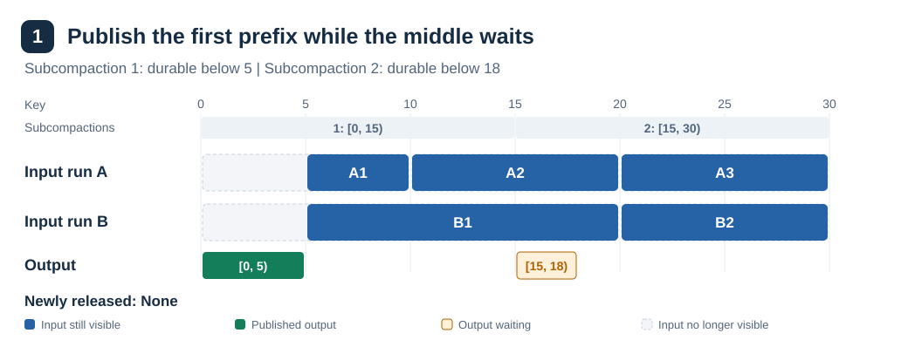
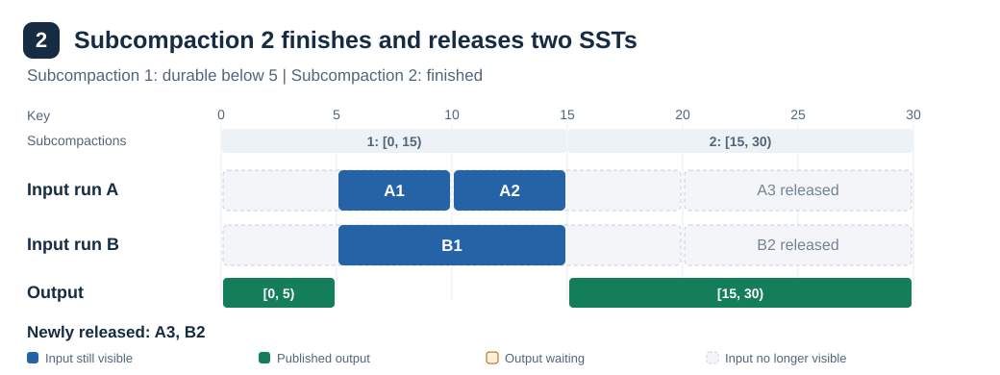
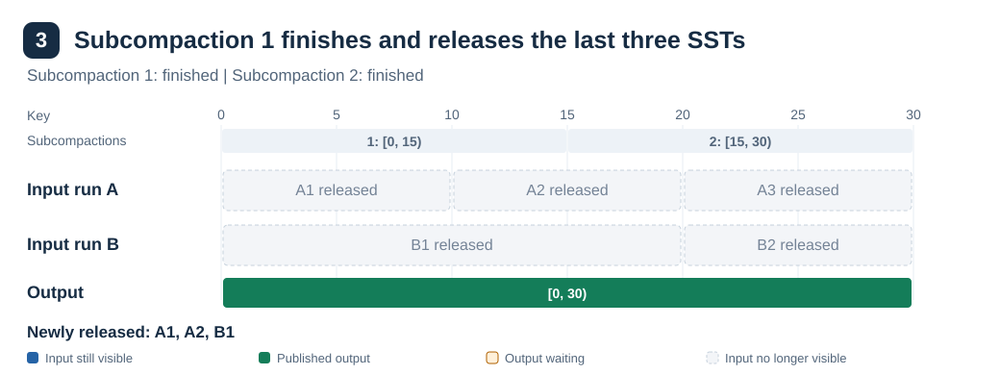

# Incremental Compaction

Table of Contents:

<!-- TOC start (generate with https://bitdowntoc.derlin.ch) -->

- [Summary](#summary)
- [Background](#background)
- [Goals](#goals)
- [Non-Goals](#non-goals)
- [Design](#design)
  - [Example of partial commits](#example-of-partial-commits)
  - [Finding durable progress](#finding-durable-progress)
  - [Choosing what to commit](#choosing-what-to-commit)
  - [Updating the manifest](#updating-the-manifest)
  - [When commits happen](#when-commits-happen)
  - [Configuration](#configuration)
  - [Stored progress and recovery](#stored-progress-and-recovery)
  - [Deleting released inputs](#deleting-released-inputs)
- [Impact analysis](#impact-analysis)
  - [Core API & query semantics](#core-api--query-semantics)
  - [Consistency, isolation, and multi-versioning](#consistency-isolation-and-multi-versioning)
  - [Time, retention, and derived state](#time-retention-and-derived-state)
  - [Metadata, coordination, and lifecycles](#metadata-coordination-and-lifecycles)
  - [Compaction](#compaction)
  - [Storage engine internals](#storage-engine-internals)
  - [Ecosystem & operations](#ecosystem--operations)
- [Operations](#operations)
  - [Performance & cost](#performance--cost)
  - [Observability](#observability)
  - [Compatibility](#compatibility)
- [Testing](#testing)
- [Rollout](#rollout)
- [Alternatives](#alternatives)
- [Open questions](#open-questions)
- [References](#references)

<!-- TOC end -->

Status: Draft

Authors:

- [Hussein Nomier](https://github.com/nomiero)

## Summary

This RFC introduces incremental compaction to reduce transient space
amplification during compaction. This matters for users that keep data on local
disk, as described in
[RFC-0034](https://github.com/slatedb/slatedb/blob/main/rfcs/0034-local-object-mirroring.md).

Incremental compaction publishes compacted key intervals while workers process
the remaining keys. This makes it possible to reclaim space from fully consumed
input SSTs before the compaction finishes.

## Background

Today, compaction output becomes visible only after every subcompaction
finishes. Until then, the manifest references all input SSTs while workers
write output to storage.

[RFC-0025](0025-distributed-compaction.md) separates compaction scheduling and
manifest commits from execution. The coordinator schedules jobs and commits
their results. Workers claim jobs, write output SSTs, and report progress through
`.compactions`. Workers do not publish compaction results to the manifest.

[RFC-0028](0028-subcompactions.md) divides a single compaction into disjoint key
ranges that a worker processes in parallel. These subcompactions can read
different portions of the same input SST. Each range stores its output list
in `.compactions`, so a replacement worker can resume from its last durable
output. The coordinator still commits the results together after all ranges
finish.

## Goals

- Release input SSTs during compaction instead of at its end.
- Support incremental commits with multiple subcompactions.
- Make the feature opt-in for deployments that need less temporary storage.

## Non-Goals

- Introduce a new compaction scheduler.

## Design

The incremental compaction can be achieved through partial manifest commits.
A partial commit is a manifest write that replaces completed portions of the
compaction inputs with the produced output in the manifest while the compaction
is still running.

This applies to sorted-run compactions. Compactions with L0 inputs still commit
once at completion, which keeps L0 watermark management unchanged.

Each `SortedRun` contains `SsTableView`s with a `visible_range` projection.
The coordinator changes these projections to show the output and hide the input
keys it replaces. Once no visible keys remain in an input SST, the coordinator
removes its view.

Two rules determine whether a partial commit is safe to publish:

- For each key in this compaction, reads must see the published output or the
  retained inputs, never both.
- Each SST must keep at most one continuous visible range, so commits do not
  create extra views for gaps.

A commit can remove an input's beginning, end, or entire range. The coordinator
adjusts proposals that leave an input view in two pieces. Such splits can occur
when an input SST spans subcompactions.

Each subcompaction publishes from the start of its planned range. Its published
progress grows as work finishes.

The coordinator considers all proposed intervals together. Adjacent intervals
join, which can allow a shared input SST to retain one continuous view.
[Choosing what to commit](#choosing-what-to-commit) describes how the coordinator
adjusts proposals that still split an input view.

### Example of partial commits

One worker runs two subcompactions to merge runs A and B. Subcompaction 1
processes `[0, 15)`, and subcompaction 2 processes `[15, 30)`. A2 and B1 cross
their shared boundary:

| Run | SST | Original key range |
|---|---|---|
| A | A1 | `[0, 10)` |
| A | A2 | `[10, 20)` |
| A | A3 | `[20, 30)` |
| B | B1 | `[0, 20)` |
| B | B2 | `[20, 30)` |

Each diagram below shows the state after a commit. Output bars represent key
intervals, not individual output SST boundaries.

#### Step 1: Publish the first prefix

Subcompaction 1 has durable output for `[0, 5)`, and subcompaction 2 has durable
output for `[15, 18)`. The coordinator publishes `[0, 5)`. Publishing `[15, 18)`
must wait because it cuts through A2 and B1, leaving two retained pieces in each.



#### Step 2: Publish subcompaction 2's range independently

Subcompaction 2 finishes, so the coordinator publishes `[15, 30)` and releases
A3 and B2. A2 and B1 each retain one continuous view, while subcompaction 1
continues.



#### Step 3: Publish the remaining gap

Subcompaction 1 finishes. The final commit publishes `[5, 15)` and releases
A1, A2, and B1.



Releasing an SST removes its view from the manifest. Checkpoints and GC rules
still determine when its physical storage can be reclaimed.

### Finding durable progress

The worker records each subcompaction's planned range and full output list in
`.compactions` like it's done today. A new completion flag records that all
input in the range is processed and all output is stored. It also records
completion for ranges that produce no output. This is useful to know that the
last key in the range is fully processed.

For an unfinished range, the coordinator reads the last key of its last
recorded output SST through `last_written_key_and_seq`. Call that key `B`.
The durable prefix is `[range.start, B)`. It excludes `B` because more versions
of that key can follow in later output SSTs.

As the worker records later SSTs, `B` can advance without waiting for the
subcompaction to finish. Once the completion flag is set, the durable interval
covers the whole planned range.

### Choosing what to commit

The coordinator chooses how far each subcompaction can advance its published
prefix. It considers all source runs and subcompactions together, so the
proposal leaves each input view empty or with one continuous range:

1. Start with every subcompaction's full durable interval.
2. If the proposal splits an input view, find the subcompactions proposing
   advances whose prefixes overlap that view. Choose the one with the highest
   start key. Remove its new progress from the proposal, but keep its previously
   committed prefix. Repeat until no input view splits. Each retry removes one
   advance for this pass, so the loop needs at most one retry per subcompaction.
3. If no prefix advances, skip the commit.

Adjacent progress can make a combined proposal safe. In the example above,
 `[0, 15)` and `[15, 18)` join into `[0, 18)`, so B1 retains only `[18, 20)`.

After step 1 of the example, B1 retains `[5, 20)`. Publishing subcompaction
2's `[15, 18)` leaves two pieces: `[5, 15)` and `[18, 20)`. A smaller advance
still leaves two pieces, so the coordinator postpones that advance. It can
reconsider when subcompaction 2 can publish through 20, or subcompaction 1 can
publish through 15.

### Updating the manifest

A `CompactionCommitRecord` in the manifest stores each job's published
intervals and final completion flag. The coordinator updates it atomically with
the SST views. This avoids reconstructing published progress from the current
views during partial commits and recovery.

```fbs
table CompactionCommitRecord {
    // ID of the compaction this record belongs to.
    compaction_id: Ulid (required);

    // Published key intervals, sorted by key without overlaps or adjacent
    // intervals.
    committed_intervals: [BytesRange] (required);

    // True once the final manifest commit succeeds. Kept until completion
    // is durable in .compactions so recovery can detect that success.
    completed: bool;
}
```

Earlier partial commits leave published output alongside retained inputs in
the destination run. The coordinator must distinguish them when it builds the
next manifest:

1. Identify earlier published output by SST id. Exclude it from the input views.
2. Remove the published keys from each retained input view. Drop empty views
   but keep every source run until the final commit.
3. Clip each output view to the published intervals. If an output SST does not
   overlap any committed interval, leave it out of the manifest. Keep it in the
   subcompaction's output list so a later commit can publish it.
4. Combine output and retained destination inputs in key order. Keep runs in
   descending id order and keep the destination's run id. Preserve version
   order across output SSTs that share a boundary key.
5. Add a checkpoint that references the manifest version being replaced.
6. Write the checkpoint, view changes, and updated commit records in one
  manifest CAS. [Recovery](#stored-progress-and-recovery) uses the commit records.

On a CAS conflict, the coordinator refreshes the manifest and merges concurrent
updates. It rebuilds the checkpoint against the new base version before retrying.

Empty source runs reserve their ids until the final commit. This prevents
conflicting ids when the scheduler creates new L0 compactions.

The final commit uses the full output list and removes all remaining inputs.
It removes projections added for incremental publication but preserves
independent ones, such as those from trivial moves. The final result must match
compaction without incremental publication.

### When commits happen

`CompactorOptions::incremental_commit_interval` sets one minimum interval for
partial commits across all jobs handled by the coordinator. On its existing
commit tick, the coordinator uses output and completion records already stored
in `.compactions`. Final commits do not wait for this interval.

On each commit pass, the coordinator collects the safe partial results of
every running job. When several jobs advance, it combines them in one manifest
CAS, with a separate commit record for each job. The write applies the whole
batch atomically, with one checkpoint of the preceding manifest.

With `incremental_commit_interval = 1 minute`, the sequence is:

1. Workers upload SSTs and report durable progress with heartbeats.
2. At most once a minute, the coordinator publishes more safe intervals and a
   new checkpoint.
3. Completion triggers a final commit and checkpoint without waiting for the
   interval.

### Configuration

```rust
pub struct CompactorOptions {
    // ... existing fields ...

    /// Minimum time between partial commits across all running compactions.
    pub incremental_commit_interval: Option<Duration>,
}
```

The default is `None`, which disables incremental compaction.

### Stored progress and recovery

Workers resume execution from `.compactions`. The coordinator recovers
published intervals from `CompactionCommitRecord` in the manifest.

Workers claim `Scheduled` jobs as `Running` and mark them `Compacted` after
execution. If a heartbeat expires, the coordinator reassigns the job.
Unfinished subcompactions resume after the `(key, seq)` cursor from their last
recorded output SST.

Coordinator restart still sends `Scheduled` jobs through `Submitted` for
revalidation. Revalidation now preserves `ctx` in `.compactions`, which holds
the range plan, full output lists, and retention sequence.

Source validation requires the source run ids to remain present. Partial
commits therefore keep these runs until the final commit, even when empty.

The final manifest update sets `completed = true` before the coordinator records
`Completed` in `.compactions`. If the coordinator crashes between these writes,
recovery uses the flag to acknowledge the successful commit. Once `Completed`
is durable in `.compactions`, a later manifest update removes the record.

### Deleting released inputs

Each commit keeps a checkpoint of the preceding manifest to protect its inputs
while existing readers use them.

GC can delete a released SST only when no current or checkpointed manifest
references it. Its ID timestamp must also fall below the GC cutoff.
[RFC-0029](0029-gc-safe-sst-ulid-timestamps.md) describes the age and watermark
limits that set this cutoff.

## Impact analysis

Marked items identify implementation areas that change or need correctness
testing. The public KV API and query semantics remain unchanged.

### Core API & query semantics

- [x] Basic KV API (`get`/`put`/`delete`)
- [x] Range queries, iterators, seek semantics
- [ ] Range deletions
- [ ] Error model, API errors

### Consistency, isolation, and multi-versioning

- [ ] Transactions
- [x] Snapshots
- [x] Sequence numbers

### Time, retention, and derived state

- [x] Time to live (TTL)
- [x] Compaction filters
- [x] Merge operator
- [ ] Change Data Capture (CDC)

### Metadata, coordination, and lifecycles

- [x] Manifest format
- [x] Checkpoints
- [x] Clones
- [x] Garbage collection
- [ ] Database splitting and merging
- [ ] Multi-writer

### Compaction

- [x] Compaction state persistence
- [x] Compaction strategies
- [x] Distributed compaction
- [x] `.compactions` format

### Storage engine internals

- [ ] Write-ahead log (WAL)
- [ ] Block cache
- [x] Object store cache
- [ ] Indexing (bloom filters, metadata)
- [ ] SST format or block format

### Ecosystem & operations

- [ ] CLI tools
- [ ] Language bindings (Go/Python/etc)
- [x] Observability (metrics/logging/tracing)

## Operations

### Performance & cost

Each partial commit batch adds one manifest version and one checkpoint.
Shorter commit intervals increase metadata writes and coordinator work.
Conflicts require additional write attempts.

Checkpoint retention and GC delays determine when released SSTs free disk space.

### Observability

TODO

### Compatibility
Feature is disabled by default and previous compaction states would work.
Rolling back to an older binary is not supported while incremental compactions are unfinished or their recovery records remain.

## Testing

TODO

## Rollout

TODO

## Alternatives

TODO

## Open questions

TODO

## References

- [RFC-0002: Compaction](0002-compaction.md), in particular the position on
  transient space amplification.
- [RFC-0024: Segment Oriented Compaction](0024-segment-oriented-compaction.md),
  the origin of projected SST views in the manifest.
- [RFC-0025: Distributed Compaction](0025-distributed-compaction.md), the
  coordinator and worker split and the manifest commit protocol.
- [RFC-0028: Subcompactions](0028-subcompactions.md), per range output SSTs and
  the resume cursor.
- [RFC-0029: GC Safe SST ULID Timestamps](0029-gc-safe-sst-ulid-timestamps.md),
  the compaction low watermark that protects unpublished output.
- [Maximizing Disk Utilization with Incremental
  Compaction](https://www.scylladb.com/2020/01/16/maximizing-disk-utilization-with-incremental-compaction/),
  ScyllaDB, the origin of this approach.
