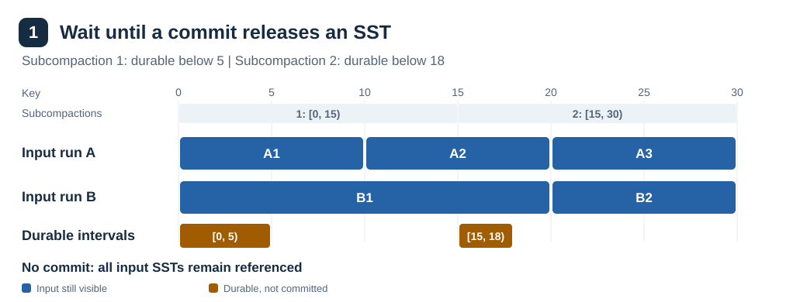
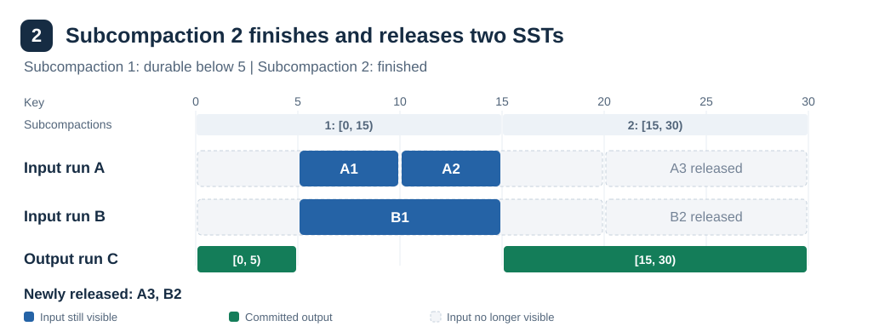

# Incremental Compaction

Table of Contents:

<!-- TOC start (generate with https://bitdowntoc.derlin.ch) -->

- [Summary](#summary)
- [Background](#background)
- [Goals](#goals)
- [Non-Goals](#non-goals)
- [Design](#design)
  - [Overview](#overview)
  - [Example of incremental commits](#example-of-incremental-commits)
  - [Durable progress](#durable-progress)
  - [Updating the manifest](#updating-the-manifest)
  - [Stored progress and recovery](#stored-progress-and-recovery)
  - [Deleting released inputs](#deleting-released-inputs)
  - [Commit timing and configuration](#commit-timing-and-configuration)
  - [Changes to sorted runs](#changes-to-sorted-runs)
- [Impact analysis](#impact-analysis)
  - [Core API & query semantics](#core-api--query-semantics)
  - [Consistency, isolation, and multi-versioning](#consistency-isolation-and-multi-versioning)
  - [Time, retention, and derived state](#time-retention-and-derived-state)
  - [Metadata, coordination, and lifecycles](#metadata-coordination-and-lifecycles)
  - [Compaction](#compaction)
  - [Storage engine internals](#storage-engine-internals)
  - [Ecosystem & operations](#ecosystem--operations)
- [Operations](#operations)
  - [Performance & cost](#performance--cost)
  - [Observability](#observability)
  - [Compatibility](#compatibility)
- [Testing](#testing)
- [Rollout](#rollout)
- [Alternatives](#alternatives)
- [Open questions](#open-questions)
- [References](#references)

<!-- TOC end -->

Status: Draft

Authors:

- [Hussein Nomier](https://github.com/nomiero)

## Summary

This RFC introduces incremental compaction to reduce transient space
amplification during compaction. This matters for users that keep data on local
disk, as described in
[RFC-0034](https://github.com/slatedb/slatedb/blob/main/rfcs/0034-local-object-mirroring.md).

A commit is an atomic manifest update. All its changes succeed or fail together.
The commit replaces input views with output views that readers can use.
Incremental compaction commits output for key intervals while workers process
the remaining keys. This allows reclamation of fully consumed input SSTs before
the compaction finishes.

## Background

Today, compaction output becomes visible only after every subcompaction
finishes. Until then, the manifest references all input SSTs while workers
write output to storage.

[RFC-0025](0025-distributed-compaction.md) separates compaction scheduling and
manifest commits from execution. The coordinator schedules jobs and commits
their results. Workers claim jobs, write output SSTs, and record progress in
`.compactions`. Recording progress does not change the manifest.
Only the coordinator commits compaction results.

[RFC-0028](0028-subcompactions.md) divides a single compaction into disjoint key
ranges that a worker processes in parallel. These subcompactions can read
different portions of the same input SST. The worker records each range's
output list in `.compactions`, so a replacement worker can resume from its
last recorded output SST. The coordinator still commits the results together
after all ranges finish.

## Goals

- Release input SSTs during compaction instead of at its end.
- Support incremental commits with multiple subcompactions.
- Make the feature opt-in for deployments that need less temporary storage.

## Non-Goals

- Introduce a new compaction scheduler.

## Design

### Overview

The coordinator adds incremental commits between the start of a job and its
final commit. An incremental commit is a manifest update that applies the
durable progress of a compaction that has not finished. The manifest update
itself is complete and atomic.
A final commit applies the finished compaction's full result and removes its
input runs.

One job moves through these steps:

1. The worker processes each subcompaction's planned key range, uploads
   output SSTs, and records each SST in `.compactions`. When a range
   finishes, the worker sets a completion flag for it. See
   [Durable progress](#durable-progress).

2. Once per `incremental_commit_interval`, `.compactions` record is polled and
   the coordinator derives one durable interval per subcompaction from that
   record. A durable interval is a key range whose output is fully stored, so
   it is safe to commit. For an unfinished range, the interval runs from the
   range start up to the last key of the last recorded output SST, and excludes
   that key. For a finished range, it covers the whole planned range. See
   [Durable progress](#durable-progress).

3. The coordinator subtracts the durable intervals from each input view.
   Each `SortedRun` holds `SsTableView`s. Each view has its own ID and a
   `visible_range` projection that limits the keys visible through it.
   Subtraction can narrow a view, split it into several views of the same
   physical SST, or remove it. The coordinator then rebuilds the output run
   from the full recorded output list, clipped to the durable intervals. The
   output run has a fresh ID and sits immediately before the input runs.
   For each key, readers see the committed output or the retained input,
   never both. See [Updating the manifest](#updating-the-manifest) and
   [Changes to sorted runs](#changes-to-sorted-runs).

4. The coordinator groups the updates of all running jobs into one batch.
   If the batch contains only incremental updates and no physical SST loses its
   last view, the coordinator skips the commit and keeps the recorded
   progress for a later attempt. Otherwise, it writes the new views, the
   output run, and a checkpoint of the previous manifest in one CAS. See
   [Commit timing and configuration](#commit-timing-and-configuration).

5. An SST with no remaining view in the new manifest is released. GC deletes
   it when no current or checkpointed manifest references it and its ID
   timestamp falls below the GC cutoff. See
   [Deleting released inputs](#deleting-released-inputs).

6. When every subcompaction finishes, the final commit applies the full
   output run and removes all input runs. It does not wait for the commit
   interval or for an SST release.

If the coordinator crashes, recovery rebuilds the same views from
`.compactions`. An incremental commit that did not land repeats. See
[Stored progress and recovery](#stored-progress-and-recovery).

The next section shows steps 2 through 6 on two input runs.

### Example of incremental commits

One worker runs two subcompactions to merge runs A and B. Subcompaction 1
processes `[0, 15)`, and subcompaction 2 processes `[15, 30)`. A2 and B1 cross
their shared boundary:

| Run | SST | Original key range |
|---|---|---|
| A | A1 | `[0, 10)` |
| A | A2 | `[10, 20)` |
| A | A3 | `[20, 30)` |
| B | B1 | `[0, 20)` |
| B | B2 | `[20, 30)` |

Step 1 shows durable intervals that do not yet justify a commit. Steps 2 and 3
show the manifest after a commit. Output bars represent key intervals in the
output run C, not individual output SST boundaries. The diagram rows group
inputs and output rather than showing manifest order.

#### Step 1: Wait until a commit releases an SST

Subcompaction 1 has a durable interval of `[0, 5)`, and subcompaction 2 has one
of `[15, 18)`. Applying these intervals leaves at least one view of every input
SST. The coordinator skips the incremental commit and keeps the manifest unchanged.
The recorded progress remains in `.compactions` for a later commit.



#### Step 2: Commit subcompaction 2's range independently

Subcompaction 2 finishes. The coordinator commits both `[0, 5)` and `[15, 30)`,
including the progress retained from step 1. This releases A3 and B2.
A2 and B1 each retain one continuous view, while subcompaction 1 continues.



#### Step 3: Commit the remaining gap

Subcompaction 1 finishes. The final commit covers `[0, 30)`, including the
remaining gap `[5, 15)`. It releases A1, A2, and B1.


Releasing an SST removes its last input view from the manifest. Checkpoints
and GC rules still determine when its physical storage can be reclaimed.

### Durable progress

Durable intervals can extend beyond the intervals already committed to the
manifest. The worker records each subcompaction's planned range and full output
list in `.compactions`, as it does today. A new completion flag records that the worker finished the range
and stored all its output. The flag also covers ranges that produce no output.

For an unfinished range, the coordinator takes the boundary key `B` from the
last recorded output SST's `CompactedSsTable.info.last_entry` metadata. This
avoids reading the SST's index and final block. If `last_entry` is absent,
the coordinator falls back to `last_written_key_and_seq` and uses only the
returned key.

The durable prefix is `[range.start, B)`. It excludes `B` because more versions
of that key can follow in later output SSTs. A commit must exclude every
version of `B`, including versions in earlier output SSTs.

As the worker records later SSTs, `B` can advance without waiting for the
subcompaction to finish. Once the completion flag is set, the durable interval
covers the whole planned range.

The coordinator joins adjacent durable intervals and applies their union to
retained inputs. It rebuilds the output run from the full recorded output lists.
Rebuilding these views is safe to repeat and can combine adjacent views of the
same SST.

A batch groups jobs updates into one atomic manifest commit. It can contain
updates from one or more compaction jobs. For a batch of incremental updates,
the coordinator skips the commit if no physical SST loses its last reference
in the manifest. Workers keep recording progress in `.compactions`, and a
later commit uses all accumulated durable intervals.

The coordinator must use progress at least as recent as its previous
commit. Output lists only grow, and completion flags never revert.

### Updating the manifest

The manifest stores the current input views and output run. The coordinator
uses the recorded plan and output lists in `.compactions` to rebuild these views.
A compare-and-swap (CAS) write requires an unchanged base version.

The scheduler reserves both input runs and the output run until the job
reaches a terminal state in `.compactions`. Other compactions cannot consume
or replace these runs during incremental commits. Empty input runs remain
present until the final commit.

The coordinator prepares the next manifest for a batch as follows.
Steps 1 through 6 apply to each job.

1. Subtract all durable intervals from each current input view, preserving any preexisting gaps or projections.
2. For each input view, keep one view for each remaining interval. If no interval remains, remove the view.
3. Keep every input run, including empty runs, until the final commit.
4. Rebuild the output run from the full recorded output list, clipped to the durable intervals.
5. Order output run views by key, preserving version order when output SSTs share a boundary key.
6. Update the output run's views. If the output run does not exist, insert it immediately before the first input run.
7. If the batch contains only incremental updates and releases no SSTs, skip the commit.
8. Add a checkpoint that references the manifest version being replaced.
9. Write the checkpoint and run changes in one manifest CAS.

When an input view splits, one retained piece keeps its ID and the other
pieces receive fresh view IDs. Unchanged views keep their IDs.

For example, an input view covering `[10, 20)` can span a subcompaction
boundary at `15`. Committing `[15, 18)` leaves views for `[10, 15)` and
`[18, 20)`. Both views reference the same input SST, but each has its own view ID.
The batch can commit this split when its other changes release an SST.

On a CAS conflict, the coordinator refreshes metadata objects and rebuilds
from the current manifest and durable job state.

The final commit uses the full output list and removes all input runs.

### Stored progress and recovery

Workers resume execution from `.compactions`. The coordinator uses that same
state to prepare manifest updates.

Workers claim `Scheduled` jobs as `Running` and mark them `Compacted` after
execution. If a heartbeat expires, the coordinator reassigns the job.
Unfinished subcompactions resume after the `(key, seq)` cursor from their last
recorded output SST. Workers obtain this cursor through `last_written_key_and_seq`.
The sequence number lets workers resume between versions of the same key.
Completed subcompactions, including empty ones, do not run again.

Coordinator restart still sends `Scheduled` jobs through `Submitted` for
revalidation. Revalidation preserves `ctx` in `.compactions`, including the
range plan, full output lists, completion flags, and retention sequence.
A worker must not clear this state after an incremental commit because some
original input files can already be gone.

Before revalidation, recovery recognizes successful final commits using the
completion rule below. For jobs that still need execution or a manifest commit,
revalidation requires every input run ID to remain present. It accepts the
job's own incrementally committed output run and uses input order without that
output run when testing consecutiveness. It preserves reservations for the
input runs and output run.

A crash before an incremental commit leaves the previous views intact. Recovery
rebuilds views from all durable intervals and applies the same SST release rule.
After a successful incremental commit, rebuilding unchanged views releases no SSTs,
so recovery skips the manifest update.

The coordinator writes the final manifest only after `.compactions` records
`Compacted`, which means execution finished. It then records `Completed` in
`.compactions`. If it crashes before the manifest write, all input run IDs
remain available, so recovery retries the final commit.

If the job is `Compacted` and all input run IDs are absent, the final manifest
commit succeeded. Recovery records `Completed` without rerunning the job or
changing the manifest.

### Deleting released inputs

A commit releases an SST when the new manifest no longer references any view
of that physical file. The coordinator compares physical SST IDs across all
trees in the current manifest and the new manifest for the complete batch.
Splitting or narrowing views does not release an SST while any view still
references it.

Each commit adds a checkpoint of the preceding manifest to protect existing
readers. In the example, step 1 skips the commit, while steps 2 and 3 each
add a checkpoint.

GC can delete a released SST only when no current or checkpointed manifest
references any view of it. Its ID timestamp must also fall below the GC cutoff.
[RFC-0029](0029-gc-safe-sst-ulid-timestamps.md) describes the age and watermark
limits that set this cutoff.

### Commit timing and configuration

The coordinator already polls `.compactions` every `compactions_poll_interval`
to find finished jobs, as [RFC-0025](0025-distributed-compaction.md) describes.
`CompactorOptions::incremental_commit_interval` sets one minimum interval
between incremental commit attempts across all jobs handled by the
coordinator. Once that interval has elapsed since the last attempt, the
coordinator uses its next poll to derive durable intervals from the output
and completion records already stored in `.compactions` and to attempt a
commit. A skipped commit counts as an attempt. Final commits happen on any
poll that finds a `Compacted` job and do not wait for this interval.

Incremental commits apply only to sorted-run compactions. Compactions with L0
inputs commit only at completion, so L0 watermark management does not change.

On each attempt, the coordinator prepares manifest updates from the durable
intervals of every running job. These updates become committed only when the
manifest CAS succeeds. When several jobs advance, it combines their updates
in one manifest CAS. A batch containing only incremental updates must release at
least one SST. A batch containing a final update commits even if it releases
no SSTs. Each committed batch adds one checkpoint of the preceding manifest.

With `incremental_commit_interval = 1 minute`, the sequence is:

1. Workers upload SSTs and record progress in `.compactions` with heartbeats.
2. At most once a minute, the coordinator commits durable intervals if the batch releases at least one SST.
3. Completion triggers a final commit and checkpoint without waiting for the interval or an SST release.

```rust
pub struct CompactorOptions {
    // ... existing fields ...

    /// Minimum time between incremental commits across all running compactions.
    pub incremental_commit_interval: Option<Duration>,
}
```

The default is `None`, which disables incremental compaction.

### Changes to sorted runs

Incremental compaction uses separate output runs instead of merging the output
with the oldest input run. This requires changes to ID allocation and
manifest placement.
These rules apply to every compaction that produces a sorted run, including
compactions that commit only at completion.

Run IDs identify runs. Their positions in the manifest define data order.
The coordinator uses those positions to keep newer data before older data.
Compaction inputs must remain consecutive in that order.

For example, compacting runs 3 and 2 in `[5, 4, 3, 2, 1]` uses a fresh ID, 6.
The first incremental commit inserts run 6 before its block of input runs:
`[5, 4, 6, 3, 2, 1]`. The final commit removes the input runs and leaves
`[5, 4, 6, 1]`. Run 6 and the retained inputs have disjoint visible key ranges.
Unrelated runs retain their order relative to the entire block of input runs.

The coordinator keeps this output run position across incremental commits.
Compactions with only L0 inputs insert their output before the existing sorted
runs using the existing rules for consecutive L0 inputs.

The allocator reserves output run IDs across all trees and active jobs,
including jobs selected in the same scheduling pass. It must not reuse an ID
referenced by a run in the manifest or an unfinished job.

Scheduling and recovery must use manifest position for input order and
input IDs for identity.

## Impact analysis

Marked items identify implementation areas that change or need correctness
testing. The public KV API and query semantics remain unchanged.

### Core API & query semantics

- [x] Basic KV API (`get`/`put`/`delete`)
- [x] Range queries, iterators, seek semantics
- [ ] Range deletions
- [ ] Error model, API errors

### Consistency, isolation, and multi-versioning

- [ ] Transactions
- [x] Snapshots
- [x] Sequence numbers

### Time, retention, and derived state

- [x] Time to live (TTL)
- [x] Compaction filters
- [x] Merge operator
- [ ] Change Data Capture (CDC)

### Metadata, coordination, and lifecycles

- [x] Manifest format
- [x] Checkpoints
- [x] Clones
- [x] Garbage collection
- [ ] Database splitting and merging
- [ ] Multi-writer

### Compaction

- [x] Compaction state persistence
- [x] Compaction strategies
- [x] Distributed compaction
- [x] `.compactions` format

### Storage engine internals

- [ ] Write-ahead log (WAL)
- [ ] Block cache
- [x] Object store cache
- [ ] Indexing (bloom filters, metadata)
- [ ] SST format or block format

### Ecosystem & operations

- [ ] CLI tools
- [ ] Language bindings (Go/Python/etc)
- [x] Observability (metrics/logging/tracing)

## Operations

### Performance & cost

Each committed batch adds one manifest version and one checkpoint. Skipping
incremental batches that release no SSTs avoids metadata writes and new checkpoints.
Shorter commit intervals increase coordinator work and can increase metadata
writes. Conflicts require additional write attempts.

Checkpoint retention and GC delays determine when released SSTs free disk space.

### Observability

TODO

### Compatibility

Incremental compaction is disabled by default.

Existing jobs that reuse an input run ID for their output run must finish
under the old rules before the new rules take effect. The implementation must
support this upgrade scenario.

Older binaries assume descending run IDs, so rollback is not possible after
one new compaction.

## Testing

TODO

## Rollout

TODO

## Alternatives

TODO

## Open questions

TODO

## References

- [RFC-0002: Compaction](0002-compaction.md), in particular the position on
  transient space amplification.
- [RFC-0024: Segment Oriented Compaction](0024-segment-oriented-compaction.md),
  the origin of projected SST views in the manifest.
- [RFC-0025: Distributed Compaction](0025-distributed-compaction.md), the
  coordinator and worker split and the manifest commit protocol.
- [RFC-0028: Subcompactions](0028-subcompactions.md), per range output SSTs and
  the resume cursor.
- [RFC-0029: GC Safe SST ULID Timestamps](0029-gc-safe-sst-ulid-timestamps.md),
  the compaction low watermark that protects output awaiting a commit.
- [Maximizing Disk Utilization with Incremental
  Compaction](https://www.scylladb.com/2020/01/16/maximizing-disk-utilization-with-incremental-compaction/),
  ScyllaDB, the origin of this approach.
