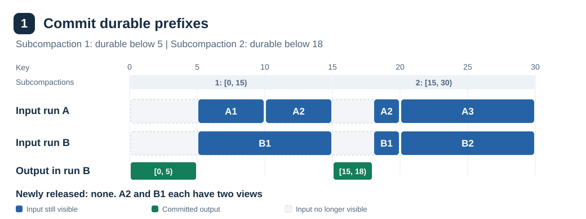
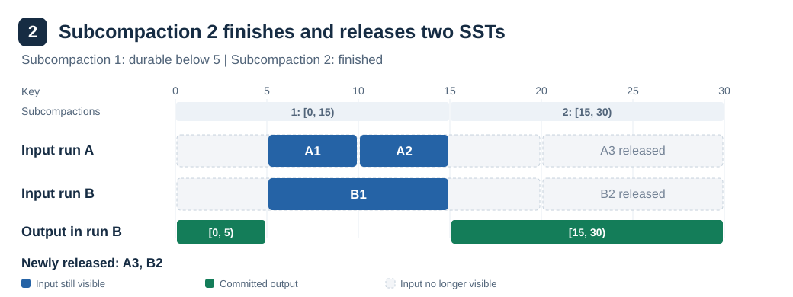
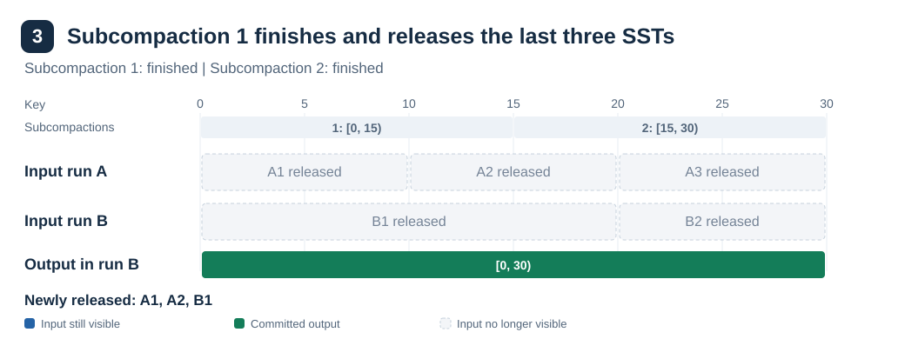

# Incremental Compaction

Table of Contents:

<!-- TOC start (generate with https://bitdowntoc.derlin.ch) -->

- [Summary](#summary)
- [Background](#background)
- [Goals](#goals)
- [Non-Goals](#non-goals)
- [Design](#design)
  - [Overview](#overview)
  - [Example of incremental commits](#example-of-incremental-commits)
  - [Durable progress](#durable-progress)
  - [Output in the destination run](#output-in-the-destination-run)
  - [Updating the manifest](#updating-the-manifest)
  - [Stored progress and recovery](#stored-progress-and-recovery)
  - [Deleting released inputs](#deleting-released-inputs)
  - [Commit timing and configuration](#commit-timing-and-configuration)
  - [Schema changes](#schema-changes)
- [Impact analysis](#impact-analysis)
  - [Core API & query semantics](#core-api--query-semantics)
  - [Consistency, isolation, and multi-versioning](#consistency-isolation-and-multi-versioning)
  - [Time, retention, and derived state](#time-retention-and-derived-state)
  - [Metadata, coordination, and lifecycles](#metadata-coordination-and-lifecycles)
  - [Compaction](#compaction)
  - [Storage engine internals](#storage-engine-internals)
  - [Ecosystem & operations](#ecosystem--operations)
- [Operations](#operations)
  - [Performance & cost](#performance--cost)
  - [Observability](#observability)
  - [Compatibility](#compatibility)
- [Testing](#testing)
- [Rollout](#rollout)
- [Alternatives](#alternatives)
- [Open questions](#open-questions)
- [References](#references)

<!-- TOC end -->

Status: Draft

Authors:

- [Hussein Nomier](https://github.com/nomiero)

## Summary

This RFC introduces incremental compaction to reduce transient space
amplification during compaction. This matters for users that keep data on local
disk, as described in
[RFC-0034](https://github.com/slatedb/slatedb/blob/main/rfcs/0034-local-object-mirroring.md).

A commit is an atomic manifest update. All its changes succeed or fail together.
The commit replaces input views with output views that readers can use.
Incremental compaction commits output for key intervals while workers process
the remaining keys. This allows reclamation of fully consumed input SSTs before
the compaction finishes.

## Background

Today, compaction output becomes visible only after every subcompaction
finishes. Until then, the manifest references all input SSTs while workers
write output to storage.

[RFC-0025](0025-distributed-compaction.md) separates compaction scheduling and
manifest commits from execution. The coordinator schedules jobs and commits
their results. Workers claim jobs, write output SSTs, and record progress in
`.compactions`. Recording progress does not change the manifest.
Only the coordinator commits compaction results.

[RFC-0028](0028-subcompactions.md) divides a single compaction into disjoint key
ranges that a worker processes in parallel. These subcompactions can read
different portions of the same input SST. The worker records each range's
output list in `.compactions`, so a replacement worker can resume from its
last recorded output SST. The coordinator still commits the results together
after all ranges finish.

## Goals

- Release input SSTs during compaction instead of at its end.
- Support incremental commits with multiple subcompactions.
- Make the feature opt-in for deployments that need less temporary storage.

## Non-Goals

- Introduce a new compaction scheduler.

## Design

### Overview

The coordinator adds incremental commits between the start of a job and its
final commit. An incremental commit is a manifest update that applies the
durable progress of a compaction that has not finished.
A final commit applies the finished compaction's full result and removes its
input runs, except the destination run like it happens today.

One job moves through these steps:

1. The worker processes each subcompaction's planned key range, uploads
   output SSTs, and records each SST in `.compactions`. When a range
   finishes, the worker sets the status of the range to `Completed`. See
   [Durable progress](#durable-progress).

2. Once per incremental commit interval, the coordinator polls
   `.compactions` and derives one durable interval per subcompaction from the
   record. A durable interval is a key range whose output is fully stored, so
   it is safe to commit. For an unfinished range, the interval runs from the
   range start up to the last key of the last recorded output SST, and excludes
   that key. For a finished range, it covers the whole planned range. See
   [Durable progress](#durable-progress).

3. The coordinator subtracts the durable intervals from each input view.
   Each `SortedRun` holds `SsTableView`s. Each view has its own ID and a
   `visible_range` projection that limits the keys visible through it.
   Subtraction can narrow a view, split it into several views of the same
   physical SST, or remove it. The coordinator then adds the recorded output,
   clipped to the durable intervals, to the destination run. For each key,
   readers see the committed output or the retained input, never both. See
   [Updating the manifest](#updating-the-manifest) and
   [Output in the destination run](#output-in-the-destination-run).

4. The coordinator groups the updates of all running jobs into one batch.
   It writes the new views and a checkpoint of the previous manifest in one
   CAS. See [Commit timing and configuration](#commit-timing-and-configuration).

5. An SST with no remaining view in the new manifest is released. GC deletes
   it when no current or checkpointed manifest references it and its ID
   timestamp falls below the GC cutoff. See
   [Deleting released inputs](#deleting-released-inputs).

6. When every subcompaction finishes, the final commit sets the destination
   run to the full output list and removes the other input runs. It does not
   wait for the commit interval.

The next section shows steps 2 through 6 on two input runs.

### Example of incremental commits

One worker runs two subcompactions to merge runs A and B. Run A is newer than
run B, so run B is the destination run. Subcompaction 1 processes `[0, 15)`,
and subcompaction 2 processes `[15, 30)`. A2 and B1 cross their shared
boundary:

| Run | SST | Original key range |
|---|---|---|
| A | A1 | `[0, 10)` |
| A | A2 | `[10, 20)` |
| A | A3 | `[20, 30)` |
| B | B1 | `[0, 20)` |
| B | B2 | `[20, 30)` |

Each step shows the manifest after a commit. Output bars represent key
intervals of output in run B, not individual output SST boundaries. The
diagrams show the retained inputs of run B and the output in run B on separate
rows, but both are views in the same run.

#### Step 1: Commit durable prefixes

Subcompaction 1 has a durable interval of `[0, 5)`, and subcompaction 2 has one
of `[15, 18)`. The coordinator commits both intervals. A1 keeps a narrower view.
A2 and B1 each split into two views because `[15, 18)` falls inside them.
Every input SST keeps at least one view, so the commit releases no SSTs.



#### Step 2: Commit subcompaction 2's range independently

Subcompaction 2 finishes. The coordinator commits both `[0, 5)` and `[15, 30)`.
This releases A3 and B2. The views of A2 and B1 that cover `[18, 20)` are
removed, so A2 and B1 each keep one view while subcompaction 1 continues.



#### Step 3: Commit the remaining gap

Subcompaction 1 finishes. The final commit covers `[0, 30)`, including the
remaining gap `[5, 15)`. It releases A1, A2, and B1, and removes run A. Run B
now holds only output.



### Durable progress

The worker records each subcompaction's planned range and full output list in
 `.compactions`, as it does today. A new status for each subcompaction
records whether the worker finished the range and stored all its output. See
[Schema changes](#schema-changes). The `Completed` status also covers ranges
that produce no output.

For an unfinished range, the coordinator takes the boundary key `B` from the
last recorded output SST's `CompactedSsTable.info.last_entry` metadata. This
avoids reading the SST's index and final block.

The durable prefix is `[range.start, B)`. It excludes `B` because more versions
of that key can follow in later output SSTs. A commit must exclude every
version of `B`, including versions in earlier output SSTs.

As the worker records later SSTs, `B` can advance without waiting for the
subcompaction to finish. When the status of the range is `Completed`, the
durable interval covers the whole planned range.

The coordinator must use progress at least as recent as its previous commit.
 Output lists only grow, and a subcompaction status never changes from
`Completed` back to `InProgress`.

### Output in the destination run

After an incremental commit, the destination run holds two kinds of views:
committed output views and retained input views of the destination run. The
coordinator tells them apart by SST ID. An SST in the recorded output lists of
the job is output. Every other SST in the destination run is input.

Output views cover the durable intervals. Retained input views cover the rest
of the key space. The two sets do not overlap, so the destination run stays a
valid sorted run with views in key order.

The destination run keeps its ID and its position in the manifest. Incremental
compaction does not change how the scheduler assigns run IDs or orders runs.

### Updating the manifest

The manifest stores the current input views and output views. The coordinator
uses the recorded plan and output lists in `.compactions` to rebuild these views.

The scheduler reserves all input runs, including the destination run, until
the job reaches a terminal state in `.compactions`. Other compactions cannot
use these runs during incremental commits.

The coordinator prepares the next manifest for a batch as follows.
Steps 1 through 4 apply to each job.

1. Subtract all durable intervals from each input view, preserving any preexisting gaps or projections. Make one view for each interval that remains, and remove the view if no keys remain.
2. Keep every input run, including empty runs, until the final commit.
3. Rebuild the output views from the full recorded output list, clipped to the durable intervals. The rebuild is safe to repeat.
4. Set the views of the destination run to its retained input views and the output views, ordered by key.
5. Add a checkpoint that references the manifest version being replaced.
6. Write the checkpoint and run changes in one manifest CAS.

When an input view splits, one retained piece keeps its ID and the other
pieces receive fresh view IDs. Unchanged views keep their IDs. Step 1 of the
[example](#example-of-incremental-commits) shows this split for A2 and B1.

On a CAS conflict, the coordinator refreshes metadata objects and rebuilds
from the current manifest and durable job state.

### Stored progress and recovery

Workers resume execution from `.compactions`. The coordinator uses the same
state to prepare manifest updates.

Workers claim `Scheduled` jobs as `Running` and mark them `Compacted` after
execution. If a heartbeat expires, the coordinator reassigns the job.
An unfinished subcompaction resumes after the last entry in its last recorded
output SST. Completed subcompactions, including empty ones, do not run again.

Each job in `.compactions` stores a `TieredCompactionContext`, which holds the
subcompactions and the retention sequence of the job. Today, only workers read
it. With incremental compaction, the coordinator also reads the range plan,
the output lists, and the subcompaction status in it. After a job is scheduled,
workers cannot re-plan it:

- A worker must not change the planned range of a subcompaction.
- A worker must not remove or reorder recorded output SSTs. It can only append
  output SSTs to a range.
- A worker can change the status of a range only from `InProgress` to
  `Completed`.
- A worker must not clear the `TieredCompactionContext`.

On restart, the coordinator still sends `Scheduled` jobs through `Submitted`
for revalidation. Revalidation keeps the `TieredCompactionContext` and requires
every input run ID to remain present. It accepts output views that an earlier
incremental commit added to the destination run.

Recovery rebuilds views from all durable intervals. If the coordinator crashed
before an incremental commit, the next commit applies the same views.

The coordinator writes the final manifest after `.compactions` records
`Compacted`, and then records `Completed`. If it crashes before the manifest
write, recovery retries the final commit. If it crashes after the manifest
write but before recording `Completed`, the input runs other than the
destination are absent, and the destination run holds only recorded output SSTs.
Recovery then records `Completed` without changing the manifest.

### Deleting released inputs

A commit releases an SST when the new manifest no longer references any view
of that physical file. The coordinator compares physical SST IDs across all
trees in the current manifest and the new manifest for the complete batch.
Splitting or narrowing views does not release an SST while any view still
references it.

Each commit adds a checkpoint of the preceding manifest to protect existing
readers. This is the same short-lived checkpoint that the compactor writes
today when it updates the manifest. In the example, each of the three steps
adds a checkpoint.

GC can delete a released SST only when no current or checkpointed manifest
references any view of it. Its ID timestamp must also fall below the GC cutoff.
[RFC-0029](0029-gc-safe-sst-ulid-timestamps.md) describes the age and watermark
limits that set this cutoff.

### Commit timing and configuration

The coordinator already polls `.compactions` every `compactions_poll_interval`
to find finished jobs, as [RFC-0025](0025-distributed-compaction.md) describes.
The incremental commit interval is one minimum interval between incremental
commits across all jobs handled by the coordinator. Once
that interval has elapsed since the last incremental commit, the coordinator
uses its next poll to derive durable intervals from the output and status
records already stored in `.compactions` and commits them. Final commits happen
on any poll that finds a `Compacted` job and do not wait for this interval.

Incremental commits apply only to sorted-run compactions. Compactions with L0
inputs commit only at completion, so L0 watermark management does not change.

The incremental commit interval starts as an internal constant. Will be set
based on testimg. If users need to tune it, a later change can expose it in
`CompactorOptions`.

`CompactorOptions` gets a new field to turn the feature on:

```rust
pub struct CompactorOptions {
    // ... existing fields ...

    /// Commits the durable progress of running compactions to the manifest
    /// before they finish.
    pub enable_incremental_compaction: bool,
}
```

The default is `false`, which disables incremental compaction. We can remove
that field later once we confirm incremental compaction is stable.

### Schema changes

Incremental compaction adds one field in `.compactions`. The manifest schema
does not change, because `SortedRunV2` and `CompactedSsTableView` already
store views with a `visible_range`.

`Subcompaction` in `schemas/compactor.fbs` gets a status enum:

```fbs
enum SubcompactionStatus : byte {
    /// The worker has not finished this range. This includes ranges that
    /// did not start. More output SSTs can follow.
    InProgress = 0,
    /// The worker processed all input in this range and recorded all its
    /// output SSTs, including ranges that produce no output.
    Completed,
}

table Subcompaction {
    range: BytesRange (required);
    output_ssts: [CompactedSsTable];

    // Appended after existing fields so vtable offsets for earlier fields
    // remain stable. Records written before this field existed read as
    // `InProgress`.
    status: SubcompactionStatus;
}
```

The Rust `Subcompaction` struct gets a matching `status` field. An enum
instead of a boolean flag leaves room for more states later.

## Impact analysis

Marked items identify implementation areas that change or need correctness
testing. The public KV API and query semantics remain unchanged.

### Core API & query semantics

- [x] Basic KV API (`get`/`put`/`delete`)
- [x] Range queries, iterators, seek semantics
- [ ] Range deletions
- [ ] Error model, API errors

### Consistency, isolation, and multi-versioning

- [ ] Transactions
- [x] Snapshots
- [x] Sequence numbers

### Time, retention, and derived state

- [x] Time to live (TTL)
- [x] Compaction filters
- [x] Merge operator
- [ ] Change Data Capture (CDC)

### Metadata, coordination, and lifecycles

- [x] Manifest format
- [x] Checkpoints
- [x] Clones
- [x] Garbage collection
- [ ] Database splitting and merging
- [ ] Multi-writer

### Compaction

- [x] Compaction state persistence
- [x] Compaction strategies
- [x] Distributed compaction
- [x] `.compactions` format

### Storage engine internals

- [ ] Write-ahead log (WAL)
- [ ] Block cache
- [x] Object store cache
- [ ] Indexing (bloom filters, metadata)
- [ ] SST format or block format

### Ecosystem & operations

- [ ] CLI tools
- [ ] Language bindings (Go/Python/etc)
- [x] Observability (metrics/logging/tracing)

## Operations

### Performance & cost

Each committed batch adds one manifest version and one checkpoint. With
an incremental commit interval of 1 minute, incremental commits add at most one
manifest version per minute. Shorter commit intervals increase coordinator work and metadata writes. Conflicts require additional write attempts.

Checkpoint retention and GC delays determine when released SSTs free disk space.

### Observability

`CompactionStats` gets one new counter, `incremental_released_bytes`, next to
`jobs_claimed` and `jobs_reclaimed`. It counts the bytes of input SSTs that
incremental commits release before the final commit. This shows how much
space becomes free before compactions finish.

### Compatibility

Incremental compaction is disabled by default.

The new `status` field in `Subcompaction` is additive. Older records read as
`InProgress`, as [Schema changes](#schema-changes) describes.


## Testing

- Regular unit test coverage.
- Fault injection and recovery tests.
- Testing on a large dataset (e.g. 1TB) and confirm that released bytes and GC
makes incremental compaction can do what it's intended for.

## Rollout

- Feature will start as false until we confirm it's stable then we can make
it always enabled and remove the knob to enable it.

## Alternatives

### Status quo

Keep the current behavior, where the manifest references all input SSTs until
the compaction finishes. A deployment that mirrors data on local disk, as
described in
[RFC-0034](https://github.com/slatedb/slatedb/blob/main/rfcs/0034-local-object-mirroring.md),
then keeps both the inputs and the output of a compaction on disk until the
final commit. This transient space amplification can need up to twice the size
of the compacted data, so the mirror wastes a large amount of disk space.

### Leveled compaction

Leveled compaction rewrites small key ranges in each compaction, so it needs
less temporary space. But it is a different compaction strategy, not a change
to the current one. It loses the benefits of size-tiered compaction, such as
lower write amplification.

## Open questions

### Output in the destination run or in a new sorted run

Question: Keep the destination run as the oldest input run, as it is today,
or write the output to a new sorted run?

Answer: Keep the destination run as it is today. A new sorted run removes the
need to keep input views and output views together in the destination run,
but this benefit is small. A new sorted run for the output can be follow-up
work. [#2115](https://github.com/slatedb/slatedb/issues/2115) tracks the
first step, which makes sorted run IDs ULIDs that do not define run order.

## References

- [RFC-0002: Compaction](0002-compaction.md), in particular the position on
  transient space amplification.
- [RFC-0024: Segment Oriented Compaction](0024-segment-oriented-compaction.md),
  the origin of projected SST views in the manifest.
- [RFC-0025: Distributed Compaction](0025-distributed-compaction.md), the
  coordinator and worker split and the manifest commit protocol.
- [RFC-0028: Subcompactions](0028-subcompactions.md), per range output SSTs and
  the resume cursor.
- [RFC-0029: GC Safe SST ULID Timestamps](0029-gc-safe-sst-ulid-timestamps.md),
  the compaction low watermark that protects output awaiting a commit.
- [Maximizing Disk Utilization with Incremental
  Compaction](https://www.scylladb.com/2020/01/16/maximizing-disk-utilization-with-incremental-compaction/),
  ScyllaDB, the origin of this approach.
