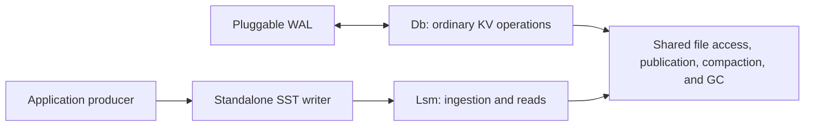

# SlateDB Standalone SST Writing and Ingestion

Table of Contents:

- [Summary](#summary)
- [Motivation](#motivation)
- [Goals](#goals)
- [Non-Goals](#non-goals)
- [Design](#design)
- [Impact Analysis](#impact-analysis)
- [Operations](#operations)
- [Testing](#testing)
- [Rollout](#rollout)
- [Alternatives](#alternatives)
- [Open Questions](#open-questions)
- [References](#references)

Status: Draft

Authors:

* [kumarUjjawal](https://github.com/kumarUjjawal)

## Summary

This RFC adds a standalone `SstWriter` and an `Lsm` client for ingesting and
reading completed SSTs. Applications can build files outside SlateDB's write
path, then use its file management and compaction. `Lsm` assigns destination
sequences through the manifest without changing the physical SST format.
Applications switch between `Lsm` for bulk loading and `Db` for ordinary writes,
with one active writer for each database.

## Motivation

[Issue #1143](https://github.com/slatedb/slatedb/issues/1143) requests SST creation
outside a running database. Applications in
[issue #1105](https://github.com/slatedb/slatedb/issues/1105) also accumulate
updates in structures such as vectors or bitmaps and encode them at flush time.
Shared file interfaces let these producers reuse SlateDB's storage layer while
keeping their own memory representation.

An [Iceberg primary-key index](https://github.com/slatedb/slatedb/pull/2103#issuecomment-5789501302)
provides a bulk-loading use case. Initial construction runs without a WAL,
followed by ordinary reads, writes, and deletes for CDC with the WAL enabled.
Snapshot runs fill memory and L0 quickly, then wait for compaction.
External SST construction can avoid the memory write path, but its benefit
also depends on sorting, L0 admission, and compaction throughput.

The index also rebuilds individual tables during CDC. Its owner confirmed that
[separate databases per table are compatible](https://github.com/slatedb/slatedb/pull/2103#issuecomment-5808365694)
and cross-table index transactions are unnecessary. Each table can switch
clients independently, following the
[ingestion-only client proposal](https://github.com/slatedb/slatedb/pull/2103#pullrequestreview-5286827487)
and [per-table handoff](https://github.com/slatedb/slatedb/pull/2103#issuecomment-5800449727).

This proposal builds on [RFC #1146](https://github.com/slatedb/slatedb/pull/1146),
by [KarinaMilet](https://github.com/KarinaMilet), with shared SST interfaces and
a SlateDB ingestion protocol.

## Goals

- Expose standalone SST creation and reading.
- Expose LSM reads and ingestion independently of ordinary KV writes.
- Define exclusive writer ownership, publication, and handoff to `Db`.
- Preserve sequence ordering, recovery, and file cleanup guarantees.
- Measure manifest growth and the complete bulk-loading cost.

## Non-Goals

- Add ingestion to `Db` or run `Db` and `Lsm` writers concurrently on one database.
- Define custom KV provider traits or coordinate their unpublished memory reads.
- Add a general external sorter, foreign formats, or custom comparators.
- Import source database histories or publish multiple files atomically.
- Provide durable request deduplication or automatic rebuild recovery.

## Design

### Component Boundary

`Db` owns ordinary KV operations, memory, transactions, and WAL integration.
`Lsm` accepts completed files and exposes reads over published state. Both reuse
file access, manifest publication, compaction, and GC, with a common writer
fencing protocol. The existing `Reader` provides shared get and scan execution.

This separates file production from LSM maintenance alongside the pluggable WAL.
An application can own its write frontend without adopting SlateDB's memtable,
but it remains responsible for queries and recovery of its unpublished data.



For one database path, `Db` and `Lsm` operate at different times. Read-only
consumers can coexist under the visibility rules below. Shared SST reading and
writing live in `slatedb-sst`; client coordination remains in `slatedb`.

### SST Interfaces

The writer reuses the existing streaming SST implementation. Its public surface
includes the following methods:

```rust
pub enum SstSequenceMode {
    Preserve,
    Deferred,
}

impl SstWriter {
    pub fn new(
        store: Arc<dyn ObjectStore>,
        path: Path,
        options: SstWriterOptions,
    ) -> Result<Self, Error>;

    pub async fn add(&mut self, entry: RowEntry) -> Result<(), Error>;
    pub async fn close(self) -> Result<SstArtifact, Error>;
}

impl SstReader {
    pub fn new_with_options(
        store: Arc<dyn ObjectStore>,
        options: SstReaderOptions,
    ) -> Self;

    pub async fn open_at(&self, path: Path, id: Ulid) -> Result<SstFile, Error>;
}
```

Each writer produces one file. Options select the format version, compression,
filters, block transformation, and sequence mode:

| Mode | Record contract | Use |
| --- | --- | --- |
| Preserve | Supplied sequences and timestamps, including versions and merge operands | Standalone creation and inspection |
| Deferred | Sequence zero, one value or tombstone per key, no timestamps | `Lsm::ingest` |

Keys ascend in byte order, with versions in descending sequence order. The writer
rejects unordered entries, duplicate key-sequence pairs, empty files, and records
outside the selected mode or format limits before passing them to the builder.

`close()` completes upload and returns an `SstArtifact` containing the
`SsTableHandle`, path, byte size, row count, encoded-file SHA-256 digest, and
optional object version. Failure returns no artifact and attempts an upload
abort. The producer owns source files and any incomplete uploads that survive
cleanup. Artifacts use versioned JSON, independently of Rust serialization.

`SstReaderOptions` makes the cache and database root optional and includes the
cache scope and block transformer. Existing constructors and database-relative
open methods remain available. `open_at` needs no root, and callers without an
artifact supply a fresh physical ID. A cache scope and ID identify immutable
bytes under one decoding configuration, including cached metadata.

### Producing Sorted Files

`SstWriter` accepts sorted records. The producer handles unsorted snapshot input
by sorting within a memory budget, spilling sorted runs when necessary, and
merging them into SSTs. Duplicate-key resolution follows the source's update
order before deferred files are written. Arbitrary chunk or scan completion
order cannot determine which value wins.

The initial ingestion API uses files staged in the client's configured object
store, outside database-managed directories. Producers use the same block
transformation as destination readers and compactors. Local sorting scratch and
completed object-store SSTs have separate lifetimes, both owned by the producer.
The external sorter and its spill policy remain application work.

### Lsm API

```rust
pub enum IngestSequence {
    Allocate,
    Explicit(u64),
}

pub struct IngestOptions {
    pub sequence: IngestSequence,
    pub ttl: Ttl,
}

pub struct IngestResult {
    pub sequence: u64,
    pub sst_id: Ulid,
}

impl Lsm {
    pub fn builder(path: Path, store: Arc<dyn ObjectStore>) -> LsmBuilder;

    pub async fn ingest(
        &self,
        artifact: SstArtifact,
        options: IngestOptions,
    ) -> Result<IngestResult, Error>;

    pub async fn get_with_options(
        &self, key: &[u8], options: &ReadOptions,
    ) -> Result<Option<Bytes>, Error>;

    pub async fn scan_with_options(
        &self, range: BytesRange, options: &ScanOptions,
    ) -> Result<DbIterator, Error>;

    pub async fn close(&self) -> Result<(), Error>;
}
```

The builder configures file access, caching, compaction, and the segment
extractor using existing SlateDB conventions. It also accepts the database's WAL
configuration, merge operator, and system clock. The WAL configuration selects
the WAL store or custom `WriterInit` used for handoff. Ingestion uses that
client's store and transformer, with no per-import override. `Lsm` has no put,
write, delete, or transaction methods and appends no imported records to the WAL.

`Allocate` chooses the next sequence. `Explicit` requires a value above the
current maximum and uses the same external sequence authority as later `Db`
writes. Each call accepts one deferred file. Publication order determines
precedence for overlapping keys, so producers submit dependent files in order.
The returned SST ID identifies the installed object for diagnostics, but
compaction can replace and collect that object.

Deferred records do not expire. `Ttl::NoExpiry` bypasses a configured default,
while `Ttl::Default` requires no default TTL. Explicit expiration is unsupported.
Creation and expiration timestamps remain absent after compaction. Filters must
handle absent timestamps, and missing `KeyValue` creation time remains zero.

### Ingestion and Publication

`Lsm` serializes ingestion operations while reads and compaction continue.
After admission validates the artifact and reserves L0 capacity, the publisher
assigns a sequence and a fresh destination SST ID. It copies the staged source
into database-owned storage, checking the digest, checksums, ordering, record
types, sequence mode, and format limits on the stream it uploads.

The copy binds to the source object version when available. Prefetched footer
and index data must match the copied bytes. Successful upload and supported
transport checksums provide upload integrity without a full destination reread.
The caller-owned source remains unchanged.

Destination IDs follow [RFC 0029](0029-gc-safe-sst-ulid-timestamps.md): physical
and initial view IDs match, and their timestamps meet the current L0 cutoff.
No later ingestion passes an unfinished copy or publication. This preserves
existing GC protection for unpublished L0 files without a pending-import field.
A new attempt after abandonment or restart allocates a fresh destination ID.

After upload, a single manifest update publishes the file view and its sequence
override. It advances `last_l0_seq` and the monotonic `last_l0_clock_tick`,
records the sequence/time sample, and updates `recent_snapshot_min_seq` under
the existing retention rules for active read views.
The WAL replay boundary stays at the frontier established before opening `Lsm`.
Imports advance committed and database-durable progress after local read state
is installed, without advancing WAL progress or waiting for a nonexistent WAL
record. Success means the file and publication are durable.

### Segments and Rebuilds

The proposed segment contract accepts one SST belonging to one segment. With an
extractor configured, validation checks every key against that extractor and
requires one valid prefix. Publication uses that segment's L0 tree and existing
prefix-conflict checks. Files spanning segments are rejected, and an
unsegmented database continues to use its root tree.

This supports generation-based index cleanup without making a multi-file rebuild
atomic. The application keeps the affected table unavailable until all files and
its completion marker are durable. It tracks incomplete generations for restart
and retires old generations only under its cleanup contract. Importing a file
does not delete old keys absent from that file.

One database per table permits other tables to continue CDC during this handoff.
Those databases still share machine and object-store resources. Segment routing
and the release scope for this use case remain explicit open questions.

### Switching Between Lsm and Db

A handoff transfers exclusive writer ownership and preserves the published
sequence and clock. Applications stop operations using the departing client and
finish active transactions before closing it. `Db` must close with a successful
`FlushType::MemTable` flush so the files cover its accepted writes. A WAL-only
flush is insufficient.

Before serving reads or imports, `Lsm` uses the existing `WriterFencer` and
configured `WriterInit::fence_and_init` to fence both manifest and WAL writers.
It consumes the returned bounded replay iterator, ignoring rows already covered
by `last_l0_seq`. If any row has a higher sequence, opening fails and the
application must recover and flush through `Db` first. Iterator errors also
abort startup.

Startup closes the returned WAL writer without appending imported rows, including
when replay validation fails. Opening succeeds only after validation and WAL
close succeed, with manifest ownership rechecked before admission. The monotonic
clock starts from `last_l0_clock_tick` using the configured system clock. This
reuses the existing WAL recovery boundary without a separate handoff record.

`Lsm::close` stops admission and settles in-flight publication before releasing
ownership. A subsequent `Db` reads the latest manifest and starts above the
last imported sequence. A crash recovers published files from the manifest.
Unpublished sources and application rebuild progress remain caller-owned.
An uncertain close or publication cannot authorize a new client to skip fencing
or recovery checks.

### Read Visibility

Each `Lsm` read captures a consistent published view and sequence through shared
read machinery and uses existing read-retention rules to protect its files.
An import at 101 supersedes older records for new reads, while a reader pinned
to an earlier checkpoint retains its old manifest. This proposal adds no
cross-client snapshot handle or renewable-checkpoint lifecycle. Existing
compaction-filter limits on snapshot consistency still apply.

A WAL-following `DbReader` can outlive a client switch, so separate writer clients
alone do not fix reader ordering. It must capture a bounded WAL end before
loading a fresh manifest, replay only through that bound, and install the combined
state before advancing durable progress. Initial open and refresh use the same
order under the existing checkpoint policy. Pinned readers retain their fixed
manifest and replay boundary.

If the captured WAL includes a later `Db` write at 102, the subsequent manifest
read must include import 101. Sequence gaps cannot identify imports because
ordinary writes can supply explicit sequences. This requires a fresh, strongly
consistent manifest read and bounded replay support from the WAL implementation.

### Manifest Representation

Sequence interpretation belongs to the view:

```fbs
table CompactedSsTableView {
    id: Ulid (required);
    sst_id: Ulid (required);
    visible_range: BytesRange;
    sequence_override: ulong = null;
}
```

Absent overrides preserve stored sequences. Populated overrides apply one
sequence before snapshot filtering, version selection, or merge resolution.
Translation occurs above raw caches, while standalone readers expose physical
metadata. Checkpoints, clones, and projections preserve the override while
referencing the original file. Compaction inputs resolve these views from the
manifest.

Compactions that rewrite records materialize effective sequences and omit
overrides from their output views. When `enable_trivial_move` is enabled and
effective key ranges are disjoint, compaction reuses the views with their
overrides intact. `SortedRunV2` already stores `CompactedSsTableView`, so sequence
translation applies in sorted runs as well as L0. The manifest contains no
durable request history or pending-import collection.

### Failures and Retries

A failure before manifest publication leaves no visible import. The upload is
aborted when possible, and GC collects abandoned destination objects. Restart
recovers committed manifest state but cannot reconstruct the caller's source
artifact or resume an unfinished copy.

`Lsm` retains the operation's sequence `s`, destination ID, writer epoch, and
exact candidate update for manifest version `m`. Later imports remain blocked
until publication resolves. After a lost write response, it refreshes through
the fenced manifest interface. If it still owns the epoch, `last_l0_seq >= s`
proves publication because `s` exceeds the previous frontier.

Each manifest version is a conditional create at the next ID. If the frontier
remains below `s` and `m` is absent, `Lsm` retries the same update at `m`.
Once `m` exists, a delayed write cannot replace it. A refresh then distinguishes
the import from a competing metadata update. If the competing update won, `Lsm`
reapplies the import to the latest manifest under the same writer epoch.
All retries retain the metadata GC boundary checks that reject obsolete versions.

If reads or writes remain uncertain, or another writer fences the client, it
stops admission and reports unresolved publication. Caller cancellation does
not abandon this coordination.

A new API call is a new import, even if it supplies the same artifact. There is
no request ID, status lookup, or durable deduplication guarantee. After a lost
response, callers must reconcile their application state before resubmitting:
a new sequence can overwrite intervening imports. A frontier advanced by another
writer cannot identify the earlier request, and `Allocate` returns its sequence
only on success. An SST object's presence or absence also cannot prove the
original outcome.

## Impact Analysis

### Core API & Query Semantics

- [x] Basic KV API (`get`/`put`/`delete`)
- [x] Range queries, iterators, seek semantics
- [ ] Range deletions
- [x] Error model, API errors

### Consistency, Isolation, and Multi-Versioning

- [x] Transactions - active `Db` operations finish before handoff to `Lsm`.
- [x] Snapshots
- [x] Sequence numbers

### Time, Retention, and Derived State

- [x] Logical clocks
- [x] Time to live (TTL)
- [x] Compaction filters
- [x] Merge operator
- [x] Change Data Capture (CDC)

### Metadata, Coordination, and Lifecycles

- [x] Manifest format
- [x] Checkpoints
- [x] Clones
- [x] Garbage collection
- [x] Database splitting and merging
- [x] Multi-writer - `Db` and `Lsm` share writer fencing.

### Compaction

- [x] Compaction state persistence
- [x] Compaction filters
- [x] Compaction strategies
- [x] Distributed compaction
- [ ] Compactions format

### Storage Engine Internals

- [x] Write-ahead log (WAL)
- [x] Block cache
- [x] Object store cache
- [x] Indexing (bloom filters, metadata)
- [ ] SST format or block format - physical layout is unchanged.

### Ecosystem & Operations

- [x] CLI tools
- [x] Language bindings (Go/Python/etc)
- [x] Observability (metrics/logging/tracing)

## Operations

### Performance & Cost

A sequence override contributes eight payload bytes per populated view, before
FlatBuffers alignment and vtable overhead. Trivial moves retain overrides in
sorted runs, so their count is not bounded by L0 admission alone. Measure
equivalent current and proposed manifests with absent and populated overrides
in L0 and sorted runs, realistic key bounds, segments, projections, and retained
checkpoints. Include configured L0 limits and stress cases of 1,000, 10,000, and
100,000 views. Report encoded size, encode/decode time, decoded memory, and traffic
from repeated full manifest uploads.

For a staged file of `S` bytes, a streamed copy reads about `S` and uploads `S`,
plus footer and index requests. It needs one successful publication update,
excluding opening/fencing, concurrent compaction, multipart requests, and retries.
Creating the staged file adds another `S` upload. The source and installed copy
occupy roughly `2S` until the producer deletes the source, before compaction.
Manifest reads and object listing during open, recovery, and GC also contribute
requests.

Per database, ingestion runs one file copy and publication at a time. Benchmark
throughput and L0 waits across file sizes to determine whether serialization or
compaction limits loading. Parallel destination copies can reuse RFC 0029's
protection by allocating destination IDs before dispatch in publication order
and publishing in that order. This needs no separate pending-object GC mechanism
and remains a follow-up optimization.

Compare the complete pipeline with normal batch writes: sorting and spill,
SST construction, index/filter buffers, upload, validation, publication, and
compaction. Ingestion still waits for L0 capacity. Independent databases avoid
a shared writer pause but multiply cache budgets, polling, and maintenance work.
Measure active table counts and CDC latency alongside initial build time and
rebuild time. The adopter's 100k+ TPS CDC target is a goal, not a measured benefit
of this proposal.

### Observability

Opening `Lsm` is the explicit opt-in. This proposal adds no `Db` ingestion setting.
Track staged and imported bytes, L0 admission waits, validation and publication
time, failures, uncertain outcomes, and manifest size. Expose the published
sequence and clock, handoff failures, and recovery-required errors. Record object
and manifest identifiers for diagnostics without treating them as retry tokens.

### Compatibility

Keep existing `SstReader`, `SstFile`, `SstIndex`, `RowEntry`, `ValueDeletable`,
`SstStats`, and `BlockStats` paths through re-exports with unchanged type identity.
Share the SST handle, ID, info, type, and filter-format types without circular
dependencies. Move `CompressionCodec` with the file code while preserving
`slatedb::config::CompressionCodec` and forwarding existing compression features.
Expose the handle's format version through an accessor.

Manifest format version 3 uses the extended `ManifestV2` table. New decoders
continue to read versions 1 and 2. Writers emit v3 only when a sequence override
is present and v2 otherwise. The `.compactions` format stays unchanged: input
sources are view or sorted-run IDs, and output `CompactedSsTable` entries contain
physical file metadata. Overrides live in the manifest, whose version makes old
consumers reject them instead of silently interpreting zero sequences.

Upgrade readers, writers, compactors, workers, GC, CLI tools, and binding runtimes
before the first import. This includes reader-ordering changes for consumers
that follow WAL across a handoff.

Trivial moves can retain overrides indefinitely, so disabling ingestion alone
does not permit downgrade. Stop writes and imports, finish active compactions,
and set `enable_trivial_move=false` on the compactor. Use `Admin::submit_compaction`
to submit full compactions for affected trees, then verify completion and a v2
manifest without overrides. Release or expire checkpoints retaining v3 manifests
and allow obsolete versions to be collected before opening with old code.
Retained v3 checkpoints continue to block downgrade, and clones need the same
checks independently.

Block transformation must remain compatible across clients and compactors for
the file's lifetime. Imported changes bypass WAL-based CDC, so consumers of that
WAL need an application notification or resnapshot. Existing binding APIs remain
unchanged. New writer and `Lsm` bindings are follow-up work.

## Testing

- **SST contracts**: Round-trip both modes, standalone paths, versions, timestamps, merges, tombstones, compression, transformers, stats, and digests; reject invalid ordering and mode/format violations before builder access.
- **Publication and reads**: Import 101 over earlier data and preserve an older checkpoint. Verify get/scan, shared caches, projections, and restart across trivial moves that retain overrides and compactions that materialize sequences.
- **Handoff**: Close `Db` with published write 100, import 101 through `Lsm`, then reopen `Db` and write 102; race long-lived `DbReader` refreshes and exercise explicit sequence gaps.
- **Recovery and fencing**: Exercise failed `Db` close, configured WAL stores and custom `WriterInit`, replay exhaustion and errors, WAL-writer close failures, and competing clients. Reject WAL rows beyond file coverage and verify merge behavior and clock continuity across handoff.
- **Failure boundaries**: Fail or cancel copy, validation, upload, and manifest publication. Retry an identical update at the same manifest ID after a lost response, including a delayed original write and a competing metadata update. Preserve epoch fencing and metadata GC boundary checks. A failed import at 101 followed by another writer publishing 102 must not count as proof of the first import. Exercise caller resubmission and GC during uploads that outlast minimum file age.
- **Segments and generations**: Route single-segment files, reject mixed or conflicting prefixes, preserve unrelated segments, and restart an incomplete rebuild without publishing its completion marker.
- **Compatibility**: Cover old-reader rejection, conditional manifest versions, unchanged `.compactions` encoding, and worker lookup of overridden input views. Test downgrade after forced rewrites, including rejection while v3 checkpoints remain. Cover timestamp-free records, optional reader roots/caches, and unchanged public exports.
- **Simulation and cost**: Combine ingestion, compaction, GC, fencing, and restart in the existing simulation framework; run the metadata and end-to-end experiments above.

## Rollout

1. Measure manifest growth and establish a bulk-load baseline, including sorting and L0 waits.
2. Extract shared SST code with compatible exports, then expose the standalone writer and reader paths.
3. Add conditional manifest versions and propagate overrides through reads, compaction, and retained manifests.
4. Add `Lsm` ingestion and reads with exclusive fencing, publication, and uncertain-outcome handling.
5. Validate the `Db` handoff, long-lived readers, and segment routing before enabling the per-table index workflow.

The standalone interfaces can ship independently. The `Lsm` release must specify
its supported WAL handoffs and segment scope. Documentation covers source
ownership, staging, retries, client switching, generation completion, and upgrades.

## Alternatives

### Ingestion Through Db

A mixed API supports imports while ordinary writes continue in the same database,
but requires coordination with memory, transactions, WAL progress, and publication.
The per-table workload can switch clients instead. Mixed ingestion remains a
future extension if a workload requires concurrent write modes within one database.

### Normal Batch Writes or Writer-Only Release

Normal batches retain the existing lifecycle and avoid external sorting and
staging. They remain the performance baseline because external files still
enter L0. A writer-only release is useful for file tooling but does not expose
LSM publication and reads to application-owned producers.

### Durable Request Tracking

A manifest-backed outcome collection can prevent duplicate imports after lost
responses, at the cost of metadata growth, retention rules, and capacity limits.
Separate outcome storage still needs an atomic link to publication. The first
API documents uncertain outcomes without promising durable deduplication.

### Rewrite or Translate Imports

Rewriting during ingestion embeds destination sequences and timestamps at the
cost of decoding and encoding every record. An override avoids that rewrite for
deferred files. Sequence offsets preserve source history but require additional
rules for overlap, bounds, and snapshots.

## Open Questions

1. Does the first `Lsm` release include single-segment ingestion, or does adoption wait for a later segment milestone?
2. What memory, spill, staging, and duplicate-resolution policies does the first producer need for unsorted inputs?
3. What manifest growth and per-table resource budgets are acceptable at the expected table count?
4. Does a concrete workload require import-time timestamps, atomic multi-file publication, or durable retry tracking?

## References

- [Issue #1143](https://github.com/slatedb/slatedb/issues/1143) and [RFC #1146](https://github.com/slatedb/slatedb/pull/1146), by [KarinaMilet](https://github.com/KarinaMilet).
- RFC #1146 requests for the [package boundary](https://github.com/slatedb/slatedb/pull/1146#discussion_r2649290355), [reader paths](https://github.com/slatedb/slatedb/pull/1146#discussion_r2649289303), [returned handle](https://github.com/slatedb/slatedb/pull/1146#discussion_r2674413603), and [SlateDB manifest representation](https://github.com/slatedb/slatedb/pull/1146#discussion_r2674447687).
- RFC #2103 discussions of the [Lsm client](https://github.com/slatedb/slatedb/pull/2103#pullrequestreview-5286827487), [per-table databases](https://github.com/slatedb/slatedb/pull/2103#issuecomment-5800449727), [producer requirements](https://github.com/slatedb/slatedb/pull/2103#issuecomment-5808365694), [retry guarantees](https://github.com/slatedb/slatedb/pull/2103#discussion_r4078981105), and [shared configuration](https://github.com/slatedb/slatedb/pull/2103#discussion_r4079040923).
- [Issue #1105](https://github.com/slatedb/slatedb/issues/1105), including [read and freeze coordination](https://github.com/slatedb/slatedb/issues/1105#issuecomment-3666587872).
- [Pluggable WAL](0030-pluggable-wal.md), [sequence tracking](0012-sequence-tracker.md), [checkpoints](0004-checkpoints.md), and [GC-safe SST identifiers](0029-gc-safe-sst-ulid-timestamps.md).
- [Segment-oriented compaction](0024-segment-oriented-compaction.md) and [compaction filters](0017-compaction-filters.md).
- [SST writer](../slatedb/src/tablestore.rs), [standalone reader](../slatedb/src/sst_reader.rs), [shared Reader](../slatedb/src/reader.rs), and [manifest publication](../slatedb/src/memtable_flusher/manifest_writer.rs).
- [Writer fencing](../slatedb/src/fence.rs), [WAL initialization](../slatedb/src/wal/mod.rs), and [client configuration](../slatedb/src/db/builder.rs).
- [File-view schema](../schemas/sst.fbs), [manifest schema](../schemas/manifest.fbs), and [compaction-state schema](../schemas/compactor.fbs).
- [Conditional metadata writes](../slatedb-txn-obj/src/object_store.rs), [metadata GC boundary checks](../slatedb-txn-obj/src/lib.rs), and [manual compaction](../slatedb/src/admin.rs).
