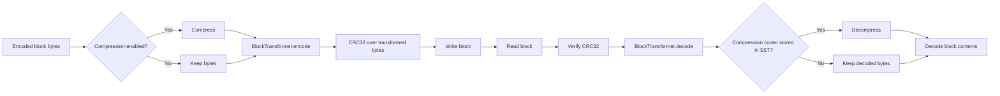

[`BlockTransformer`](https://docs.rs/slatedb/latest/slatedb/trait.BlockTransformer.html) is SlateDB's hook for custom per-block transforms such as encryption. SlateDB applies it only to SST blocks written to object storage. That includes data blocks plus the filter, index, and stats blocks in both WAL SSTs and compacted SSTs.

It does not transform manifest files, compaction-state files, or the trailing [`SsTableInfo`](https://github.com/slatedb/slatedb/blob/main/slatedb/src/db_state.rs) record and final offset/version footer in an SST. SlateDB reads that footer first so it can find the transformed blocks and learn the stored compression codec.

## Order

SlateDB applies the transform after optional block compression on write, and reverses that order on read.

The checksum covers the transformed payload, not the original plaintext block. Corruption of the stored bytes is detected before SlateDB calls `decode`. A mismatched transformer usually fails later, during `decode`, decompression, or block decoding.

This ordering matters when you combine a transformer with [Compression](/docs/design/compression). If the transformer encrypts data, it receives compressed bytes, not raw row encodings.

## Trait Contract

The trait has two async methods: [`encode`](https://docs.rs/slatedb/latest/slatedb/trait.BlockTransformer.html#tymethod.encode) and [`decode`](https://docs.rs/slatedb/latest/slatedb/trait.BlockTransformer.html#tymethod.decode). `decode` must invert `encode` for every block SlateDB writes.

The methods are async so implementations can offload CPU-heavy work or call an external service. The trait docs include a minimal XOR example, but real deployments usually use it for encryption or another reversible byte transform.

SlateDB does not store transformer identity, key ID, or transform version in `SsTableInfo`. If you need key rotation or format evolution, the transformer has to make the stored block self-describing or rely on shared external configuration that every reader can still use later.

## Matching Configuration

Every component that reads or writes SST blocks has to use compatible transformer logic.

- Writers configure it with [`DbBuilder::with_block_transformer`](https://docs.rs/slatedb/latest/slatedb/struct.DbBuilder.html#method.with_block_transformer).
- Standalone compactors configure it with [`CompactorBuilder::with_block_transformer`](https://docs.rs/slatedb/latest/slatedb/struct.CompactorBuilder.html#method.with_block_transformer).
- Read-only database handles configure it with [`DbReaderBuilder::with_block_transformer`](https://docs.rs/slatedb/latest/slatedb/struct.DbReaderBuilder.html#method.with_block_transformer).
- SST inspection configures it through [`SstReader::new`](https://docs.rs/slatedb/latest/slatedb/struct.SstReader.html#method.new).

If a writer used a transformer and a reader does not, SlateDB can still open the untransformed footer metadata, but reads of the filter, index, stats, or data blocks fail. That is why the [DbReader](/docs/design/reader) page calls out matching reader-side configuration explicitly.

`WalReader` currently does not expose a `BlockTransformer` setting. WAL SSTs written with a custom transformer are therefore not inspectable through that API.
