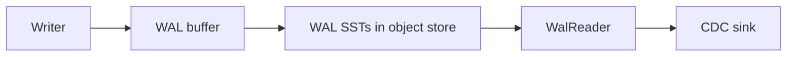

Change data capture (CDC) turns writes in SlateDB into a durable change stream that external systems can consume. SlateDB exposes CDC through the `WalReader`, which reads WAL SST files from object storage and returns the same row entries that were written by the database.

This page explains how to build a CDC pipeline with `WalReader`, including ordering, durability, deletes, and resume semantics.

## When to use WAL-based CDC

Use WAL-based CDC when you need:

- A low-latency stream of inserts, updates, and deletes.
- A simple, append-only feed that can be replayed.
- Integration with downstream systems like Kafka, Pulsar, or data lakes.

WAL-based CDC is not a bootstrap or backfill API. If you need an initial full copy of data, combine a backfill with WAL tailing as described below.

## What WalReader reads

SlateDB stores WAL SSTs under the `wal/` directory in the object store. Each WAL file has a monotonically increasing ID and is written in insertion order by sequence number. `WalReader` lists these files in ID order and exposes a `WalFile` for each file in object storage.

Each `WalFile` exposes an `iterator()` that yields `RowEntry` values in order. The iterator is optional because the underlying object might have been deleted between listing and reading (for example, due to GC).

Each row returned by the iterator is a `RowEntry` with:

- `key`: the key bytes
- `value`: a `ValueDeletable` variant (`Value`, `Merge`, or `Tombstone`)
- `seq`: a globally increasing sequence number
- `create_ts` and `expire_ts`: optional timestamps

Deletes appear as `Tombstone`s. If your database uses merge operators, you will see `Merge` values and must apply the merge logic yourself if your sink requires materialized values.

## Visibility and durability

`WalReader` only sees WAL SSTs that have been flushed to object storage. WAL flushes occur when:

- The WAL buffer reaches its size threshold.
- The configured `flush_interval` elapses.
- You explicitly call a WAL or MemTable flush.

If you need lower CDC latency, shorten `Settings::flush_interval` or call:

```rust
use slatedb::config::{FlushOptions, FlushType};

db.flush_with_options(FlushOptions {
    flush_type: FlushType::Wal,
}).await?;
```

Note that a memtable flush also forces any pending WAL data to be flushed first, which guarantees the WAL is durable before L0 data is written.

## CDC architecture



`WalReader` does not interpret or compact data. It simply provides a durable, ordered feed of row-level changes.

## Basic tailer loop

This example tails all WAL files, emits row entries, and records a cursor so the stream can resume after restarts.

```rust
use slatedb::WalReader;
use std::sync::Arc;
use object_store::ObjectStore;

struct CdcCursor {
    wal_id: u64,
    last_seq: u64,
}

async fn tail_wal(object_store: Arc<dyn ObjectStore>, path: &str) -> anyhow::Result<()> {
    let wal_reader = WalReader::new(path, object_store);
    let mut cursor = CdcCursor { wal_id: 0, last_seq: 0 };

    loop {
        let wal_files = wal_reader.list(cursor.wal_id..).await?;
        for wal_file in wal_files {
            if let Some(mut iter) = wal_file.iterator().await? {
                while let Some(row) = iter.next_entry().await? {
                    if wal_file.id == cursor.wal_id && row.seq <= cursor.last_seq {
                        continue;
                    }

                    // Emit the change to your sink here.
                    // For deletes, check row.value.is_tombstone().

                    cursor.wal_id = wal_file.id;
                    cursor.last_seq = row.seq;
                    // Persist cursor to durable storage here.
                }
            }
        }

        tokio::time::sleep(std::time::Duration::from_millis(250)).await;
    }
}
```

This pattern is safe and idempotent as long as you persist the cursor after each emitted row and skip any rows with `seq <= last_seq` when resuming.

## Backfills plus streaming

If you need a full backfill of data not in the WAL along with the WAL change stream:

1. Start a WAL tailer and buffer changes.
2. Clone the database using `Admin::create_clone`.
2. Range scan (`Db::scan_rows`) over the cloned database to read old data.
3. Apply the buffered WAL changes in sequence order.
4. Continue tailing WALs from the stored cursor.

This avoids gaps between the backfill and the live stream. Your sink should be idempotent if the backfill and WAL stream can overlap.

## Resumability and ordering

`WalReader` lists files in wal ID order, and each WAL file stores entries in increasing sequence order. This gives you a total order that is stable across restarts. A minimal cursor includes:

- `wal_id`: the WAL file currently being processed
- `last_seq`: the highest sequence number processed in that file

If you need to fan out to multiple workers, partition by key and keep one cursor per partition. Ensure your sink can handle replays or duplicates. Since WAL files can be deleted between `list` and `iterator` calls, handle `None` by skipping that file or re-listing from a newer cursor.

## Listing costs and polling strategy

The `list()` API can become expensive when WAL retention is high or GC is not keeping up. If the GC is not running, listings can grow without bound. Even with GC, CDC often needs higher retention. Retaining WAL files for just 1 hour can yield tens of thousands of files, which is expensive to list in both cost (object-store listing calls) and time.

If you plan to poll frequently:

1. Use `list()` once to get an initial view (or to recover after a long outage).
2. Track the highest WAL ID you have successfully processed.
3. From mthen on, poll using `WalReader::get(latest_id + 1)`.

## Deletes, merges, and TTL

- Deletes appear as `ValueDeletable::Tombstone`. Emit a delete event in your CDC sink.
- Merge operands appear as `ValueDeletable::Merge`. If you use merge operators, downstream consumers must either apply the merge or store the operand as-is.
- TTL is represented by `expire_ts`. If your downstream system enforces TTL, honor this field.

## WAL retention and GC

WAL SSTs are garbage collected based on the GC configuration. If your CDC consumer falls behind, the WAL files it needs may be deleted. Set the WAL GC `min_age` option to retain files long enough for your slowest consumer and implement monitoring. Slow consumers should copy the WAL files elsewhere for processing. See [Garbage Collection](/docs/design/gc) for details.

## Using a separate WAL object store

If your database uses a dedicated WAL object store, pass that store to `WalReader::new` rather than the main store.
