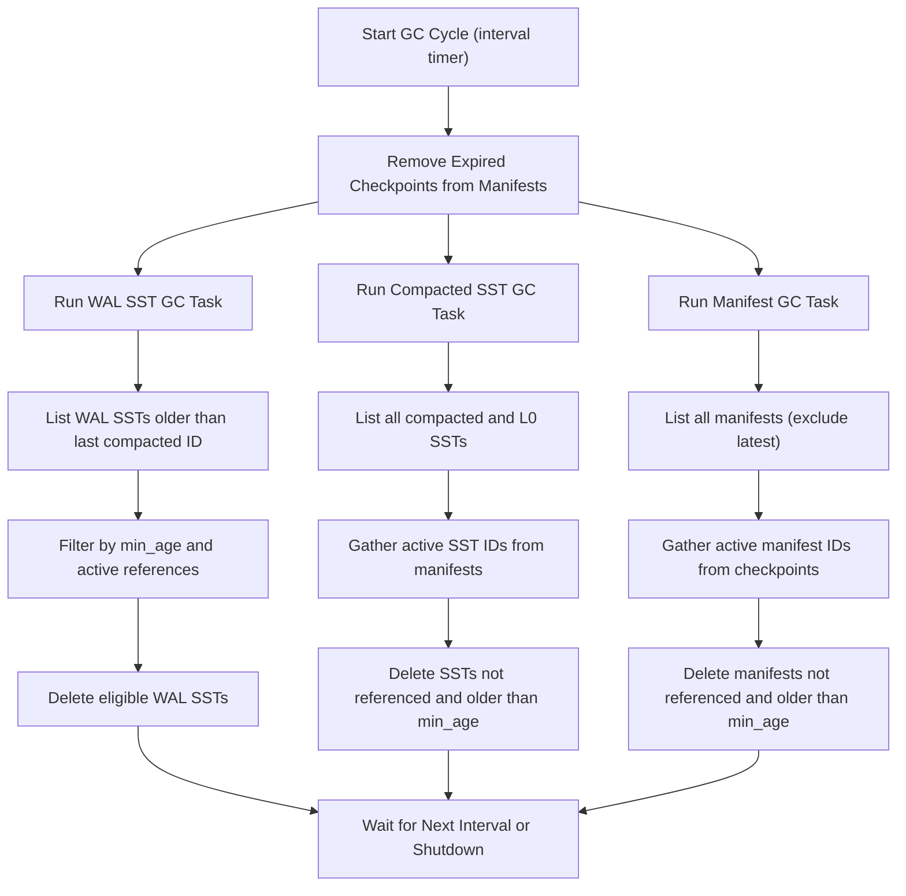

SlateDB's garbage collector runs as a background task in the client process, periodically checking for obsolete files in the database storage.

The garbage collector has a configurable minimum age and interval for each file type (WAL SSTs, compacted SSTs, and manifests). Garbage collection for a file type can be disabled by setting its options to `None`. The collector runs every `interval` seconds and will delete files older than `min_age` that are not referenced by any active manifest or checkpoint.

Below is a diagram illustrating the high-level flow of garbage collection in SlateDB:

