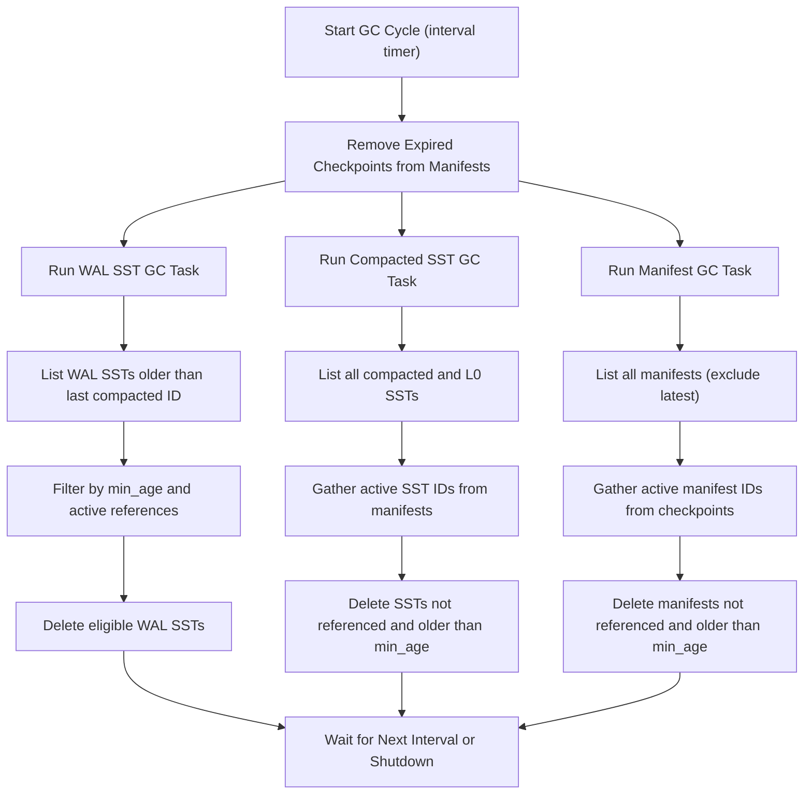

SlateDB's garbage collector runs as a background task in the client process, periodically checking for obsolete files in the database storage.

The garbage collector has a configurable minimum age and interval for each file type (WAL SSTs, WAL fence SSTs, compacted SSTs, manifests, and compactions). Garbage collection for a file type can be disabled by setting its options to `None`. The collector runs every `interval` seconds and will delete files older than `min_age` that are not referenced by any active manifest or checkpoint.

Each garbage collection directory type supports a `dry_run` option. When enabled, the collector logs files that would be deleted without actually deleting them. This is useful for testing or verifying garbage collection behavior before enabling actual deletion.

Below is a diagram illustrating the high-level flow of garbage collection in SlateDB:

```mermaid
flowchart TD

    A["Start GC Cycle (interval timer)"] --> B[Remove Expired Checkpoints from Manifests]

    B --> C[Run WAL SST GC Task]
    C --> C1[List WAL SSTs older than last compacted ID]
    C1 --> C2[Filter by min_age and active references]
    C2 --> C3[Delete eligible WAL SSTs]

    B --> D[Run Compacted SST GC Task]
    D --> D1[List all compacted and L0 SSTs]
    D1 --> D2[Gather active SST IDs from manifests]
    D2 --> D3[Delete SSTs not referenced and older than min_age]

    B --> E[Run Manifest GC Task]
    E --> E1["List all manifests (exclude latest)"]
    E1 --> E2[Gather active manifest IDs from checkpoints]
    E2 --> E3[Delete manifests not referenced and older than min_age]

    C3 & D3 & E3 --> G[Wait for Next Interval or Shutdown]
```

## Default Garbage Collection Behavior

By default, garbage collection is enabled for all managed directories (manifest, WAL, WAL fence, compacted SSTs, and compactions) using standard interval and minimum age settings.

WAL fence garbage collection runs in dry-run mode by default. This means it logs files that would be deleted without actually deleting them. This conservative default prevents accidental data loss while still providing visibility into what would be cleaned up.

To enable actual deletion for WAL fence GC, set `dry_run: false` with a high `min_age` to safely clean up old fences. Alternatively, to silence the dry-run logging entirely, set `wal_fence_options: None`.