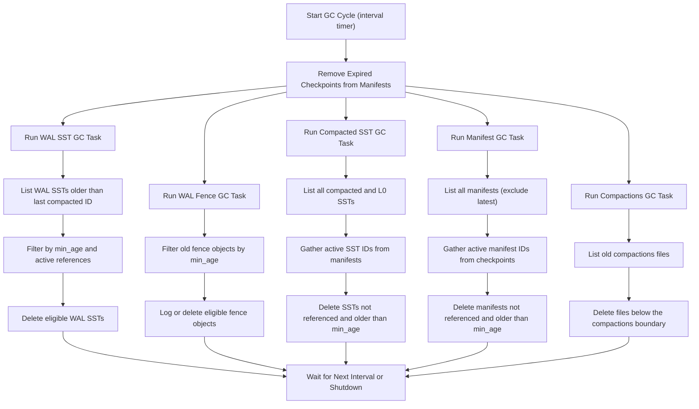

SlateDB's garbage collector deletes objects that are no longer referenced by live database state, checkpoints, clones, or compaction state. It usually runs as a background task in a `Db` process, and the CLI can also run one-off or scheduled GC jobs.

The garbage collector has a configurable minimum age and interval for each managed directory:

- `manifest/`
- `wal/`
- WAL fence objects
- `compacted/`
- `compactions/`

Clone detach cleanup has its own scheduled task. When a clone no longer references any SSTs from a parent database, the detach pass can remove the pinning checkpoint from the parent and drop the external DB entry from the clone.

Garbage collection for a file type can be disabled by setting its options to `None`. If a directory option is enabled with `interval: None`, SlateDB uses the default interval. `GarbageCollectorDirectoryOptions::default()` runs every minute and deletes files that are at least five minutes old.

Each directory type supports `dry_run`. When enabled, the collector logs files that would be deleted without deleting them. This is useful for testing or verifying behavior before enabling deletion.

Below is a diagram illustrating the high-level flow of garbage collection in SlateDB:


```mermaid
flowchart TD

    A["Start GC Cycle (interval timer)"] --> B[Remove Expired Checkpoints from Manifests]

    B --> C[Run WAL SST GC Task]
    C --> C1[List WAL SSTs older than last compacted ID]
    C1 --> C2[Filter by min_age and active references]
    C2 --> C3[Delete eligible WAL SSTs]

    B --> F[Run WAL Fence GC Task]
    F --> F1[Filter old fence objects by min_age]
    F1 --> F2[Log or delete eligible fence objects]

    B --> D[Run Compacted SST GC Task]
    D --> D1[List all compacted and L0 SSTs]
    D1 --> D2[Gather active SST IDs from manifests]
    D2 --> D3[Delete SSTs not referenced and older than min_age]

    B --> E[Run Manifest GC Task]
    E --> E1["List all manifests (exclude latest)"]
    E1 --> E2[Gather active manifest IDs from checkpoints]
    E2 --> E3[Delete manifests not referenced and older than min_age]

    B --> H[Run Compactions GC Task]
    H --> H1[List old compactions files]
    H1 --> H2[Delete files below the compactions boundary]

    C3 & F2 & D3 & E3 & H2 --> G[Wait for Next Interval or Shutdown]
```

## Default Garbage Collection Behavior

By default, garbage collection is enabled for manifests, WAL SSTs, WAL fences, compacted SSTs, compactions files, and clone detach cleanup.

WAL fence garbage collection runs in dry-run mode by default. It logs files that would be deleted without deleting them. This conservative default prevents accidental data loss while still showing what GC would clean up.

To enable actual deletion for WAL fence GC, set `dry_run: false` with a high `min_age` to safely clean up old fences. Alternatively, to silence the dry-run logging entirely, set `wal_fence_options: None`.

## Retention Rules

GC does not delete an object just because it is old. The object must be old enough and unreferenced.

- Manifest GC keeps the latest manifest and manifests pinned by checkpoints.
- WAL GC respects the replay point and WAL references held by active checkpoint manifests.
- Compacted SST GC keeps SSTs referenced by current manifests, checkpoints, clones, and compaction boundaries.
- Compactions GC keeps recent `.compactions` snapshots needed by the compaction protocol.

Set `min_age` above the longest expected delay between a process observing state and acting on it. This is especially important for WAL fence objects. Deleting a fence too aggressively can let an old writer succeed after it should have been fenced.

## Running GC Manually

Use the CLI for one-off cleanup:

```bash
slatedb --env-file .env --path <db-path> run-garbage-collection \
  --resource compacted \
  --min-age "24h"
```

For recurring CLI-managed GC:

```bash
slatedb --env-file .env --path <db-path> schedule-garbage-collection \
  --manifest "min_age=7days,period=1day" \
  --wal "min_age=24h,period=6h"
```

The [CLI](/docs/operations/cli/#garbage-collection) page lists the supported resource names.
