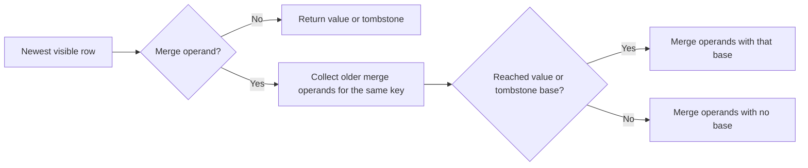
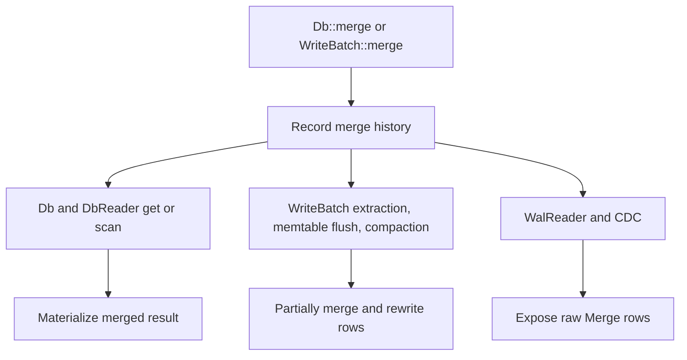

[`MergeOperator`](https://docs.rs/slatedb/latest/slatedb/trait.MergeOperator.html) lets SlateDB record partial updates with [`Db::merge`](https://docs.rs/slatedb/latest/slatedb/struct.Db.html#method.merge), [`Db::merge_with_options`](https://docs.rs/slatedb/latest/slatedb/struct.Db.html#method.merge_with_options), and [`WriteBatch::merge`](https://docs.rs/slatedb/latest/slatedb/struct.WriteBatch.html#method.merge). Those APIs record merge operands in the write history instead of forcing every writer to read the current value first. Later, SlateDB resolves or partially reduces that history with the operator you install.

## History Model

For one key, SlateDB reads the newest visible row first and walks backward until it reaches a plain value, a tombstone, or the end of history.

A value or tombstone cuts off anything older. In chronological order:

- `Value -> Merge -> Merge` reads as the base value plus both operands.
- `Tombstone -> Merge -> Merge` reads only the operands newer than the delete, with older history hidden.
- `Merge -> Merge` reads as the merged operand bytes even though no base value exists yet.

When SlateDB rewrites storage, that last case may stay a single `Merge` row rather than becoming a plain value. That lets older levels still participate later.

## Trait Contract

The trait has two methods:

- [`merge`](https://docs.rs/slatedb/latest/slatedb/trait.MergeOperator.html#tymethod.merge) combines one operand with an optional accumulated value.
- [`merge_batch`](https://docs.rs/slatedb/latest/slatedb/trait.MergeOperator.html#method.merge_batch) combines an optional accumulated value with a slice of operands ordered from oldest to newest.

The default `merge_batch` implementation calls `merge` pairwise. Override it when you can process a whole batch more efficiently.

The operator must be associative. SlateDB may regroup operands during reads, memtable flush, and compaction, so your result has to stay stable under that regrouping. SlateDB stores one operator configuration per database, but your implementation can dispatch by key prefix or value format if you need different behaviors.

## Where It Runs

### Reads

Normal reads wrap the iterator stack with [`MergeOperatorIterator`](https://github.com/slatedb/slatedb/blob/main/slatedb/src/merge_operator.rs). Point lookups and scans can therefore merge operands across the write batch, memtable, immutable memtables, L0 SSTs, and sorted runs.

The read path merges operands even when their `expire_ts` values differ. The returned row reports the minimum `expire_ts` across the merged operands and any base value. [Time](/docs/design/time) covers the TTL rules in more detail.

If no merge operator is configured and a read encounters a `Merge` row, SlateDB returns `MergeOperatorMissing`.

### Rewrites

Inside a committed `WriteBatch`, SlateDB eagerly reduces consecutive merge operations for the same key when the writer has a merge operator configured. If the batch also contains a value or tombstone base for that key, the reduced row becomes a plain value. If it has only operands, the reduced row stays a `Merge`.

Memtable flush and compaction use the same merge logic before they write new SSTs. Those rewrite paths are stricter than reads in two ways:

- They do not merge rows with different `expire_ts` values. Different TTL groups stay separate on disk so they can expire independently.
- They stop at snapshot and durability retention boundaries, preserving version chains that active snapshots or remote readers may still need.

### Raw APIs

[`WalReader`](https://docs.rs/slatedb/latest/slatedb/struct.WalReader.html) and WAL-based [Change Data Capture](/docs/design/change-data-capture) do not apply the merge operator. They return raw `ValueDeletable::Merge` rows. Downstream consumers have to materialize those operands themselves if they need final values.

## Matching Configuration

Every process that reads or rewrites stored merge rows needs compatible merge logic:

- Writers configure it with [`DbBuilder::with_merge_operator`](https://docs.rs/slatedb/latest/slatedb/struct.DbBuilder.html#method.with_merge_operator).
- Standalone compactors configure it with [`CompactorBuilder::with_merge_operator`](https://docs.rs/slatedb/latest/slatedb/struct.CompactorBuilder.html#method.with_merge_operator).
- Read-only handles configure it with [`DbReaderBuilder::with_merge_operator`](https://docs.rs/slatedb/latest/slatedb/struct.DbReaderBuilder.html#method.with_merge_operator).

If one process writes merge operands and another process opens the same database without a compatible operator, the raw merge rows can still exist in storage, but later reads, memtable flushes, or compaction can fail when they reach them.
