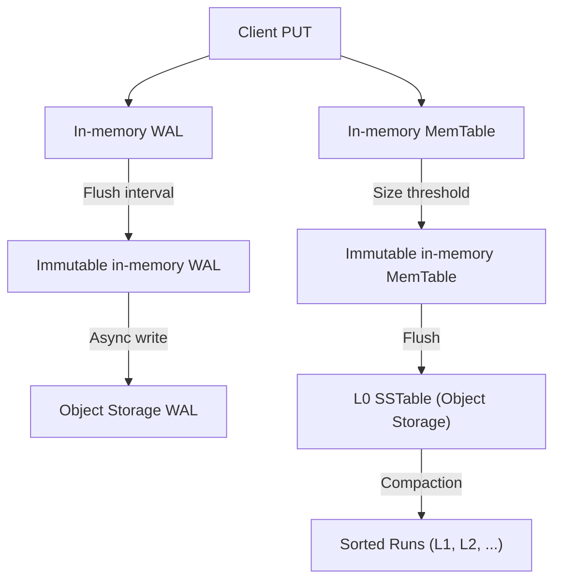
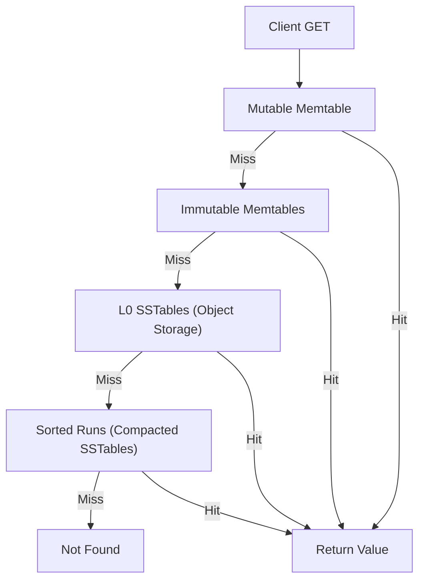

Log-Structured Merge-trees (LSMs) are the backbone of modern write-optimized storage engines. At their core, LSMs transform a barrage of random writes into a sequence of efficient, sequential operations. Incoming writes land in an in-memory buffer—often called a memtable—where they accumulate. Once this buffer fills, its contents are flushed to disk as a new, immutable file (an SSTable). Over time, these files accumulate, so background compaction processes merge and reorganize them, reducing read amplification and reclaiming space from overwritten or deleted keys. Reads traverse this hierarchy, consulting the memtable first, then searching through progressively older SSTables, often aided by bloom filters to avoid unnecessary disk seeks. The result is a system that absorbs high write throughput while keeping read latency in check.

SlateDB reimagines the LSM for the cloud era, shifting the entire persistence layer onto object storage. Unlike traditional LSMs that rely on local disks for durability and performance, SlateDB writes everything—including its write-ahead log (WAL)—directly to object storage. This design leverages the durability, scalability, and cost profile of services like S3 or GCS, while embracing the realities of higher write latency and eventual consistency. The architecture is intentionally minimal: no local state, no control plane, no replication protocol. The database runs in-process, with a single-writer model enforced by fencing, and supports multiple concurrent readers across nodes. Caching, both in-memory and optionally on-disk, mitigates the latency of object storage for hot data.

The write path in SlateDB begins when a client issues a `put`. The key-value pair is appended to a mutable, in-memory WAL. After a configurable flush interval, this WAL is frozen and asynchronously written to object storage. Once the WAL is safely persisted, its contents are ingested into a mutable memtable, and any clients awaiting durability are notified. When the memtable reaches a size threshold, it too is frozen and flushed to object storage as an L0 SSTable. Compaction runs in the background, merging L0 SSTables into lower levels—called sorted runs—each covering a distinct key range. This process is orchestrated by a compactor, which schedules and executes merges to control space amplification and maintain read performance. Backpressure mechanisms ensure that if compaction lags, writes are throttled, preventing runaway growth of unmerged files.

Reads in SlateDB follow a predictable path. A `get` first checks the mutable memtable for the requested key. If not found, the search continues through any immutable memtables, then scans the L0 SSTables in object storage, starting from the newest. Bloom filters accelerate this process, quickly ruling out files that cannot possibly contain the key. If the key remains elusive, the search proceeds to the sorted runs—compacted SSTables organized by key range and recency. This layered approach ensures that the most recent data is always checked first, while older, less frequently accessed data remains available but incurs the higher latency of object storage. Caching at each layer further reduces the cost of repeated reads.

The manifest file acts as the database’s source of truth, tracking the current set of WALs, L0 SSTables, and sorted runs, as well as epochs for writers and compactors. This enables robust fencing, garbage collection, and—eventually—multi-version concurrency control via snapshots. Compaction is pluggable, with the current implementation using a size-tiered scheduler, but the architecture allows for alternative strategies. The result is a storage engine that is cloud-native by design, trading some write latency for operational simplicity, durability, and scale. For workloads that can tolerate 50–100ms write latency and occasional data loss during catastrophic failures, SlateDB offers a compelling foundation for stream processing, serverless state, durable caches, and beyond.

[Learn more about SlateDB’s architecture and design](https://github.com/slatedb/slatedb/blob/788013b5960089b25419753a4f159fa2176f1777/website/src/content/docs/docs/architecture.md).