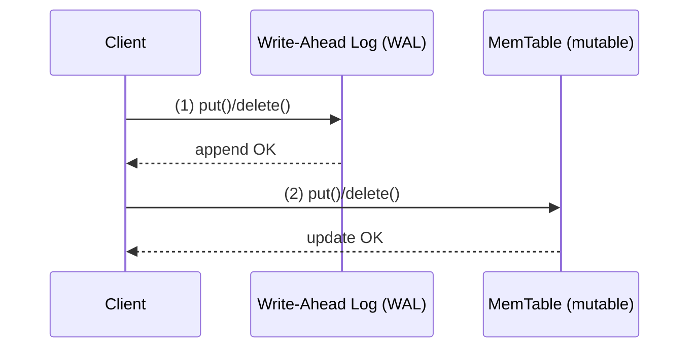
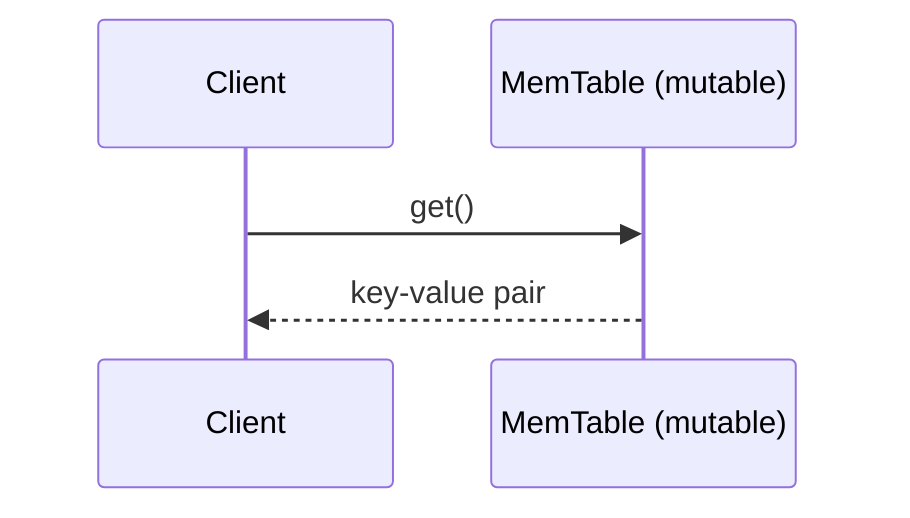
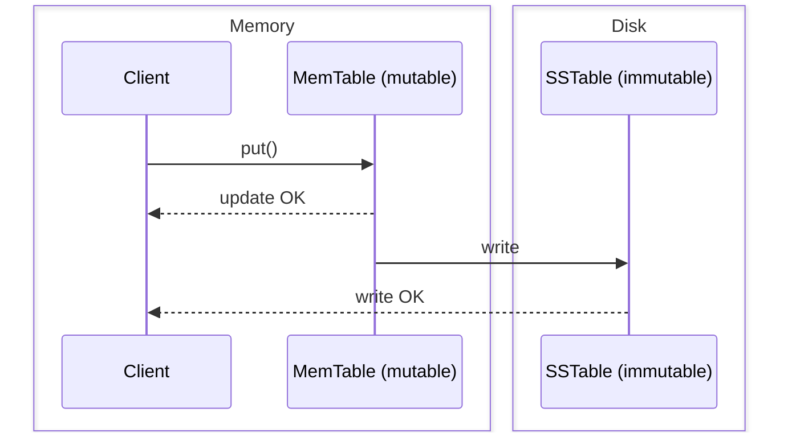
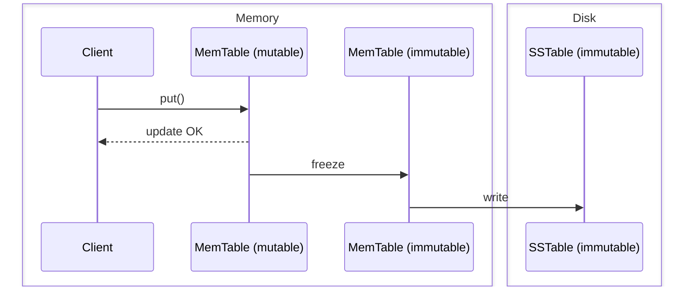
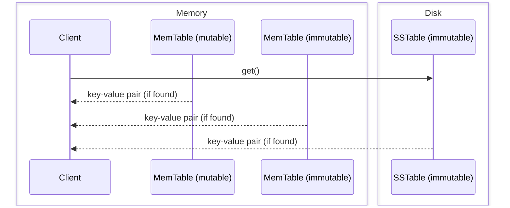
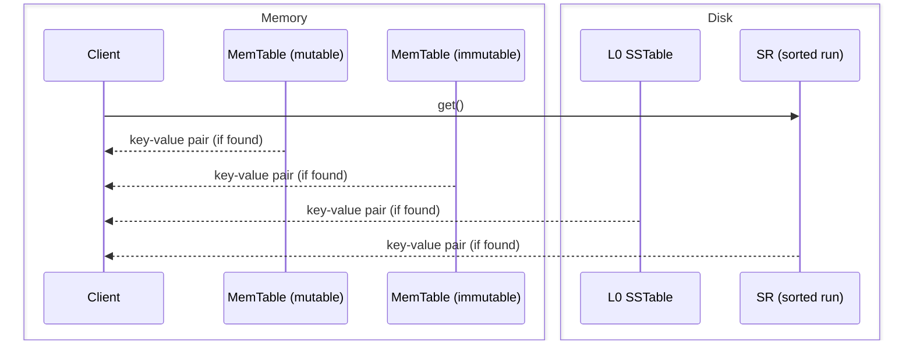

SlateDB is a log-structured merge-tree (LSM tree). We must first understand how LSM trees work to understand SlateDB's design. In this page, we'll explore LSMs and see how SlateDB uses them.

## What is an LSM tree?

LSM trees are an in-memory and on-disk data structure used to store key-value (KV) data. KV storage engines such as [RocksDB](https://github.com/facebook/rocksdb), [LevelDB](https://github.com/google/leveldb), and [Sled](https://github.com/spacejam/sled), are based on LSM trees. Databases such as ClickHouse  They are a type of key-value (KV) storage engine. LSMs provide operations common to most KV storage engines:

- `put(key, value)`: Insert a key-value pair.
- `get(key)`: Retrieve a key-value pair.
- `delete(key)`: Delete a key-value pair.
- `scan(range)`: Scan a range of keys.
- `flush()`: Flush the in-memory data to disk.

## LSM tree design

LSM trees are made up of a _write-ahead log (WAL)_, a mutable in-memory map called a _MemTable_, _sorted strings tables (SSTables)_, and a _manifest_. We will discuss each of these components in detail.

### Write-ahead log (WAL)

A put() call writes its data to a write-ahead log (WAL). A WAL is an append-only persistent log. WALs are used to recover data in the event of a crash. When the database restarts, it can replay the WAL to recover its state. WALs are not great for serving reads, though; they're not optimized for random access. Every write is simply an appended to the end of the log. A get() operation must scan the WAL from the last write to the first write until it finds the key-value pair (or until it reaches the beginning of the WAL).

### MemTables

LSM trees avoid this linear scan by storing their data in an additional data structure called a MemTable. After a put() call writes its data to the WAL, it inserts its data into a mutable in-memory map called a MemTable. MemTabls typically use a sorted map such as a [SkipList](https://en.wikipedia.org/wiki/Skip_list) map so that `scan()` operations work as well.



When a get() occurs, the database will search the MemTable for the key-value pair.



### SSTables

But an in-memory MemTable will only allow us to have a database that fits in memory. We must persist our data on disk. We've already seen that the WAL is an inappropriate format for serving reads. LSM trees introduce a third data structure here: a sorted strings table (SSTable). SSTables are files that contain a sequence of key-value pairs sorted by key:

```
key1:value1
key2:value2
key3:value3
...
```

We've established that MemTables are sorted by key, so LSM trees need only write their MemTable to disk in the same order.



There's a problem with this design, though. The MemTable must be locked while we write to disk. `put()` calls will block until the write is complete. This can cause performance issues if the MemTable is large. To get around this, LSM trees have both a mutable MemTable and one or more immutable MemTables that are being written to disk. When the mutable MemTable reaches a certain size, it is _frozen_ and written to disk in the background. A new mutable MemTable is then created (or pulled from a pool) to receive new writes while the froze MemTable is written in the background.



When a get() occurs, the database will search all of the MemTables and SSTables for the key-value pair.



Imagine we have 1000s (or millions) of immutable MemTables and SSTables. A read would need to search them sequentially to find the most recent version of a key-value pair (a user might have updated a key multiple times). This is clearly not efficient. LSM trees solve this problem with _compaction_. Compaction is a process where the database merges multiple SSTables into a new sequence of range partitioned SSTables. Consider the following SSTables:

```
SSTable 1:
  key1:value1a
  key56:value56a
  key99:value99

SSTable 2:
  key43:value43
  key56:value56b
  key89:value89

SSTable 3:
  key1:value1b
  key44:value44
  key77:value77
```

Each SST in the example above is unpartitioned--it can potentially contain any key-value pair. Compaction will merge these SSTables into a new sequence of range partitioned SSTables. For example, the SSTables above might be compacted into the following SSTables:

```
SSTable 1:
  key1:value1b
  key43:value43
  key44:value44
  key56:value56b
  key77:value77

SSTable 2:
  key89:value89
  key99:value99
```

Now a read for `key56` will only need to search the first SSTable. Readers need only check the key range of each SSTable (stored in memory) to determine if it might contain the key. The unpartitioned tables, are called _level 0 (L0)_ SSTables. The partitioned tables are called _sorted runs (SRs)_. L0 SSTables are part of the write path, as we saw above. Sorted runs are generated through a background compaction process.

A `get()` will traverse the MemTables, L0 SSTables, and SRs to find the key-value pair.



### Manifests

Another issue remains: upon restart, the database has no easy way to know what SSTables it should load. We might try to list all SSTs and read each file's metadata, but this doesn't work. RocksDB's [MANIFEST page](https://github.com/facebook/rocksdb/wiki/MANIFEST) explains why:

> File system operations are not atomic, and are susceptible to inconsistencies in the event of system failure. Even with journaling turned on, file systems do not guarantee consistency on unclean restart. POSIX file system does not support atomic batching of operations either. Hence, it is not possible to rely on metadata embedded in RocksDB datastore files to reconstruct the last consistent state of the RocksDB on restart.

LSM tree implementations store their state in a manifest. The manifest is a file (or log of files) that stores the database's state; this includes the location of all SSTables, the WAL recovery starting point, and many other details. The LSM tree reads the manifest on startup to reconstruct its in-memory state. As state changes, the LSM tree writes manifest changes atomically to ensure consistency.

We've now built a basic LSM tree. There are many, many details to be explored (deletion tombstones, consistency, WAL replay, and more). Still, this basic implementation will work. If you're interested in experimenting more with LSMs, we highly recommend checking out [Mini-LSM](https://skyzh.github.io/mini-lsm/).

## Tradeoffs

LSM trees are elegant, simple data structures. However, they are not without tradeoffs. LSM trees work very well for high write-throughput workloads. It does so by moving as much work as possible out of the write path. Consequently, the design requires more background work (CPU), more files (storage space), and more variable read/latency (I/O) than other data structures. These tradeoffs are commonly framed in the following terms:

* Write amplification: The number of extra bytes written to storage per byte of live user data ingested.
* Read amplification: The number of extra bytes read from storage per byte of result data returned.
* Space amplification: The total on-disk byte size relative to the total live logical byte size.

LSM trees tend to have higher write throughput but worse read locality, more read and space amplification, more background compaction CPU, and higher tail latencies than B-trees. LSM trees are an active area research and there are now many strategies to balance these tradeoffs.

## SlateDB's LSM design