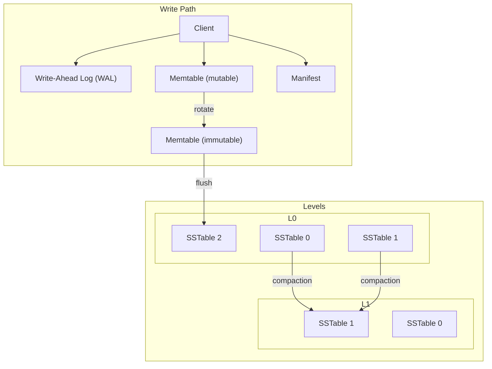

SlateDB is a log-structured merge-tree (LSM tree). You must understand how LSM trees work to understand SlateDB's design.

Let's take a look at a typical LSM tree design.

## Log-Structured Merge-Trees

The following diagram shows a typical LSM tree design:

## SlateDB's LSM Implementation

