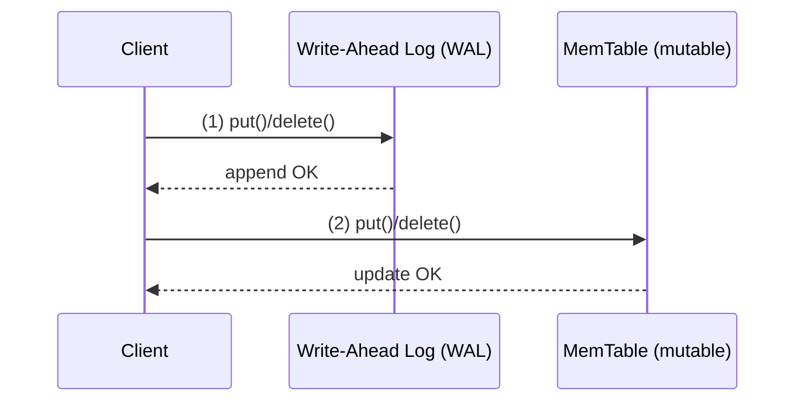
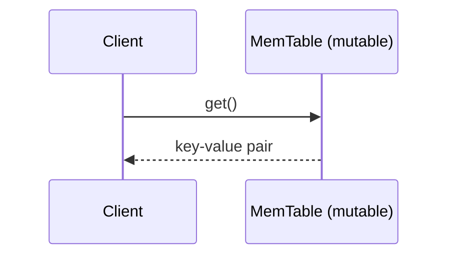
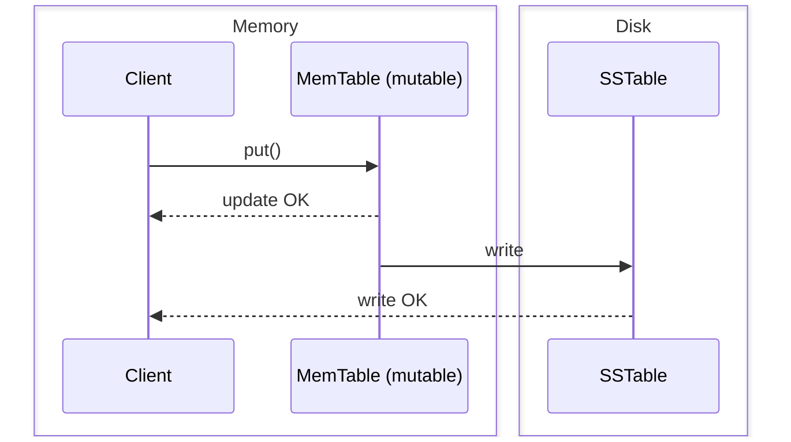
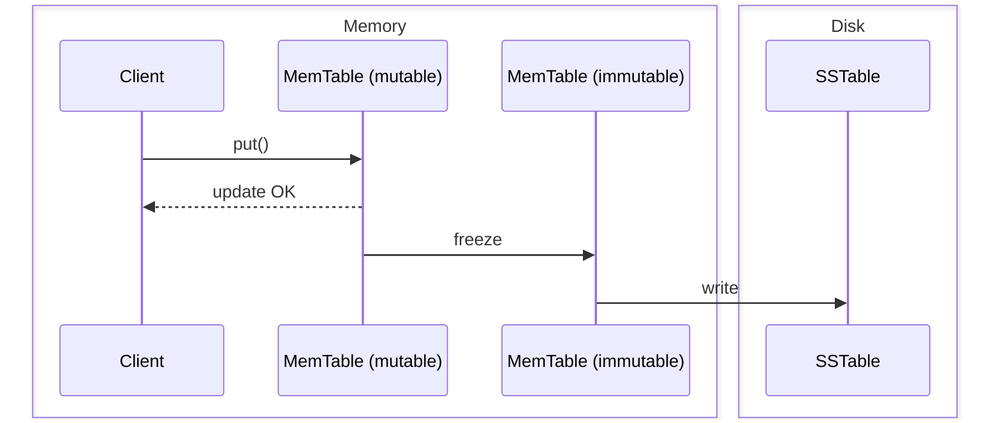
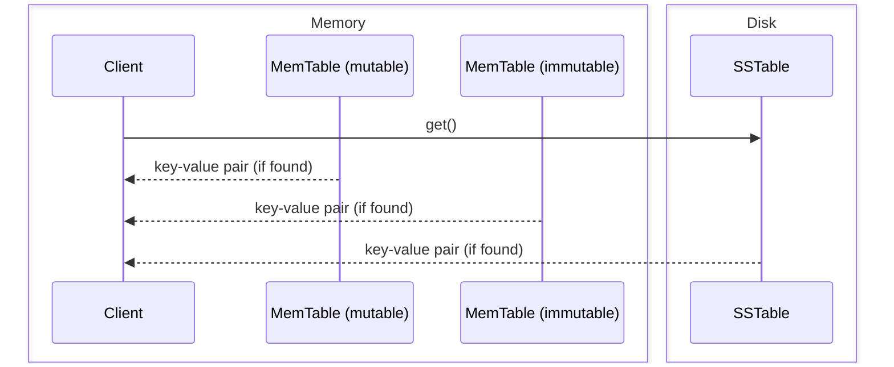
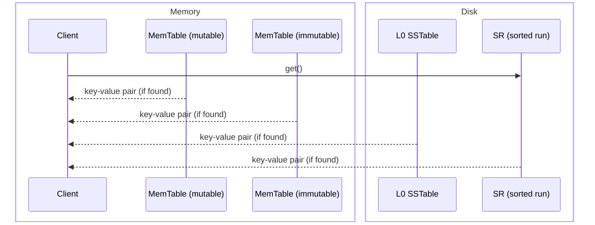
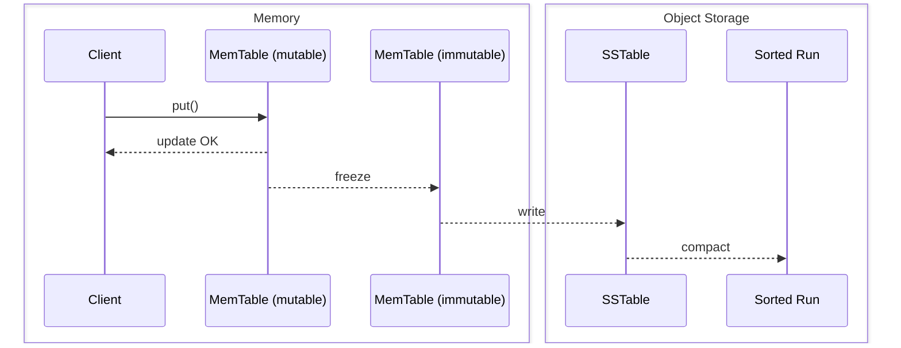

SlateDB is a log-structured merge-tree (LSM tree). Understanding SlateDB's design starts with the basic LSM shape.

## What is an LSM tree?

LSM trees are an in-memory and on-disk data structure used to store key-value (KV) data. KV storage engines such as [RocksDB](https://github.com/facebook/rocksdb) and [LevelDB](https://github.com/google/leveldb) use LSM trees. LSMs provide operations common to most KV storage engines:

- `put(key, value)`: Insert a key-value pair.
- `get(key)`: Retrieve a key-value pair.
- `delete(key)`: Delete a key-value pair.
- `scan(range)`: Scan a range of keys.
- `flush()`: Flush the in-memory data to disk.

## LSM tree design

LSM trees are made up of a _write-ahead log (WAL)_, a mutable in-memory map called a _MemTable_, _sorted strings tables (SSTables)_, and a _manifest_.

### Write-ahead log (WAL)

A `put()` call writes its data to a write-ahead log (WAL). A WAL is an append-only persistent log. When the database restarts after a crash, it can replay the WAL to recover its state. WALs are poor read indexes, though. They are not optimized for random access. Every write is appended to the end of the log, so a `get()` operation would have to scan backward until it finds the key-value pair or reaches the beginning of the WAL.

### MemTables

LSM trees avoid this linear scan by keeping recent data in a MemTable. After a `put()` call writes to the WAL, it inserts the key and value into a mutable in-memory map. MemTables usually use a sorted map such as a [SkipList](https://en.wikipedia.org/wiki/Skip_list) so that `scan()` operations work too.


```mermaid
sequenceDiagram
  participant C as Client
  participant WAL as Write-Ahead Log (WAL)
  participant MT as MemTable (mutable)

  C->>WAL: (1) put()/delete()
  WAL-->>C: append OK
  C->>MT: (2) put()/delete()
  MT-->>C: update OK
```

For a `get()`, the database searches the MemTable for the key-value pair.


```mermaid
sequenceDiagram
  participant C as Client
  participant MT as MemTable (mutable)

  C->>MT: get()
  MT-->>C: key-value pair
```

### SSTables

An in-memory MemTable only holds data that fits in memory. The database still needs durable files that can serve reads efficiently. LSM trees use sorted strings tables (SSTables) for that. SSTables are files that contain key-value pairs sorted by key:

```
key1:value1
key2:value2
key3:value3
...
```

Since MemTables are already sorted by key, the database can write a MemTable to an SSTable in key order.


```mermaid
sequenceDiagram
  box Memory
    participant C as Client
    participant MT as MemTable (mutable)
  end
  box Disk
    participant SST as SSTable
  end

  C->>MT: put()
  MT-->>C: update OK
  MT->>SST: write
  SST-->>C: write OK
```

This design still has a problem. The MemTable must be locked while the database writes it to disk. `put()` calls block until that write completes, which hurts write latency when the MemTable is large. LSM trees avoid that by keeping one mutable MemTable and one or more immutable MemTables. When the mutable MemTable reaches a target size, the database freezes it and writes it to disk in the background. A new mutable MemTable receives writes while the frozen MemTable is written.


```mermaid
sequenceDiagram
  box Memory
    participant C as Client
    participant MT as MemTable (mutable)
    participant IMT as MemTable (immutable)
  end
  box Disk
    participant SST as SSTable
  end

  C->>MT: put()
  MT-->>C: update OK
  MT->>IMT: freeze
  IMT->>SST: write
```

For a `get()`, the database searches the MemTables and SSTables for the key-value pair.


```mermaid
sequenceDiagram
  box Memory
    participant C as Client
    participant MT as MemTable (mutable)
    participant IMT as MemTable (immutable)
  end
  box Disk
    participant SST as SSTable
  end

  C->>SST: get()
  MT-->>C: key-value pair (if found)
  IMT-->>C: key-value pair (if found)
  SST-->>C: key-value pair (if found)
```

If a database had thousands or millions of immutable MemTables and SSTables, a read would need to search them sequentially to find the newest version of a key-value pair. LSM trees solve this with _compaction_. Compaction merges multiple SSTables into a new sequence of range-partitioned SSTables. Consider the following SSTables:

```
SSTable 1:
  key1:value1a
  key56:value56a
  key99:value99

SSTable 2:
  key43:value43
  key56:value56b
  key89:value89

SSTable 3:
  key1:value1b
  key44:value44
  key77:value77
```

Each SST in the example above is unpartitioned. It can contain any key-value pair. Compaction merges those SSTables into a new sequence of range-partitioned SSTables. For example, the SSTables above might become:

```
SSTable 1:
  key1:value1b
  key43:value43
  key44:value44
  key56:value56b
  key77:value77

SSTable 2:
  key89:value89
  key99:value99
```

Now a read for `key56` only needs to search the first SSTable. Readers check each SSTable's in-memory key range to decide whether it might contain the key. The unpartitioned tables are called _level 0 (L0)_ SSTables. The partitioned tables are called _sorted runs (SRs)_. L0 SSTables are part of the write path. Sorted runs are generated through background compaction.

:::note

Sorted runs are a logical construct. The files written to disk are the sorted run's SSTables. The manifest contains the mapping from a sorted run ID to its SSTables.

:::

A `get()` traverses the MemTables, L0 SSTables, and SRs to find the key-value pair.


```mermaid
sequenceDiagram
  box Memory
    participant C as Client
    participant MT as MemTable (mutable)
    participant IMT as MemTable (immutable)
  end
  box Disk
    participant L0 as L0 SSTable
    participant SR as SR (sorted run)
  end

  C->>SR: get()
  MT-->>C: key-value pair (if found)
  IMT-->>C: key-value pair (if found)
  L0-->>C: key-value pair (if found)
  SR-->>C: key-value pair (if found)
```

### Manifests

Another issue remains: upon restart, the database has no easy way to know what SSTables it should load. We might try to list all SSTs and read each file's metadata, but this doesn't work. RocksDB's [MANIFEST page](https://github.com/facebook/rocksdb/wiki/MANIFEST) explains why:

> File system operations are not atomic, and are susceptible to inconsistencies in the event of system failure. Even with journaling turned on, file systems do not guarantee consistency on unclean restart. POSIX file system does not support atomic batching of operations either. Hence, it is not possible to rely on metadata embedded in RocksDB datastore files to reconstruct the last consistent state of the RocksDB on restart.

LSM tree implementations store their state in a manifest. The manifest is a file (or log of files) that stores the database's state; this includes the location of all SSTables, the WAL recovery starting point, and many other details. The LSM tree reads the manifest on startup to reconstruct its in-memory state. As state changes, the LSM tree writes manifest changes atomically to ensure consistency.

This is enough for a basic LSM tree. Real implementations add deletion tombstones, consistency rules, WAL replay, snapshots, checksums, and a long list of operational details. If you want to experiment with a small LSM implementation, [Mini-LSM](https://skyzh.github.io/mini-lsm/) is a good place to start.

## Tradeoffs

LSM trees are simple data structures with real tradeoffs. They work well for high write-throughput workloads because they move work out of the write path. The cost is more background CPU, more temporary storage, and more variable read latency. These tradeoffs are commonly framed in the following terms:

* Write amplification: The number of extra bytes written to storage per byte of live user data ingested.
* Read amplification: The number of extra bytes read from storage per byte of result data returned.
* Space amplification: The total on-disk byte size relative to the total live logical byte size.

LSM trees tend to have higher write throughput but worse read locality, more read and space amplification, more background compaction CPU, and higher tail latencies than B-trees. This subject is an active area of research and there are now many strategies to balance these tradeoffs.

## SlateDB's LSM design

SlateDB's LSM design stays close to the basic LSM tree design above. SlateDB has a WAL, MemTables, SSTables, sorted runs, and a manifest. The main difference is that SlateDB writes all durable data to object storage instead of a local disk or filesystem:


```mermaid
sequenceDiagram
  box Memory
    participant C as Client
    participant MT as MemTable (mutable)
    participant IMT as MemTable (immutable)
  end
  box Object Storage
    participant SST as SSTable
    participant SR as Sorted Run
  end

  C->>MT: put()
  MT-->>C: update OK
  MT-->>IMT: freeze
  IMT-->>SST: write
  SST-->>SR: compact
```

The [Files](/docs/design/files/) page covers SlateDB's object-store directory structure.
