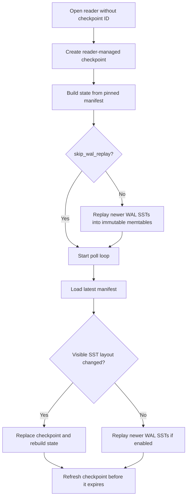

[`DbReader`](https://docs.rs/slatedb/latest/slatedb/struct.DbReader.html) is SlateDB's read-only handle. It serves the same operations as [`DbRead`](https://docs.rs/slatedb/latest/slatedb/trait.DbRead.html), but it never owns a mutable memtable and it never writes new WAL records. A reader works from a checkpointed manifest, the SSTs named by that manifest, and, when WAL replay is enabled, reader-local immutable memtables built by replaying WAL SSTs that are newer than the pinned manifest.

## Open Modes

If you open a reader without [`DbReaderBuilder::with_checkpoint_id`](https://docs.rs/slatedb/latest/slatedb/struct.DbReaderBuilder.html#method.with_checkpoint_id), SlateDB creates a checkpoint in the latest manifest and sets its lifetime from [`DbReaderOptions::checkpoint_lifetime`](https://docs.rs/slatedb/latest/slatedb/config/struct.DbReaderOptions.html#structfield.checkpoint_lifetime). That checkpoint pins the initial L0 and sorted-run view. The reader then replays newer WAL SSTs into immutable memtables unless [`DbReaderOptions::skip_wal_replay`](https://docs.rs/slatedb/latest/slatedb/config/struct.DbReaderOptions.html#structfield.skip_wal_replay) is `true`.

If you open a reader with an explicit checkpoint ID, SlateDB loads exactly the manifest pinned by that checkpoint. It does not create a new checkpoint, does not refresh or delete the user-managed checkpoint, and does not follow newer manifests or newer WAL SSTs.

When `skip_wal_replay` is `true`, the reader only sees data that is already referenced from the manifest it opened. It can still pick up later memtable flushes and compaction results when it owns the checkpoint and the manifest changes, but it ignores WAL-only data between those manifest updates.

## State

Internally the reader tracks the pinned checkpoint and manifest, a deque of immutable memtables built from WAL replay, the last WAL file it replayed, and the highest durable sequence number it can expose. For reads, it hands that state to the same internal [`Reader`](https://github.com/slatedb/slatedb/blob/main/slatedb/src/reader.rs) implementation that backs ordinary `Db` reads.

A `DbReader` has no mutable memtable of its own. Its visible precedence is replayed immutable memtables, then L0 SSTs, then sorted runs. When SlateDB replaces the reader's checkpoint with a newer manifest, it keeps only WAL-replayed rows whose sequence numbers are still newer than the new manifest's `last_l0_seq`. Rows that are already covered by L0 or lower levels are dropped from the reader-local memtables.

## Poll Loop

When the reader owns the checkpoint, it starts a background poller that wakes up every [`DbReaderOptions::manifest_poll_interval`](https://docs.rs/slatedb/latest/slatedb/config/struct.DbReaderOptions.html#structfield.manifest_poll_interval).

On each tick, SlateDB loads the latest manifest. If compaction or a memtable flush changes the visible SST layout, or if the latest L0 sequence number has moved past the WAL state already replayed into the reader, the reader replaces its checkpoint and rebuilds state from the new manifest. Otherwise it keeps the current checkpoint and only looks for newer WAL SSTs.

SlateDB refreshes the checkpoint expiration after half of the configured lifetime has elapsed. [`DbReader::close`](https://docs.rs/slatedb/latest/slatedb/struct.DbReader.html#method.close) stops the poller and deletes the checkpoint the reader created for itself.

## Read Semantics

`get`, `get_key_value`, `scan`, and `scan_prefix` all use the normal SST iterator stack. Options such as [`ReadOptions::cache_blocks`](https://docs.rs/slatedb/latest/slatedb/config/struct.ReadOptions.html#structfield.cache_blocks), [`ScanOptions::read_ahead_bytes`](https://docs.rs/slatedb/latest/slatedb/config/struct.ScanOptions.html#structfield.read_ahead_bytes), and [`ScanOptions::max_fetch_tasks`](https://docs.rs/slatedb/latest/slatedb/config/struct.ScanOptions.html#structfield.max_fetch_tasks) still affect caching and scan behavior.

Visibility is narrower than `Db`. A reader does not share a writer's live mutable memtable, so read options cannot expose unflushed writer state. `DbReader` only exposes committed data that is already durable in object storage, either through the pinned manifest or through WAL SSTs it replayed itself.

Reader-side block and object-store caches use the same configuration surface as `Db`. [Caching](/docs/design/caching) covers those layers.

## Matching Writer Configuration

If the database was opened with a separate WAL object store, the reader builder must also use [`DbReaderBuilder::with_wal_object_store`](https://docs.rs/slatedb/latest/slatedb/struct.DbReaderBuilder.html#method.with_wal_object_store). If the database stores merge operands or applies custom block transforms, pass the same [`DbReaderBuilder::with_merge_operator`](https://docs.rs/slatedb/latest/slatedb/struct.DbReaderBuilder.html#method.with_merge_operator) and [`DbReaderBuilder::with_block_transformer`](https://docs.rs/slatedb/latest/slatedb/struct.DbReaderBuilder.html#method.with_block_transformer) settings so the reader can interpret stored data correctly.
