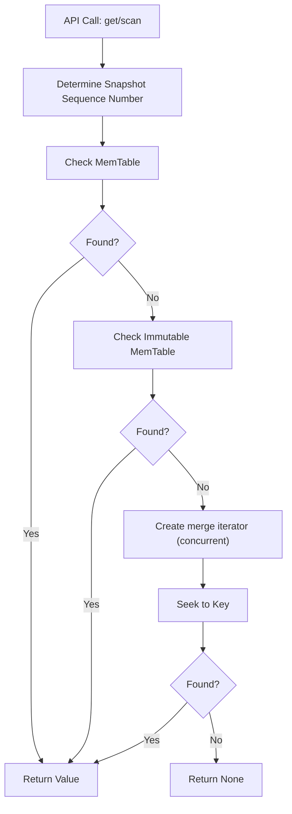

1. A get(), scan(), or similar read call is made on the client.
2. The read request is routed to the database engine, which determines the current read snapshot (either the latest state or a pinned snapshot if using the snapshot API).
3. The engine first checks the in-memory MemTable for the requested key or range. If the key is found and not expired, the value is returned immediately.
4. If the key is not found in the MemTable, the engine searches the immutable MemTable (if present, e.g., during a flush).
5. If the key is still not found, the engine concurrently creates iterators over all L0 SSTables (uncompacted, recently flushed files) and all compacted sorted runs (lower levels). These iterators are constructed in parallel to maximize throughput and minimize latency, with the degree of concurrency determined by the number of files and system configuration [[source]](https://github.com/slatedb/slatedb/pull/815).
6. Each SSTable is searched using its block index. A binary search locates the block that may contain the key. If multiple blocks start with the same key, the engine ensures it returns the first such block to avoid stale data and to support multiple versions of a key [[source]](https://github.com/slatedb/slatedb/issues/517).
7. As iterators are created, SlateDB asynchronously fetches and caches file blocks from object storage.
8. The engine merges the MemTable, immutable MemTable, L0 SSTable iterators, and sorted run iterators into a single merged iterator. The iterator respects sequence numbers and snapshot visibility, ensuring that only the correct version of each key is visible for the current read or snapshot.
9. The merged iterator returns the value for the requested key (or the next key in a scan). If the key is not found in any structure, None is returned.

Below is a diagram illustrating the high-level flow of a read in SlateDB:

**Notes:**
- Iterator creation for L0 SSTables and compacted runs is parallelized for performance.
- Block cache is populated asynchronously during reads.
- Reads from snapshots always reflect the state at the time the snapshot was taken, regardless of later modifications.
- WAL SSTs are not read during normal operations; they are only accessed during recovery [[source]](https://github.com/slatedb/slatedb/issues/499).