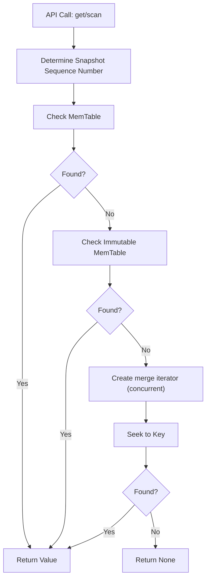

Reads merge several sources into one visible keyspace. A `get`, `scan`, or snapshot read may need to consult the mutable MemTable, immutable MemTables waiting to flush, L0 SSTs, and compacted sorted runs.

The read result is chosen by sequence number. Newer rows shadow older rows for the same key, unless the newer row is not visible to the read's sequence number. Tombstones hide older values. Expired rows are ignored. Merge operands are resolved through the configured merge operator.

## Visibility

Every read runs at a sequence number:

- A normal `Db` read uses the latest visible database state.
- A `DbSnapshot` read uses the sequence number pinned when `snapshot()` was called.
- A `DbReader` read uses the manifest state it opened or refreshed to.

That sequence number decides which row versions are visible. Later writes can continue while a snapshot or reader keeps seeing the older view.

## Point Reads

For a point read, SlateDB checks sources from newest to oldest:

1. The mutable MemTable.
2. Immutable MemTables, if a flush is in progress.
3. L0 SSTs, which may overlap arbitrary key ranges.
4. Sorted runs, where SSTs are range-partitioned.

SST reads use the in-memory file metadata to skip files whose key range cannot contain the requested key. When filters are available, SlateDB can also skip an SST on a definite Bloom-filter miss. For candidate SSTs, SlateDB uses the block index to find the data block that may contain the key, fetches that block, verifies it, decodes it, and checks the row entries.

If the newest visible row is a value, `get` returns it. If it is a tombstone, an expired value, or no visible row exists, `get` returns `None`.

## Scans

Scans create iterators over the same sources and merge them into one ordered stream. L0 SST and sorted-run iterators can be built concurrently, which keeps wide scans from serializing all object-store metadata and block reads.

The merged iterator returns each key once for the chosen visibility point. It handles overlapping L0 files, sorted runs, tombstones, expiration, and merge operands before yielding a `KeyValue`.

`ScanOptions` controls scan-specific behavior:

- `order`: ascending or descending key order.
- `durability_filter`: whether to include in-memory writes or only remotely durable data.
- `cache_blocks`: whether fetched data blocks should populate the block cache.
- `read_ahead_bytes` and `max_fetch_tasks`: how much read-ahead concurrency to use.

Below is a diagram illustrating the high-level flow of a read in SlateDB:

```mermaid
flowchart TD

    A[API Call: get/scan] --> B[Determine Snapshot Sequence Number]

    B --> C[Check MemTable]

    C --> D{Found?}
    D -- Yes --> Z[Return Value]
    D -- No --> E[Check Immutable MemTable]

    E --> F{Found?}
    F -- Yes --> Z
    F -- No --> G["Create merge iterator (concurrent)"]

    G --> J["Seek to Key"]

    J --> K{Found?}
    K -- Yes --> Z
    K -- No --> L[Return None]
```

## Caching

Reads consult the block cache before fetching SST blocks from object storage. A block-cache hit avoids both remote I/O and block decoding. If the object-store cache is enabled, a block-cache miss may still be served from local cached object bytes instead of the remote object store. See [Caching](/docs/design/caching/) for the cache layers and [Tuning](/docs/operations/tuning/) for the read knobs.

Scans default to `cache_blocks = false` because long scans can evict hot point-read blocks. Point reads default to caching data blocks.

## WAL Files

SlateDB does not read durable WAL SSTs during normal point reads or scans. WAL SSTs are used for recovery and for WAL-based [Change Data Capture](/docs/design/change-data-capture/). Foreground reads use the in-memory WAL state already reflected in the MemTable and immutable MemTables.
