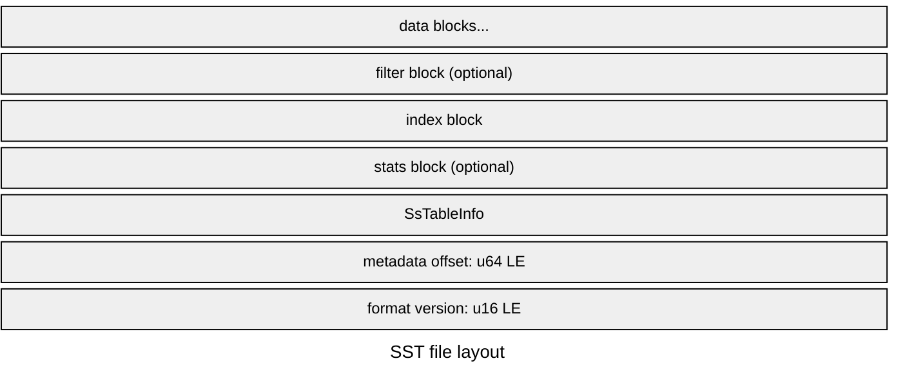
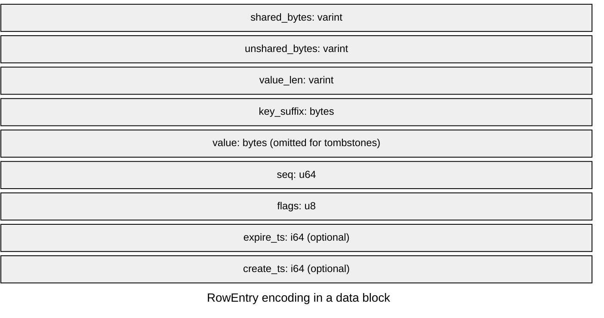

SlateDB stores durable rows in SST files under `wal/` and `compacted/`. Both use the same block and footer format, but they serve different jobs. WAL SSTs record writes in sequence number order for recovery and CDC. Compacted SSTs store L0 and sorted-run data in key order and serve normal reads. The same rows can appear in a different order depending on the SST type.

WAL SST (sequence order)
```text
seq=41  key=banana  value=yellow
seq=42  key=apple   value=green
seq=43  key=carrot  value=orange
```

Compacted SST (key order):
```text
key=apple   seq=42  value=green
key=banana  seq=41  value=yellow
key=carrot  seq=43  value=orange
```

## Layout

An SST stores data blocks first. A compacted SST may then append a Bloom filter block. The Bloom filter block stores a probabilistic membership filter that lets point reads skip the SST on a definite miss. Next comes the index block. The index block stores one entry per data block with the block offset and a search key or sequence bound so readers can jump to candidate blocks. A compacted SST may also append a stats block. The stats block stores file-level and per-block counters and byte totals for puts, deletes, merge operands, keys, and values. Every SST ends with `SsTableInfo`, followed by the 8-byte metadata offset and the 2-byte format version.



Each stored block ends with a CRC32 checksum. That applies to data blocks and to footer blocks such as the filter, index, stats, and `SsTableInfo` metadata.

## Data Blocks

SlateDB groups rows into blocks up to the target size configured with [`DbBuilder::with_sst_block_size`](https://docs.rs/slatedb/latest/slatedb/db/struct.DbBuilder.html#method.with_sst_block_size). When the next row would overflow the current block, the writer closes that block and starts a new one. Compacted SSTs write rows in key order. WAL SSTs write rows in sequence number order.

Within a data block, each stored row is a `RowEntry`: the logical fields are the key bytes, a `ValueDeletable` payload (`Value`, `Merge`, or `Tombstone`), the sequence number, and the optional `expire_ts` and `create_ts` timestamps.

In the current SST row codec (`SstRowCodecV2`), keys are prefix-compressed against the previous key in the block. `shared_bytes` records how many leading bytes match the previous key, `unshared_bytes` records the remaining suffix length, and `key_suffix` stores that suffix. At restart points, which current writers insert every 16 entries, `shared_bytes` is `0`, so the entry stores the full key and readers can seek into the block without decoding from the beginning.

The rest of the row stores the value length and payload, followed by the sequence number, a flags byte, and any optional timestamps. Tombstones set the tombstone flag, encode `value_len = 0`, and omit the value bytes. Merge operands use the same payload field as normal values but set the merge flag instead.



## Index Blocks

The index stores one entry per data block. Each entry says where that block starts in the file and what boundary 
SlateDB should use to decide whether to search that block.

In compacted SSTs, the boundary is a key: for the first block it is empty, and for later blocks it is the smallest key that should map to that block. That boundary is often a shortened prefix between the previous block's last key and this block's first key, so SlateDB does not need to store the full first key for every block.

In WAL SSTs, the index uses sequence numbers instead of keys and stores the first sequence number in each block.

Readers binary-search the index to find the first block that may contain a target key or the block range that overlaps a scan. In a sorted run, SlateDB first uses SST view boundaries and then the per-SST block index inside the selected file.

## Filter Blocks

Compacted SSTs can include a Bloom filter. SlateDB writes one when the file has at least [`Settings::min_filter_keys`](https://docs.rs/slatedb/latest/slatedb/config/struct.Settings.html#structfield.min_filter_keys) rows and sizes it with [`Settings::filter_bits_per_key`](https://docs.rs/slatedb/latest/slatedb/config/struct.Settings.html#structfield.filter_bits_per_key). Point lookups can skip the whole SST on a negative result. WAL SSTs do not include a filter because SlateDB reads them sequentially during replay.

## Stats Block

The current compacted SST builder also writes a stats block. It records counts of puts, deletes, and merge operands, plus raw key and value bytes and per-block stats. This file is useful for read optimization. See [RFC-0020](/rfcs/0020-range-metadata) for more information.

## Footer

`SsTableInfo` stores the high-level metadata needed to reopen and interpret the SST. That includes the file's key or sequence bounds, where SlateDB can find auxiliary blocks such as the index, Bloom filter, and stats block, and format details such as compression and whether the file is a WAL SST or a compacted SST.

If you want the exact field-by-field layout, see the [`SsTableInfo` FlatBuffers schema](https://github.com/slatedb/slatedb/blob/main/schemas/sst.fbs).
