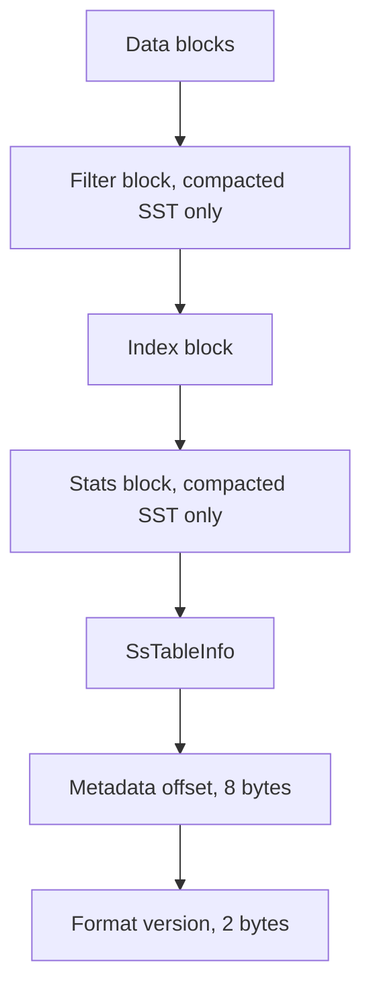

SlateDB stores durable rows in SST files under `wal/` and `compacted/`. Both use the same block and footer format, but they serve different jobs. WAL SSTs record writes in sequence number order for recovery and CDC. Compacted SSTs store L0 and sorted-run data in key order and serve normal reads.

## Roles

- `wal/<wal_id>.sst` stores rows in write order. SlateDB replays these files during recovery, `DbReader` WAL replay, and [`WalReader`](https://docs.rs/slatedb/latest/slatedb/struct.WalReader.html). Normal `Db` reads do not query them directly.
- `compacted/<ulid>.sst` stores rows in key order. Memtable flush writes L0 SSTs here, and compaction rewrites them into sorted runs.

The shared footer metadata lives in [`SsTableInfo`](https://github.com/slatedb/slatedb/blob/main/slatedb/src/db_state.rs). SlateDB also tracks compacted SSTs through [`SsTableHandle`](https://github.com/slatedb/slatedb/blob/main/slatedb/src/db_state.rs), [`SsTableView`](https://github.com/slatedb/slatedb/blob/main/slatedb/src/db_state.rs), and [`SortedRun`](https://github.com/slatedb/slatedb/blob/main/slatedb/src/db_state.rs). A handle names one physical SST. A view adds an optional `visible_range`, so the manifest can expose only part of that file. A sorted run is an ordered list of views over one or more SSTs.

## Views and Runs

L0 SSTs can overlap arbitrarily, so a point lookup may need to check every visible L0 file.

Inside a sorted run, SlateDB orders views by start key and uses the next view's start key as the exclusive upper bound of the current view. That lets a point lookup choose at most one SST per run. A range scan can skip SSTs whose effective range does not overlap the requested range.

This is also why a sorted run may reference multiple physical SSTs. Compaction can split one logical run across several files and still present them as one ordered structure in the manifest.

## File Layout

Each stored block ends with a CRC32 checksum. That applies to data blocks and to footer blocks such as the filter, index, stats, and `SsTableInfo` metadata.

## Data Blocks

SlateDB groups rows into blocks up to the target size configured with [`DbBuilder::with_sst_block_size`](https://docs.rs/slatedb/latest/slatedb/db/struct.DbBuilder.html#method.with_sst_block_size). When the next row would overflow the current block, the builder closes that block and starts a new one.

Compacted SSTs write rows in key order. WAL SSTs write rows in sequence number order. Current writers emit block format v2, which prefix-compresses keys and adds restart points so readers can still seek within the block. Readers accept both v1 and v2 files.

If compression is enabled, SlateDB compresses each block first. If a custom [`BlockTransformer`](https://docs.rs/slatedb/latest/slatedb/trait.BlockTransformer.html) is configured, it transforms the compressed bytes next. SlateDB then appends a checksum over the stored bytes. Reads reverse that order. [Compression](/docs/design/compression) covers the codec choices.

## Filter, Index, and Stats

Compacted SSTs may include a Bloom filter. SlateDB writes one when the file has at least [`Settings::min_filter_keys`](https://docs.rs/slatedb/latest/slatedb/config/struct.Settings.html#structfield.min_filter_keys) rows, and it sizes the filter with [`Settings::filter_bits_per_key`](https://docs.rs/slatedb/latest/slatedb/config/struct.Settings.html#structfield.filter_bits_per_key). Point lookups can skip the whole SST on a negative filter result. WAL SSTs do not include a filter because SlateDB reads them sequentially during replay.

The index stores one entry per data block. Each entry contains the block offset and a search key. In compacted SSTs that key is a separator key, not always the exact first key in the block. The first separator may be empty, and later separators may be shortened lower bounds between adjacent blocks. In WAL SSTs the index stores the first sequence number in each block instead.

Readers binary-search the index to find the first block that may contain a target key, or the block range that overlaps a scan. In a sorted run, SlateDB uses SST view boundaries first and then uses the per-SST block index inside the chosen file.

The current compacted SST builder also writes a stats block. It records counts of puts, deletes, and merge operands, plus raw key and value bytes and per-block stats. Older SSTs may not have this block, so [`SstFile::stats`](https://docs.rs/slatedb/latest/slatedb/struct.SstFile.html#method.stats) can return `None`.

## Footer Metadata

`SsTableInfo` stores the key or sequence bounds and the byte offsets needed to reopen the file. For compacted SSTs, `first_entry` and `last_entry` are key bounds. For WAL SSTs, `first_entry` is the first sequence number in the file and `last_entry` is unset because keys are not sorted.

The footer also records the compression codec, SST type, and the offsets and lengths of the filter, index, and stats blocks. The final 10 bytes of the file hold the metadata offset and the SST format version.

## How Reads Use SSTs

For a point lookup in a compacted SST, SlateDB can check the Bloom filter, read the index, binary-search to the first candidate block, and fetch only the needed blocks from object storage. Inside the block, the iterator seeks to the target key and walks the row entries that share that key. [Caching](/docs/design/caching) covers how block, index, filter, and stats reads are cached.

For range scans, SlateDB uses the requested key range and any `SsTableView` projection to determine which blocks overlap the scan. It can fetch several block ranges in parallel. In a sorted run it only opens the SST views that overlap the range. In L0 it may need to read from every SST because L0 files overlap.

## Creation and Rewrites

The WAL flusher creates WAL SSTs directly from write order. Memtable flush rewrites those rows into a key-sorted compacted SST in L0. Later compaction merges L0 SSTs and older sorted runs into new compacted SSTs.

One sorted run can span multiple physical SSTs because compaction rolls over to a new output file after the configured [`CompactorOptions::max_sst_size`](https://docs.rs/slatedb/latest/slatedb/config/struct.CompactorOptions.html#structfield.max_sst_size). Garbage collection removes old SSTs only after no active manifest, checkpoint, or in-flight compaction still references them.

## Inspection APIs

[`SstReader`](https://docs.rs/slatedb/latest/slatedb/struct.SstReader.html) opens compacted SSTs and exposes their metadata, object-store metadata, stats, and block index. [`WalReader`](https://docs.rs/slatedb/latest/slatedb/struct.WalReader.html) serves the WAL side of the format and yields rows in stored order.
