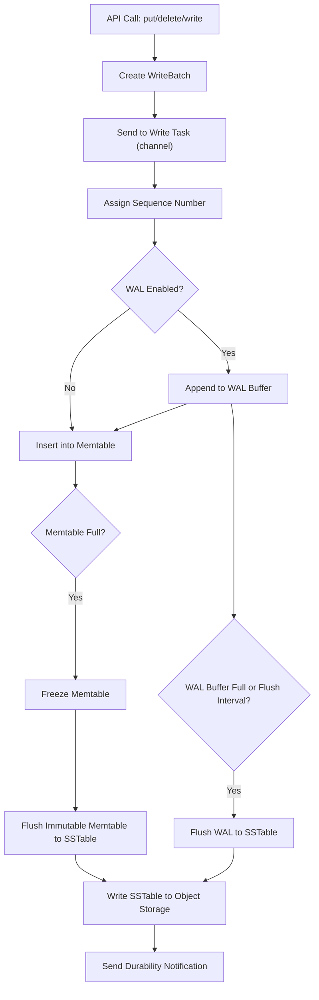

1. A `put()`, `write()`, or `delete()` call is made on the client.
2. The key/value pair is written to the mutable, in-memory WAL table.
3. The key/value pair is written to the mutable, in-memory MemTable.

The WAL flusher periodically checks if the WAL table is full. If it is, it freezes the mutable WAL table and triggers an asynchronous write to object storage. A notification is then sent to clients that wrote with `await_durable` set to `true`.

The MemTable flusher periodically checks if the MemTable is full. If it is, it freezes the mutable MemTable and triggers an asynchronous write to object storage. A notification is then sent to clients that wrote with `await_durable` set to `true` and `wal_enabled` set to `false`.

Below is a diagram illustrating the high-level flow of a write in SlateDB:

