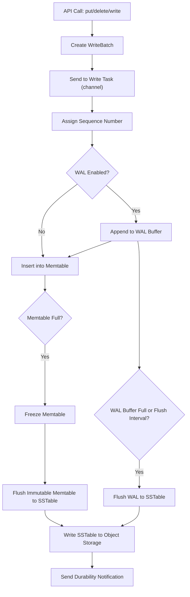

Writes are moved to a background task as quickly as possible to prevent blocking the client. By default, `put()`, `write()`, and `delete()` use `WriteOptions::default()`, so calls wait for the write to become durable before returning. If you want lower latency and can tolerate losing in-flight data, set `await_durable` to `false`. You can also call `flush()` explicitly. The synchronous flow is as follows:

1. A `put()`, `write()`, or `delete()` call is made on the client.
2. The key/value pair is written to the mutable, in-memory WAL table.
3. The key/value pair is written to the mutable, in-memory MemTable.

The following asynchronous flows occur:

- The WAL flusher periodically checks if the WAL table is full. If it is, it freezes the mutable WAL table and triggers an asynchronous write to object storage. A notification is then sent to clients that wrote with `await_durable` set to `true`.
- The MemTable flusher periodically checks if the MemTable is full. If it is, it freezes the mutable MemTable and triggers an asynchronous write to object storage. A notification is then sent to clients that wrote with `await_durable` set to `true` and `wal_enabled` set to `false`.

Below is a diagram illustrating the high-level flow of a write in SlateDB:


```mermaid
flowchart TD
    A[API Call: put/delete/write] --> B[Create WriteBatch]
    B --> C["Send to Write Task (channel)"]
    C --> D[Assign Sequence Number]
    D --> E{WAL Enabled?}
    E -- Yes --> F[Append to WAL Buffer]
    E -- No --> G[Insert into Memtable]
    F --> G[Insert into Memtable]
    G --> H{Memtable Full?}
    H -- Yes --> I[Freeze Memtable]
    I --> J[Flush Immutable Memtable to SSTable]
    F --> K{WAL Buffer Full or Flush Interval?}
    K -- Yes --> L[Flush WAL to SSTable]
    J & L --> M[Write SSTable to Object Storage]
    M --> N[Send Durability Notification]
```

## User-supplied sequence numbers

Every committed write batch is stamped with a `u64` sequence number. By default SlateDB's internal *oracle* — a monotonic counter shared by all writers — assigns one as the batch is dequeued from the write channel. [`WriteOptions::seqnum`](https://docs.rs/slatedb/latest/slatedb/config/struct.WriteOptions.html#structfield.seqnum) lets the caller override that counter and stamp the batch with a specific value instead.

### Semantics

The default value is `0`, which means *"let the oracle assign the seqnum"*. Sequence numbers issued by the oracle start at `1`, so `0` is unambiguously a sentinel. Any non-zero value is treated as a request to commit at that exact sequence number, subject to one rule:

- The supplied seqnum must be **strictly greater** than the current max sequence number known to the database. Otherwise the write fails with a [`slatedb::Error`](https://docs.rs/slatedb/latest/slatedb/enum.Error.html) of kind `Invalid`, with the message `invalid sequence number, must be greater than the current max. provided=..., current=...`.

When the check passes, the oracle is advanced to the supplied value, so subsequent auto-assigned writes resume above it. User-supplied and oracle-assigned writes can be mixed freely as long as the seqnums monotonically increase across the write stream.

```rust
use slatedb::config::{PutOptions, WriteOptions};

// Stamp this write with seqnum = 42 (e.g., the offset returned by your
// external WAL after appending the record).
let opts = WriteOptions { seqnum: 42, ..Default::default() };
db.put_with_options(b"key", b"value", &PutOptions::default(), &opts).await?;
```

### Ordering responsibility

Sequence numbers are assigned on the single-writer event loop that drains the write channel — but the *caller* picks the value before the batch is enqueued. That means concurrent writers on your side can race:

```text
thread A: pick seqnum 1, send batch to channel
thread B: pick seqnum 2, send batch to channel
```

If the OS schedules thread B's send before thread A's, the seqnum `2` batch arrives first, advances the oracle, and the seqnum `1` batch is rejected as no-longer-greater-than-current.

To avoid this, funnel all writes that use `seqnum` through a single ordering agent on your side — typically the same component that assigned the seqnums (e.g., the producer that appends to your external log). One writer, one channel, no races. If you genuinely need multiple writer threads, serialize them behind a mutex or a single-producer queue before calling `put`/`write`.

### Caveats

- **Non-contiguous seqnums.** Auto-assigned seqnums are not guaranteed to be strictly contiguous either (the memtable flusher tolerates gaps), so user-supplied jumps are consistent with existing behavior. Anything that relies on dense seqnums — don't.
- **Recovery.** On restart, SlateDB recovers the max seqnum from the manifest and any unflushed WAL. If you continue assigning seqnums from your external log, make sure the next value is above whatever SlateDB recovered, or your first post-restart write will be rejected.
- **Transactions.** Conflict detection still works on user-supplied seqnums — the read/write set is tracked against the snapshot's seqnum and the commit seqnum, regardless of who picked them. Just keep the monotonic-increase invariant.
- **`await_durable`.** `seqnum` is independent of the `await_durable` flag; both can be set on the same `WriteOptions`. The oracle is advanced as soon as the batch is processed by the write loop, before durability is confirmed. The seqno the oracle tracks is still bumped, so if the write fails the seqno is still consumed.
